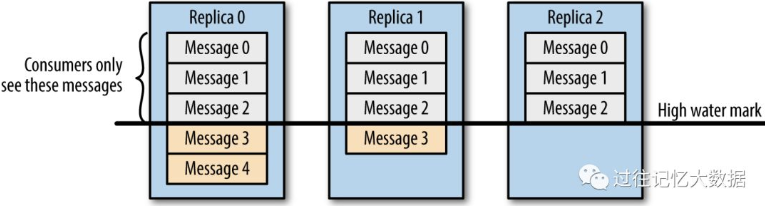

# 1. Kafka如何保证消息不丢失？

Kafka要保证消息不丢失有两个核心条件：一是只对**已提交的消息（committed message）**做持久化保证，即生产者提交消息到broker并等到多个broker确认后才算提交成功；二是必须保证有足够broker正常工作（N个broker中至少1个存活）。

从三个端分别看：

- **生产者端丢失**：`producer.send(msg)`是异步的，网络抖动或消息不合规会导致发送失败。使用`producer.send(msg, callback)`并设置合理的**retries**（推荐3以上）和重试间隔可避免。
- **Broker端丢失**：Leader宕机时未同步的数据可能丢失。
  - 设置`acks=all`：所有副本都接收到才算成功
  - 设置`replication.factor >= 3`：保证每个分区至少3个副本
  - 设置`min.insync.replicas > 1`：消息至少写入2个副本才算成功。注意保证`replication.factor > min.insync.replicas`（推荐`replication.factor = min.insync.replicas + 1`）
  - 设置`unclean.leader.election.enable = false`：Leader故障时不从同步落后的follower中选Leader
- **消费者端丢失**：消费者拉取消息后自动提交offset但还没消费完就挂掉。**解决办法是关闭自动提交offset，在真正消费完消息后再手动提交offset**。

# 2. Kafka如何保证消息不重复消费？

消费者手动提交offset会导致"先消费后提交"，如果消费完但未提交offset就挂掉，重启后会重复消费。**通过保证消费的幂等性来解决**：

- **数据库唯一键约束**：利用主键或唯一索引防止重复插入
- **先查后写**：先根据主键查一下，有数据则update而非insert
- **Redis去重**：消息中带全局唯一ID（如订单ID），消费前查Redis是否已处理
- **消息状态表**：建一张消息消费记录表，生产者发送前先入库（状态为待消费），消费者通过主键ID查询状态，处理后更新为已消费

**重复消费不可怕，可怕的是没考虑重复消费后怎么保证幂等性。**

# 3. Kafka如何保证幂等性？

幂等性解决**数据重复和数据乱序**问题。Kafka在0.11版引入了**幂等型Producer**和**事务型Producer**。

**启用幂等Producer**：设置`enable.idempotence=true`，此时`acks`强制为`all`。

**Producer 的幂等性** 指的是当发送同一条消息时，数据在 **Server 端只会被持久化一次，数据不丟不重。**

Producer 设置 at least once 时，由于异常触发重试机制导致数据重复，幂等性的目的就是为了解决这个数据重复的问题，简单来说就是：  **at least once + 幂等 = exactly once**

通过在 al least once 的基础上加上 幂等性来做到 exactly once

**单会话幂等**：开启幂等后通过**PID + Sequence Number**实现去重。每个Producer初始化时被分配一个唯一的**PID**（对用户不可见），每个`<Topic, Partition>`维护一个从0开始单调递增的**Sequence Number**。Broker端缓存Sequence Number，收到消息时校验：

- 序号比Broker缓存大1 → 接受
- 序号大一以上（乱序） → 拒绝， **说明中间有数据尚未写入** ，也即乱序。抛出`InvalidSequenceNumber`
- 序号小于等于缓存值（重复） → 丢弃， **说明该消息已被保存，即为重复消息** ，抛出`DuplicateSequenceNumber`

所以：**at least once + 幂等 = exactly once**

- **PID。** 每个新的Producer在初始化的时候会被分配一个唯一的PID，这个PID对用户是不可见的。**PID 是全局唯一的** ，Producer 故障后重新启动后会被分配一个新的 PID，这也是幂等性无法做到跨会话的一个原因
- **Sequence Numbler。** 对于每个PID，该Producer发送数据的每个<Topic, Partition>都对应一个从0开始单调递增的Sequence Number,每个 Topic-Partition 都会有一个独立的 sequence number。

**幂等性的局限性**：

- 只能保证**单会话内**不丢不重，Producer挂掉重启后会分配新PID，无法获取之前的状态信息
- 只能保证**单个Partition内**的幂等，不能跨多个Topic-Partition
- `MAX_IN_FLIGHT_REQUESTS_PER_CONNECTION`需≤5，因为Server端每个PID在每个Topic-Partition上只缓存最近5个batch数据

**跨会话、跨多个Topic-Partition的幂等需要使用Kafka事务**。

# 4. Kafka如何保证消息顺序？

Kafka**只能保证Partition内的有序**，Partition间无法保证有序。

**生产端**：发送消息时可指定(topic, partition, key)。指定**partition**则所有消息发往同一partition；指定**key**（如order id），具有相同key的消息通过`abs(hash(主键)) % partition_num`路由到同一partition。实际场景中，要保证同一订单的操作顺序不乱，根据订单主键/用户ID决定分区即可。

**消费端**：Kafka保证**一个Partition只能被同一个Consumer Group内的一个Consumer消费**，但Consumer内部建议单线程消费，否则多线程会引入乱序问题。

- **Kafka 只能保证 Partition 内有序**，Partition 间无法保证。
- 保证同一业务数据落入同一 Partition：
  - **按 Key 路由**：`abs(hash(主键/key)) % partition_num`，保证同一订单/用户落入同一 Partition。
  - **直接指定 Partition**：所有消息发往同一 Partition。
- **消费端**：Kafka 保证 **1 个 Partition 只能被 1 个 Consumer 消费**，内部单线程消费，保证同一 Partition 内的有序性。

优点：减少consumer与broker通信开销，保证partition内有序。

缺点： **无法让同一group内的consumer均匀消费数据。**

# 5. Kafka如何保证数据一致性？

通过**High Water Mark（HW）机制**和**ISR机制**保证数据一致性。一致性定义：若某条消息对client可见，那么即使Leader挂了，在新Leader上数据依然可被读到。

**HW机制**：

- **HW（高水位）**：取Partition对应的ISR中最小的LEO作为HW，**Consumer最多只能消费到HW所在的位置**
- **LEO（Log End Offset）**：replica中下一条待写入消息的offset
- 对于Leader新写入的消息，Consumer不能立刻消费，Leader会等待该消息**被所有ISR中的replica同步后更新HW**，此时消息才能被Consumer消费
- 这样确保了如果Leader Broker失效，消息仍可从新选举的Leader获取
- HW机制类似**木桶原理**：未被足够多副本复制的消息被认为是"不安全的"，如果Consumer读到Message4后Leader挂了，新Leader没有Message4，就破坏了一致性
- 延迟可通过`replica.lag.time.max.ms`配置

**ISR（In-Sync Replicas）机制**：维护所有同步的、可用的副本列表。节点存活条件：①维持和ZooKeeper的会话；②如果是从节点，复制不能太落后（包括数据复制落后和时间相差过大）。

**副本与Leader不同步的原因**：

- **慢副本**：I/O瓶颈导致follower追加速度慢于拉取速度
- **卡住副本**：GC暂停或follower失效，停止拉取请求
- **新启动副本**：增加副本因子时，新follower需赶上leader日志后才加入ISR

# 6. Kafka如何保证数据可靠性？

通过**副本机制、ACK参数、ISR机制、Partition Recovery机制**保证。

**Partition Recovery机制**：每个Partition在磁盘记录一个**RecoveryPoint**（已flush到磁盘的最大offset）。当Broker故障重启时，先读取RecoveryPoint，找到包含该点的segment及之后的segment（可能未完全flush），调用segment的recover重新读取消息并重建索引。优点：①以segment为单位管理数据，方便生命周期管理；②加快恢复速度，只需恢复未flush的segment；③通过index二分查找快速定位消息。

**Broker的三种offset**：

- **base offset**：起始位移，replica中第一条消息的offset
- **HW**：高水印值，副本中最新一条已提交消息的位移
- **LEO**：日志末端位移，replica中下一条待写入消息的offset

HW之前的才是可被外界访问的数据，LEO标示follower的同步进度。

# 7. Kafka事务和如何实现？

## **什么是 Kafka 事务**

Kafka 事务与数据库事务类似，指把**一组「Producer 生产消息 + 消费消息提交 Offset」的操作**捆绑成一个**原子单元**——要么**全部成功（commit）**，要么**全部失败（abort）**，不会出现中间状态。

**事务的作用域是** `transactional.id`，不是 topic

- 一个事务由 `transactional.id` 唯一标识，绑定的是某个**生产者会话**
- 一个事务内可以往**多个 topic 的多个 partition** 写入消息，也可以提交来自多个 partition 的消费 offset，这些操作作为一个原子单元
- 所以它解决的核心问题正是**跨多个 Topic-Partition 的原子性**——单 topic 单分区用幂等就够，不需要事务

## **为什么要引入事务**

在事务出现之前，幂等型 Producer 只能保证**单会话、单个 Partition 内的 Exactly-Once**，存在三个解决不了的场景：

- **跨多个 Topic-Partition 的写入**：例如同时写订单 topic 和审计 topic，可能出现一个写了、另一个没写的不一致状态
- **跨会话**：Producer 挂掉重启后分配新 PID，之前的幂等状态丢失
- **Consume-Process-Produce（消费-处理-再生产）**：从 Kafka 读消息 → 处理业务 → 写结果/再发消息 → 提交 offset，需要保证「业务结果」和「offset 提交」原子一致，避免"处理了但 offset 没提交导致重复消费"或"offset 提交了但业务失败导致丢消息"

## **事务能做到的保证**

- **原子性**：跨多个 Topic-Partition 要么全部写入成功，要么全部失败，没有中间状态
- **跨会话的幂等性写入**：即使中间故障，恢复后依然可保持幂等
  - **中间故障**指事务执行过程中、尚未 commit/abort 就发生的中断，例如 Producer 进程崩溃/被杀、机器宕机、网络分区、应用滚动发布重启实例等，事务被"悬挂"在未完成状态
  - 能保持幂等的根源：`transactional.id` 使新实例**取回同一个 PID（epoch 抬升）**，sequence number 状态延续，崩溃前写过的消息即使重发也能被 broker 去重，不会重复写入
- **跨会话的事务恢复**：应用实例挂了，下一个实例可保证上一个事务完成（commit 或 abort），因为协调器通过 `__transaction_state` **保留了未完成事务的状态**，新实例可对其 resolve（收尾）
- **隔离性**：在 `isolation.level=read_committed` 隔离级别下，未提交事务的消息对 Consumer 不可见，只有 commit 之后的消息才对外可见（默认 `read_uncommitted` 下未提交消息也可读）

## **什么场景需要开启和使用事务**

判断标准：只有需要 **Kafka 内部的多个写操作（多个 topic/partition 的消息 + offset 提交）原子化**，且幂等无法覆盖时才需要开启。一句话：**事务管的是"Kafka 内部"的原子性**。

**典型使用场景**

- **Consume-Process-Produce（消费-处理-再生产）流式处理**（最典型）：从 Kafka 读 → 处理 → 再写回 Kafka（可能多个 topic），同时要提交 offset。例如实时订单处理，从订单 topic 读到订单，处理后写"有效订单"topic 和"统计"topic，并把 offset 一起 commit，保证"处理结果 + offset"原子一致。流处理引擎（如 Flink）的端到端 exactly-once 底层依赖此机制
- **跨多个 Topic / Partition 的原子写入**：一条业务要同时写到多个 topic，要么全写成功，要么全不写。例如写订单 topic 的同时写审计/风控 topic，不能出现"订单写成功、审计没写"的不一致
- **多实例部署下的故障接管（跨会话恢复）**：应用挂了，另一个实例用同一个 `transactional.id` 接管，收尾未完成事务（commit/abort）且不重复写入。例如任务调度系统，一个 worker 写了一半挂掉，另一个 worker 接管继续

**什么时候不需要 / 不应该用**

- **单 topic 单 partition**：幂等（`enable.idempotence=true`）就够了，不需要事务
- **原子性跨越 Kafka 和外部系统（如 MySQL）**：Kafka 事务管不到 DB，"读 Kafka + 写 MySQL + 提交 offset"要原子一致，需要事务性 Outbox 模式等跨系统方案
- **对吞吐/延迟敏感的纯高吞吐场景**：事务有开销（写 `__transaction_state`、协调器协调、LSO 推进），会降低吞吐、增加延迟；可接受 at-least-once + 消费端幂等的场景，不要为用而用
- **下游不关心 exactly-once**：如日志收集、监控指标，重复一条无影响

**启用事务**

- 设置 `transactional.id` 为一个指定字符串（有意义的、稳定唯一的事务名称），设置后**会自动启用幂等**，不允许关闭
- **幂等是事务的基础**：幂等提供了单会话单 Partition 的 Exactly-Once，事务在此基础上扩展出跨 Partition、跨会话的原子性

**事务 API**（`Producer` 接口）

- `initTransactions()` - 初始化事务
- `beginTransaction()` - 开启事务
- `sendOffsetsToTransaction()` - 提交消费 offset
- `commitTransaction()` - 提交事务
- `abortTransaction()` - 中止事务

## **事务实现原理**

1. **查找 Transaction Coordinator**：通过 `transactional.id` 哈希计算 partition，该 partition 的 leader 即为该事务的 Transaction Coordinator，负责协调事务状态
2. **获取 PID**：Producer 启动时调用 `initTransactions()` 向 Transaction Coordinator 发起 `InitPidRequest`，**获取 PID 并注册事务状态**（一般只调用一次）
3. **开启事务**：`beginTransaction()` 将客户端本地事务状态转为 `IN_TRANSACTION`，发送第一条消息后 Transaction Coordinator 才认为事务已开启
4. **Consume-Process-Produce Loop**：典型的消费-处理-生产场景，期间可调用 `sendOffsetsToTransaction()` 把消费 offset 纳入事务
5. **提交或中止事务**：调用 `commitTransaction()` 或 `abortTransaction()`，事务状态通过 `__transaction_state` topic 持久化

**底层关键机制**

- **事务状态存储**：事务的状态记录在 Kafka 内置的 `__transaction_state` topic 中，每个 `transactional.id` 通过 hash 定位到其中一个 partition，该 partition 的 leader 就是它的 Transaction Coordinator
- **PID + epoch 防旧实例复活**：事务用 **PID + epoch** 标识"当前唯一合法的生产者会话"，同一个 `transactional.id` 的新会话会抬升 epoch，旧会话再用旧 epoch 写入会被拒绝并抛出 `ProducerFencedException`
- **LSO / LW 隔离未提交数据**：
  - **LSO（Last Stable Offset）**：未提交的事务消息带标记，`read_committed` 下 Consumer 只能消费到 LSO 之前已 resolve（commit/abort 完成）的消息
  - **LW（Log Watermark）**：主要用于 Leader 副本复制进度跟踪，以及决定事务 marker（commit/abort 控制记录）何时可清理，并不直接决定 Consumer 可见性

## **事务的边界限制**

- 一个 `transactional.id` **同一时刻只能有一个打开的事务**，必须 commit 或 abort 后才能开启下一个
- 同一 `transactional.id` 的 Producer 只能**单实例写入**，否则触发 `ProducerFencedException`（防止旧实例复活干扰）
- 事务是**单个 Producer 会话内**的原子性，不能跨多个 Producer 客户端协作

## **Consumer 与事务的关系**

Kafka 事务本质上是 **Producer 侧的事务**——事务的发起、协调、提交/回滚全部由**事务型 Producer** 驱动，Consumer 端**没有任何开启事务的 API**。Consumer 与事务的关系体现在两个方面：

- **读端可见性**：通过 `isolation.level` 决定能否看到未提交事务的消息——`read_committed` 只能读已提交（committed）消息，`read_uncommitted`（默认）下未提交消息也可读
- **offset 提交挂靠进事务**：在 Consume-Process-Produce 模式中调用 `sendOffsetsToTransaction()`，把"消费 offset 的提交"纳入 Producer 的事务，与业务写入原子一致，避免"业务写成功但 offset 没提交导致重复消费"或"offset 提交了但业务失败导致丢消息"。此时 Consumer 与 Producer 在**同一个应用进程/线程**里共享同一个事务上下文

**事务的范围边界**

Kafka 事务只覆盖 **Kafka 内部的写入**：业务消息写各业务 topic、offset 写 `__consumer_offsets`，两者在事务内原子完成；**不覆盖 Consumer 写外部系统（如 MySQL）** 的操作。若需要"读 Kafka + 写 DB + 提交 offset"原子一致，Kafka 事务做不到，要用**事务性 Outbox（发件箱）模式**等跨系统方案。

## **Consumer 端限制**

Consumer 端很难保证一个已 commit 的事务的所有消息都被消费：

- compacted topic 可能覆盖
- 旧 segment 可能过期清除
- Consumer 可通过 seek 跳转位置
- Consumer 可能未订阅所有涉及的 Partition

