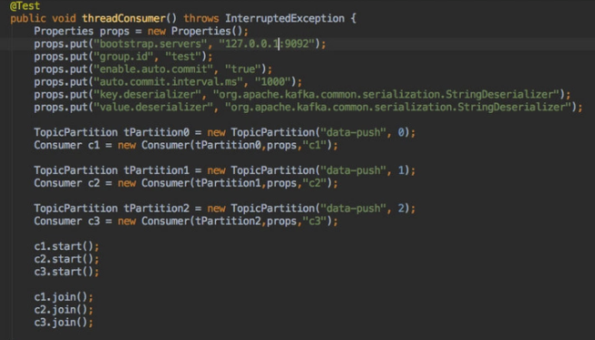
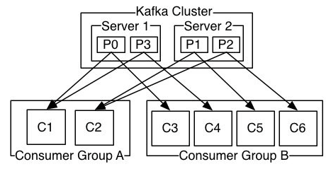

## 1. Kafka 为什么采用 pull 模式而不是 push 模式？

push 模式：服务端主动推送消息给客户端，目标是以最快速度传递消息。

**push 模式的缺点**：

- 客户端消费能力远低于服务端生产能力时，大量消息推送过来会导致客户端消息堆积、处理缓慢甚至服务崩溃，需要 MQ 提供流控机制（如 RabbitMQ 的 QoS）
- 服务端需要维护每次传输的状态，以便失败时重试
- **push 模式很难适应消费速率不同的消费者**，消息发送速率由 broker 决定，容易造成 consumer 来不及处理消息，出现拒绝服务和网络拥塞

pull 模式：客户端主动到服务端拉取数据。

**pull 模式的优点**：

- **Consumer 可自主控制消费消息的速率**，根据自身消费能力以适当速率消费
- **可简化 broker 的设计**，broker 无需维护推送状态
- Consumer 可以自己控制消费方式——可批量消费也可逐条消费，还能选择不同提交方式实现不同传输语义（at-most-once、at-least-once、exactly-once）
- **支持消息回放功能**，Consumer 决定消费什么位置的数据
- 不需要返回 ack 消息，当 Consumer 申请消费下一批消息时即可认为上一批消息已处理完毕，也不需要处理超时问题

## 2. Kafka 异步发送消息是如何实现的？

Producer 发送消息默认是异步的。`producer.send(msg)` 将消息放入缓冲区后立即返回，由后台 I/O 线程批量发送到 Broker，提升吞吐量。

**回调机制**：使用 `producer.send(msg, callback)` 注册回调，在 Broker 确认后回调 `onCompletion` 方法，在此处理发送结果。

**注意事项**：

- 异步发送不会立即抛出异常，需要通过回调捕获失败
- 需合理设置 `retries`（重试次数）和 `retry.backoff.ms`（重试间隔），避免网络抖动导致丢失
- 需设置 `max.in.flight.requests.per.connection`（默认 5），控制未确认请求数，影响顺序和吞吐
- 需配置 `linger.ms` 和 `batch.size` 以平衡延迟和吞吐量

## 3. Kafka 单线程消费存在哪些问题？

单线程消费：一个消费线程遍历所有分区拉取数据。

- **效率低下**：分区数达到几十上百个时，单线程无法高效取出数据
- **可用性很低**：一旦消费线程阻塞或进程挂掉，整个消费程序都将不可用

**解决方案**：使用多分区 + 多消费者并发消费。

## 4. Kafka 多线程消费有哪些方式？独立消费者和消费组有什么区别？

**独立消费者模式（Independent Consumer）**：

- 手动指定需要消费的分区，每个线程消费指定分区
- 
- 缺点：**可用性不高**——某个进程挂掉后，该进程负责的分区数据无法转移给其他进程处理

**消费组模式（Consumer Group）**：

- 多个消费者实例（`new KafkaConsumer()`）使用同一个 `group.id` 创建，即属于同一个消费组
- **同一个消费组中，一个分区的消息只会发往一个消费实例**
- 
- 例如 Topic 有 4 个分区（p0-p3），groupA 有 2 个实例（C1、C2），则 C1 消费 p0、p3，C2 消费 p1、p2；groupB 有 4 个实例，则每个实例消费一个分区
- **消费实例和进程没有关系**：一个进程中可以有多个消费实例。如 3 个分区但启动了 2 个进程，每个进程 2 个实例，共 4 个实例，但只有 3 个能取到消息，Kafka 通过 Rebalance 自动分配
- **优势**：高可用、高容错，不会出现单线程或独立消费者挂掉后数据无法消费的情况；多实例极大提高消费效率；扩展性好，新增分区时只需启动新消费实例加入消费组

## 5. Kafka 消费组 Rebalance 是什么？什么条件下触发？

**Rebalance**：消费组中新增消费实例或消费实例挂掉时，Kafka 自动重新分配消费实例与分区的对应关系。

**触发条件**：

- 消费组中新增消费实例
- 消费组中消费实例 down 掉
- 订阅的 Topic 分区数发生变化
- 使用正则订阅 Topic 时，匹配的 Topic 数量发生变化

## 6. Kafka 如何重新消费已经处理过的数据？

**方式一：修改 Offset**

- Kafka 中每个 Topic 的每个 Partition 维护一个 offset 记录消费位置
- 通过 `consumer.seek()` API 手动调整 offset 到想重新消费的位置即可

**方式二：使用不同的 group.id**

- 使用一个新的 group.id 重新消费数据
- Consumer 使用新 group.id 时自动在服务端注册，从注册之后产生的数据开始消费
- **注意**：新 group.id 并非消费 Topic 中所有历史数据，而是消费该 group 注册之后产生的数据

