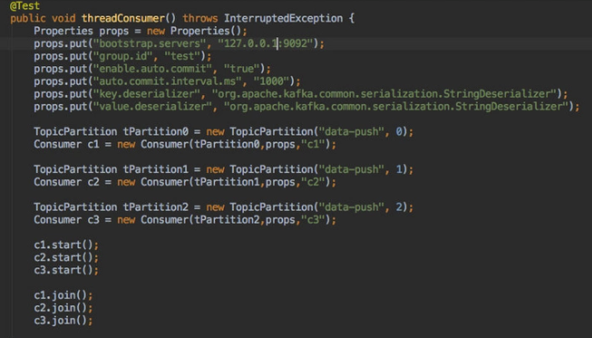
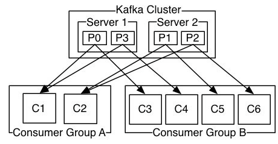

## 1. Kafka 为什么用 pull 而非 push？

push 模式：服务端主动推送消息给客户端，目标是以最快速度传递消息。

**push 模式的缺点**：

- 客户端消费能力远低于服务端生产能力时，大量消息推送过来会导致客户端消息堆积、处理缓慢甚至服务崩溃，需要 MQ 提供流控机制（如 RabbitMQ 的 QoS）
- 服务端需要维护每次传输的状态，以便失败时重试
- **push 模式很难适应消费速率不同的消费者**，消息发送速率由 broker 决定，容易造成 consumer 来不及处理消息，出现拒绝服务和网络拥塞

pull 模式：客户端主动到服务端拉取数据。

**pull 模式的优点**：

- **Consumer 可自主控制消费消息的速率**，根据自身消费能力以适当速率消费
- **可简化 broker 的设计**，broker 无需维护推送状态
- Consumer 可以自己控制消费方式——可批量消费也可逐条消费，还能选择不同提交方式实现不同传输语义（at-most-once、at-least-once、exactly-once）
- **支持消息回放功能**，Consumer 决定消费什么位置的数据
- 不需要返回 ack 消息，当 Consumer 申请消费下一批消息时即可认为上一批消息已处理完毕，也不需要处理超时问题

## 2. Kafka 异步发送消息是如何实现的？

Producer 发送消息默认是异步的。`producer.send(msg)` 将消息放入缓冲区后立即返回，由后台 I/O 线程批量发送到 Broker，提升吞吐量。

**回调机制**：使用 `producer.send(msg, callback)` 注册回调，在 Broker 确认后回调 `onCompletion` 方法，在此处理发送结果。

**注意事项**：

- 异步发送不会立即抛出异常，需要通过回调捕获失败
- 需合理设置 `retries`（重试次数）和 `retry.backoff.ms`（重试间隔），避免网络抖动导致丢失
- 需设置 `max.in.flight.requests.per.connection`（默认 5），控制未确认请求数，影响顺序和吞吐
- 需配置 `linger.ms` 和 `batch.size` 以平衡延迟和吞吐量

## 3. Kafka 单线程消费存在哪些问题？

单线程消费：一个消费线程遍历所有分区拉取数据。

- **效率低下**：分区数达到几十上百个时，单线程无法高效取出数据
- **可用性很低**：一旦消费线程阻塞或进程挂掉，整个消费程序都将不可用

**解决方案**：使用多分区 + 多消费者并发消费。

## 4. Kafka 多线程消费有哪些方式？独立消费者和消费组有什么区别？

**独立消费者模式（Independent Consumer）**：

- 手动指定需要消费的分区，每个线程消费指定分区
- 
- 缺点：**可用性不高**——某个进程挂掉后，该进程负责的分区数据无法转移给其他进程处理

**消费组模式（Consumer Group）**：

- 多个消费者实例（`new KafkaConsumer()`）使用同一个 `group.id` 创建，即属于同一个消费组
- **同一个消费组中，一个分区的消息只会发往一个消费实例**
- 
- 例如 Topic 有 4 个分区（p0-p3），groupA 有 2 个实例（C1、C2），则 C1 消费 p0、p3，C2 消费 p1、p2；groupB 有 4 个实例，则每个实例消费一个分区
- **消费实例和进程没有关系**：一个进程中可以有多个消费实例。如 3 个分区但启动了 2 个进程，每个进程 2 个实例，共 4 个实例，但只有 3 个能取到消息，Kafka 通过 Rebalance 自动分配
- **优势**：高可用、高容错，不会出现单线程或独立消费者挂掉后数据无法消费的情况；多实例极大提高消费效率；扩展性好，新增分区时只需启动新消费实例加入消费组

## 5. Kafka 消费组 Rebalance 是什么？什么条件下触发？

**Rebalance**：消费组中新增消费实例或消费实例挂掉时，Kafka 自动重新分配消费实例与分区的对应关系。

**触发条件**：

- 消费组中新增消费实例
- 消费组中消费实例 down 掉
- 订阅的 Topic 分区数发生变化
- 使用正则订阅 Topic 时，匹配的 Topic 数量发生变化

## 6. Kafka 如何重新消费已经处理过的数据？

**方式一：修改 Offset**

- Kafka 中每个 Topic 的每个 Partition 维护一个 offset 记录消费位置
- 通过 `consumer.seek()` API 手动调整 offset 到想重新消费的位置即可

**方式二：使用不同的 group.id**

- 使用一个新的 group.id 重新消费数据
- Consumer 使用新 group.id 时自动在服务端注册，从注册之后产生的数据开始消费
- **注意**：新 group.id 并非消费 Topic 中所有历史数据，而是消费该 group 注册之后产生的数据

## 7. 消息写入过程

### **1、确定partition**

Producer 通过**分区算法**确定消息写入哪个 Partition，遵循以下规则：

- **指定了 partition**：直接使用指定值
- **未指定 partition 但指定了 key**：对 key 的值做 hash 选出 partition
- **partition 和 key 都未指定**：使用**轮询**选出 partition

### 2、找到partition的通信地址

一个partition有多个replica，Producer 先从 Zookeeper 的 “/brokers/…/state” 节点找到该 partition 的 leader, 之后就只与该leader通信。

注意，这里的leader是指partition的leader，而事实上，kafka集群不像zookeeper一样，有leader管理，发起提议等，它是没有leader的

**kafka如何选用leader呢？**

Kafka 采用 **ISR 机制选举 Leader**，而非多数选举法。Leader 宕机后，**只能从 ISR 列表中选择新的 Leader**，因为 ISR 中的副本都知道 HW（High Watermark）之前的数据，能保证数据一致性。

**HW 截断机制**：

- 选出新 Leader 后，其不能保证拥有旧 Leader 的所有数据，**只能保证 HW 之前的数据是同步过的**。
- 所有 Follower **将数据截断到 HW 位置**，再与新 Leader 同步。
- 当宕机的旧 Leader 恢复后，发现数据与新 Leader 不一致，会**将自己的数据截断到宕机前的 HW 位置**，然后像 Follower 一样同步新 Leader 的数据。

### 3、数据传输

- producer 将消息发送给该 leader
- leader 将消息写入本地 log
- followers 从 leader pull 消息，写入本地 log 后 leader 发送 ACK
- leader 收到所有 ISR 中的 replica 的 ACK 后，增加 HW（high watermark，最后 commit 的 offset） 并向 producer 发送 ACK

**保证消息的传输** 有几种方式：

1. **At most once 消息可能会丢，但绝不会重复传输 acks=0**
   从Producer的角度来看，At most once意味着Producer发送完一条消息后，不会确认消息是否成功送达。这样从Producer的角度来看，消息仅仅被发送一次，也就存在者丢失的可能性。
2. **At least one 消息绝不会丢，但可能会重复传输 acks=1**
   从Producer的角度来看，At least once意味着 **Producer发送完一条消息后，会确认消息是否发送成功。** 如果Producer没有收到Broker的ack确认消息，那么会不断重试发送消息。这样就意味着消息可能被发送不止一次，也就存在这消息重复的可能性。
3. **Exactly once 每条消息肯定会被传输一次且仅传输一次 acks=all**
   从Producer的角度来看，Exactly once意味着Producer消息的发送是幂等的。这意味着不论消息重发多少遍，最终Broker上记录的只有一条不重复的数据。

`acks` 参数在 Producer 端设置，控制消息写入的可靠性：

- **acks = 0**：Producer 把消息发送出去即认为成功，不等待任何确认。吞吐量最高，但**可能丢失消息**（Leader 写入前宕机）。
- **acks = 1**（默认）：Leader **接收到消息并写入本地磁盘**即认为成功，不等待 Follower 同步。如果 Leader 写入后、Follower 同步前宕机，消息**可能丢失**。
- **acks = all（-1）**：Leader 需等待 **ISR 列表中所有 Follower 都同步完消息**才认为成功。可靠性最高，**不会丢失消息**。

## 8. 消费者如何消费数据

**一、消费者如何消费数据（pull 模型）**

1. Consumer 订阅 topic 后，通过 poll() 主动向 Broker 的 Partition Leader 拉取数据（pull 模式，不是 push）
2. Broker 按拉取参数（如 max.partition.fetch.bytes、[fetch.max.wait.ms](http://fetch.max.wait.ms)）返回一批消息
3. Consumer 处理消息（业务逻辑）
4. 处理完成后，手动或自动提交 offset 到 \__consumer_offsets topic，记录消费位置
5. 下次 poll() 从上次提交的 offset 继续拉取，实现"从哪里断的接着消费"

配套规则：

- 一个 Partition 只能被同一消费组内的一个 Consumer 消费（保证分区内有序、无并发竞争）
- Consumer 数量不要超过 Partition 数，最好与 Partition 数一致，否则多余实例闲置
- 消费位置早期维护在 Zookeeper（易重复消费、性能差），新版本维护在 Kafka 的 \__consumer_offsets

**二、什么时候一条消息达到"可消费"状态**

**核心是 HW（High Watermark，高水位）机制** ——不是写入 leader 就能消费：

1. Producer 把消息写入 Leader 的日志
2. Leader 等待该消息被 所有 ISR 中的副本同步成功
3. 所有 ISR 副本都同步后，HW 前移越过这条消息，它才成为 已提交（committed） 消息
4. Consumer 只能消费 HW 以下（已提交）的消息，HW 及以上的消息即使已写在 leader 日志里，Consumer 也读不到

所以判定是：" **消息被所有 ISR 副本复制成功、HW 越过它" 时，才达到可消费状态。**

**为什么要这么严格？** 

为了保证一致性：如果 Consumer 读到了 Message4，而 leader 恰好挂了，新选出的 leader 里没有 Message4，就破坏了"能读到的消息必须还在"的原则。HW 类似木桶原理，取 ISR 中 LEO 最小的副本，保证每个 ISR 副本都有这份数据，读它才不会丢。

两个容易搞混的点

- **"可消费" 晚于 "Producer 收到 ACK"：** 即使 acks=1（leader 写入即返回成功），Consumer 也不能马上消费，因为 HW 还没前进（还要等 ISR 副本同步）
- **事务场景额外加一道闸：** isolation.level=read_committed 下，Consumer 还要等 LSO（Last Stable Offset） 约束——这条消息之前的所有事务都 resolve（commit/abort）完成，才可消费

