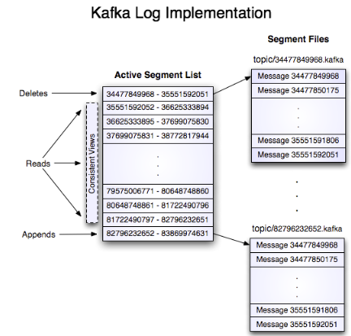
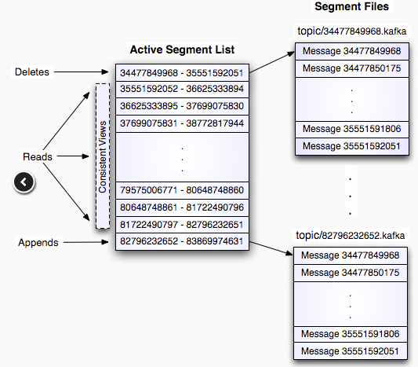
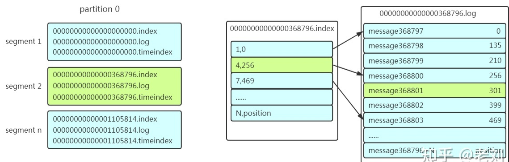
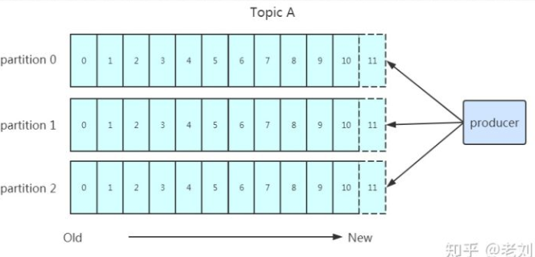
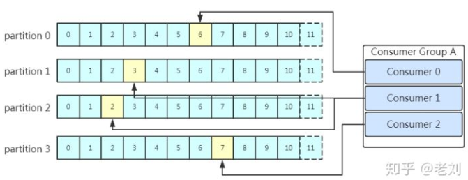
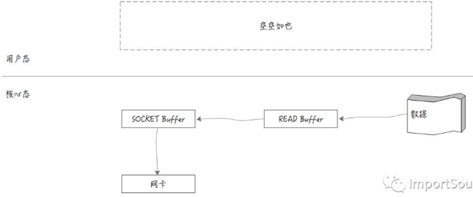
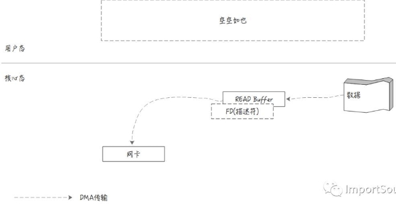

# 1. Producer 如何确定消息写入哪个 Partition？

Producer 通过**分区算法**确定消息写入哪个 Partition，遵循以下规则：

- **指定了 partition**：直接使用指定值
- **未指定 partition 但指定了 key**：对 key 的值做 hash 选出 partition
- **partition 和 key 都未指定**：使用**轮询**选出 partition

# 2. Producer 找到 Partition Leader 后的消息写入流程是怎样的？

1. Producer 确定目标 partition
2. 从 Zookeeper 的 `/brokers/.../state` 节点找到该 partition 的 **leader**
3. Producer 只与 leader 通信，将消息发送给 leader
4. leader 将消息写入本地 log
5. followers 从 leader **pull** 消息，写入本地 log 后 leader 发送 ACK
6. leader 收到**所有 ISR 中的 replica 的 ACK** 后，增加 HW（High Watermark，最后 commit 的 offset），并向 Producer 发送 ACK

# 3. Kafka 的三种消息送达语义分别是什么？如何配置？

Producer 端通过 **acks** 参数配置可靠性：

**At most once（消息可能丢，但不会重复传输）**

- 配置：`acks=0`
- Producer 发送完消息后不确认是否成功送达，存在丢失可能性

**At least once（消息不会丢，但可能重复传输）**

- 配置：`acks=1`（默认），`retries=2147483647`
- Producer 确认消息是否发送成功，未收到 ACK 则不断重试，消息可能被发送多次

**Exactly once（每条消息被传输且仅传输一次）**

- 配置：`enable.idempotence=true` + `acks=all`，建议 `max.in.flight.requests.per.connection < 5`
- 幂等性保证不论消息重发多少遍，Broker 最终只记录一条数据

# 4. Kafka 的持久化策略是什么？为什么直接写入文件系统日志？

Kafka 不采用"先缓存内存再刷盘"的传统方式，而是**直接将数据写到文件系统的日志**：

- **写操作**：数据**顺序追加**到文件中
- **读操作**：从文件中读取

这样实现的好处：

- **读操作不会阻塞写操作**和其他操作，数据大小不对性能产生影响
- 硬盘空间相对内存容量限制更小
- **线性访问磁盘**（顺序读写），速度快，可保存更长时间，更稳定

# 5. Kafka 的日志文件（Segment）是如何存储和管理的？

一个 Topic 的一个 Partition 在物理上对应一个文件夹，文件夹下由多组 **Segment 文件**组成，每组包含 `.index` 文件和 `.log` 文件。

**日志文件结构**

- Partition 在存储层面是一个 **append-only 日志文件**
- 每条消息在当前 Partition 下有唯一的 **64 位 offset**，标识其起始位置
- 日志文件由"日志条目（log entries）"序列组成，每个条目包含 4 字节整型数（值为 N）及 N 字节消息体
- 

**写操作**

- 消息顺序追加到最后一个 Segment 文件
- 文件达到 `log.segment.bytes`（默认 1GB）时滚动到新文件
- `log.flush.interval.messages`（M）：强制刷盘前的消息数
- `log.flush.interval.ms`（S）：强制刷盘前的时间（秒）
- 系统崩溃时最多丢失 M 条消息或 S 秒的数据

**读操作**

- 通过 offset 和最大块大小读取数据，返回缓冲区大小的消息迭代器
- 指定 offset 时，先找到 Segment 文件，由全局 offset 计算文件内偏移量，从此位置读取

**删除操作**

- 消息数据随 Segment 文件一起删除
- Log manager 支持可插拔的删除策略：
  - 删除修改时间超过 N 天前的日志，或保留最近 N GB 的数据
- 为避免删除时阻塞读操作，采用 **copy-on-write 技术**：删除时二分查找基于静态快照副本进行

**文件索引**

- 每个 Segment 名为**第一条消息的 offset** + `.kafka`
- 每个 Segment 有对应的 `.index` 文件，标明该 Segment 下的 offset 范围
- 采用**稀疏索引**，存储相对 offset 与对应消息物理偏移量的关系
- 索引也被分段，删除消息时可同时删除对应索引
- Kafka 不维护索引校验和，索引损坏时通过重新读取消息重新生成

**Partition 存储结构**

- 

# 6. Kafka 如何通过 Segment + Offset 高效查找消息？

以查找 offset=368801 的消息为例：

1. 利用**二分法**找到该 offset 所在的 Segment 文件
2. 打开该 Segment 的 `.index` 文件（如 `368796.index`），计算相对 offset 为 5（368801 - 368796）。索引采用**稀疏索引**存储相对 offset 与物理偏移量，利用二分法找到小于等于目标相对 offset 的**最大索引条目**
3. 根据索引确定的物理偏移位置（如 256），打开 `.log` 文件从该位置**顺序扫描**，直到找到 offset=368801 的消息

这套机制基于 **Segment + 有序 offset + 稀疏索引 + 二分查找 + 顺序查找** 多种手段高效查找数据。

- 

# 7. Kafka 为什么采用顺序读写？分区的作用是什么？

**顺序读写**

- Producer 采用 push 模式将数据发布到 Broker，消息**顺序追加**到分区，保证同一分区内数据有序
- 顺序写入磁盘的**效率远高于随机写入**
- 

**分区的作用**

- **方便扩展**：一个 Topic 可以有多个 Partition，通过增加机器应对日益增长的数据量
- **提高并发**：以 Partition 为读写单位，多个消费者并发消费，提高处理效率

**ACK 应答机制**

- **acks=0**：Producer 不等待集群返回，不确保发送成功。安全性最低，效率最高
- **acks=1**：Producer 等待 leader 应答即可发送下一条。只确保 leader 成功
- **acks=all**：等待所有 follower 完成同步。安全性最高，效率最低

**消费数据**

- Consumer 采用 pull 模式，从 leader 拉取消息
- 同一消费组内一个 Partition 只能被一个 Consumer 消费
- Consumer 数量不要大于 Partition 数量，否则多余 Consumer 闲置
- Consumer 数量最好与 Partition 数量一致
- 早期消费位置维护在 Zookeeper（易重复消费、性能差），**新版本维护在 Kafka 集群的** `__consumer_offsets` 这个 topic 中
- 

# 8. 什么是零拷贝？Kafka 如何利用零拷贝提升性能？

**传统文件拷贝**

- 数据从磁盘读出到**核心态 read buffer**，返回到**用户态应用 buffer**，再拷贝到**核心态 socket buffer**，最后发送到网卡
- 需要**多次用户态与核心态切换**和多次数据复制
- 

**DMA（Direct Memory Access）**

- 一种让硬件子系统直接访问系统主内存、不依赖 CPU 的计算机系统功能
- 网卡等硬件支持 DMA，可绕过 CPU 直接访问主内存

**零拷贝原理**

- 应用程序直接请求内核将磁盘数据传输给 Socket，数据**不经过用户态**
- DMA 将文件内容复制到内核模式下的 Read Buffer
- 只有包含**数据位置和长度信息**的文件描述符被加到 Socket Buffer
- DMA 引擎直接将数据从内核模式传递到网卡设备
- 上下文切换降为 **2 次**，数据复制降为 **2 次**
- 

**Java 零拷贝实现**

- `java.nio.channels.FileChannel.transferTo(position, count, target)` 方法
- 底层基于操作系统 **sendfile** 系统调用，不再需要拷贝到用户态
- 传统方式：`FileInputStream.read()` + `OutputStream.write()` while 循环

# 9. 什么是 Page cache 污染？如何避免？

**Page cache 污染场景**

- 某 partition 数据不能及时被消费，被刷到磁盘
- 后续消费该数据时需要从磁盘读回内存
- 内存不足时挤掉其他 page cache，这些被挤掉的数据在内存中停留时间变短
- 再次消费时又从磁盘读回，挤掉其他数据，形成**互相伤害**

**根本原因**

- **缓存页资源不足**，底层数据被主动替换。消费速度跟不上生产速度时，数据无法保留在 page cache 中，导致频繁磁盘 I/O

# 10. Kafka 如何提高吞吐量？

- **提高分区数**：增加并发读写能力
- **消费端异步消费**：获取消息后放入缓存，异步处理
- **提升 Kafka 机器性能**：增大内存、增加 CPU
- **批量发送**：Producer 端消息先放入缓冲区，批量发送减少网络开销
- **零拷贝**：消费端读取时利用 sendfile 零拷贝，减少数据复制和上下文切换
- **顺序读写**：充分利用磁盘顺序 I/O 的高性能

