## 1. 什么是算法时间复杂度？常见的大O复杂度有哪些？

**时间复杂度**表示算法的运行时间随数据量增长的变化趋势，用大O符号表示上界，即算法的运行时间不会比 f(n) 更差。

- **O(1)** — 常数时间，如哈希表查找，通过哈希函数直接定位，与数据量无关
- **O(logn)** — 对数时间，如二分查找，每次排除一半数据
- **O(n)** — 线性时间，如遍历计数，复杂度随数据量线性增长
- **O(nlogn)** — 线性对数时间，执行 n 次 logn 操作，如归并排序、堆排序
- **O(n²)** — 平方时间，如冒泡排序、选择排序

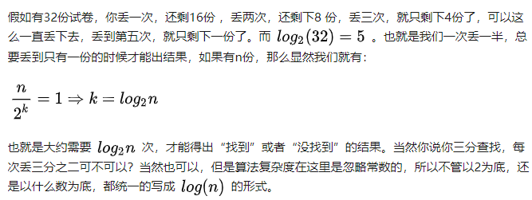
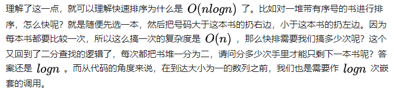
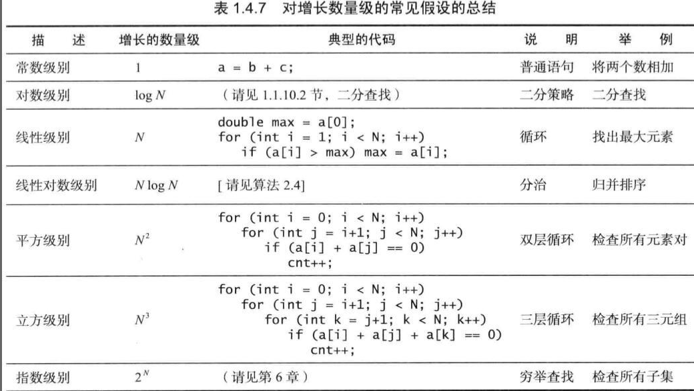

常见算法复杂度对比图：

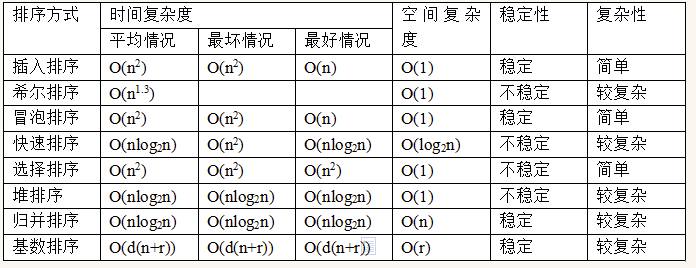
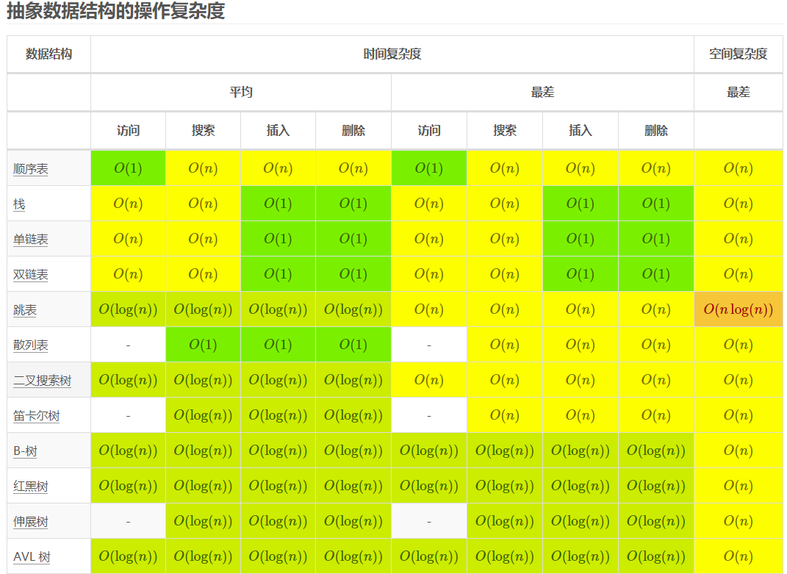
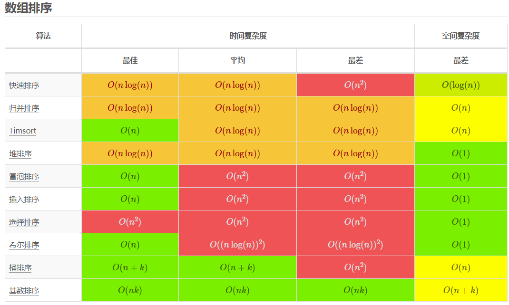

## 2. 常见排序算法的时间复杂度和空间复杂度是怎样的？

| 排序算法 | 平均时间 | 最好 | 最坏 | 空间 | 稳定性 |
|---------|---------|------|------|------|-------|
| 冒泡排序 | O(n²) | O(n) | O(n²) | O(1) | 稳定 |
| 插入排序 | O(n²) | O(n) | O(n²) | O(1) | 稳定 |
| 选择排序 | O(n²) | O(n²) | O(n²) | O(1) | 不稳定 |
| 快速排序 | O(nlogn) | O(nlogn) | O(n²) | O(logn) | 不稳定 |
| 归并排序 | O(nlogn) | O(nlogn) | O(nlogn) | O(n) | 稳定 |
| 堆排序 | O(nlogn) | O(nlogn) | O(nlogn) | O(1) | 不稳定 |
| 桶排序 | O(n+k) | O(n+k) | O(n²) | O(n+k) | 稳定 |
| 计数排序 | O(n+k) | O(n+k) | O(n+k) | O(k) | 稳定 |

## 3. 什么是稳定排序？哪些排序是稳定的？

**稳定排序**指如果两个元素相等，排序后它们的相对位置不变。**不稳定排序**则可能改变相等元素的相对顺序。

- **稳定排序**：冒泡排序、插入排序、归并排序、计数排序、桶排序
- **不稳定排序**：选择排序、快速排序、堆排序、希尔排序

## 4. 说说快速排序的原理和优化

**核心思想是分治**：
- 选择一个数作为**基准（pivot）**
- 通过一趟排序将数组分成两部分，**左边都比基准小，右边都比基准大**
- 再对两部分递归执行快速排序

实现上使用**双指针**，从左右两端同时遍历，左侧大于基准且右侧小于基准时交换，直到指针相遇，将基准放到正确位置。

**优化方式**：
- **基准选择优化**：随机基准数、三数取中（取首、中、尾三个数的中位数）
- **小数组使用插入排序**：当数组较小时（如长度 < 47），快速排序性能不如插入排序，因为递归调用有额外开销。Java `DualPivotQuicksort` 的阈值就是 47
- **双枢轴（快速三向切分）**：将数组分为小于枢轴、等于枢轴、大于枢轴三部分，将相等元素聚集起来避免重复比较，对重复数据多的场景更高效
- **五取样划分**：类似 BFPRT 算法，优化划分策略，使复杂度介于 O(N) 到 O(NlogN) 之间

## 5. 说说归并排序的原理

**归并排序**采用**分治法**，将已有序的子序列合并得到完全有序的序列。

**步骤**：
- 将数组**一分为二**，递归拆分直到每组只有一个元素
- 从底部开始**两两归并**，合并两个有序数组为一个有序数组
- 不断向上合并，直到得到一个完整的有序数组

**优化**：
- **小数组使用插入排序**，避免递归调用的开销
- 在 merge 前判断 `arr[mid] <= arr[mid+1]`，如果成立则已经有序，无需归并

## 6. 说说冒泡排序

从左往右依次比较相邻的两个值，如果左侧大于右侧则交换位置。每轮遍历后最大的数会"冒泡"到末尾。

**优化**：使用 `swapped` 标志位记录本轮是否有交换，如果没有交换说明已经有序，提前终止。

## 7. 说说插入排序

**核心思想**：每一步将待排序的记录**插入到前面已经排好序的有序序列中**，然后后移插入位置后的元素，直到插完所有元素。

适合**数据量小**或**接近有序**的数据，此时时间复杂度接近 O(n)。

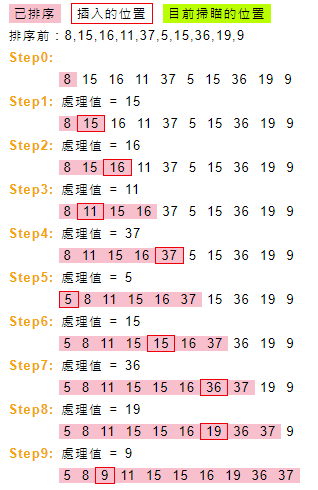

## 8. 说说桶排序和计数排序

**桶排序**：将最大值和最小值之间的范围分成若干个区间（桶），将各元素放入对应区间的桶中，对每个桶分别排序（可用快排或归并），最后合并汇总。

**计数排序**：适合**最大值和最小值差值不大**的场景。把数组元素作为数组下标，用临时数组统计每个元素出现的次数（`temp[i] = m` 表示元素 i 出现 m 次），最后按顺序汇总。

## 9. 什么是堆？堆有哪些性质？

**堆**是一类特殊的完全二叉树，父节点会大于或等于（大顶堆）所有子节点，或小于等于（小顶堆）所有子节点。

**性质**：
- **完全二叉树**：除最后一层外，其他层节点数都达到最大，最后一层节点都连续集中在最左边
- 常用**数组实现**，通过数组索引映射父子关系
- 主要用于实现**优先级队列**

**父子关系公式**（下标从 0 开始）：
- 左孩子 = `arr[2i+1]`
- 右孩子 = `arr[2i+2]`
- 大顶堆：`arr[i] >= arr[2i+1]` 且 `arr[i] >= arr[2i+2]`
- 小顶堆：`arr[i] <= arr[2i+1]` 且 `arr[i] <= arr[2i+2]`
- **最后一个非叶子节点下标 = `length/2 - 1`**
- 第一个叶子节点下标 = `length/2`

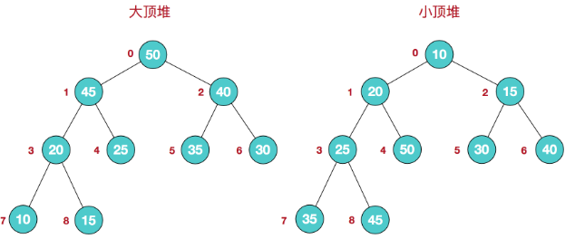
堆的数组映射：

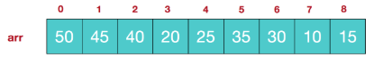

大顶堆示例：

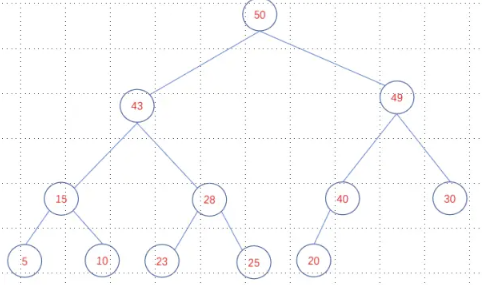

堆是完全二叉树，数组中每个数据单元都有数据项：

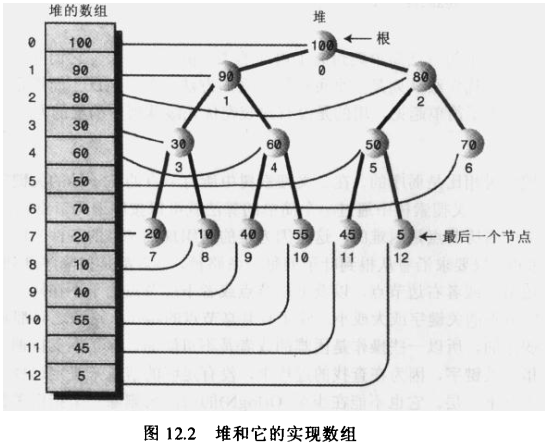

## 10. 说说堆排序的原理和步骤

**堆排序**是利用堆这种数据结构的**选择排序**，最好、最坏、平均时间复杂度均为 **O(nlogn)**，是**不稳定排序**。

**基本思想**：升序用**大顶堆**，降序用**小顶堆**。将待排序序列构造成一个大顶堆，整个序列的最大值就是堆顶根节点，将其与末尾元素交换，末尾即为最大值，再将剩余 n-1 个元素重新构造成堆得到次小值，如此反复执行。

**步骤一：建堆**

从**最后一个非叶子节点**（下标 `length/2 - 1`）开始，向前循环调整每个节点及其子树：

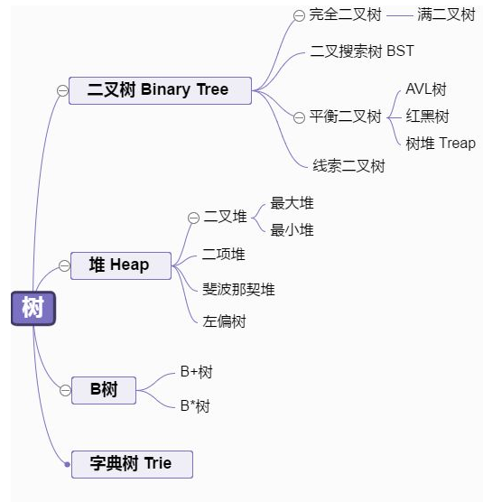

调整方法：
- 从当前父节点的左子节点开始（`2*i + 1`）
- 如果左子节点小于右子节点，则使用右子节点比较
- 如果子节点大于父节点，将子节点值赋给父节点，并以下移的子节点作为新的父节点继续调整
- 如果子节点小于等于父节点，说明已找到正确位置，结束本次调整

**步骤二：排序**

将堆顶与当前最后一个节点交换，再对剩余节点（排除已排序的末尾）重新调整为大顶堆，重复直到排序完成。
