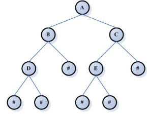
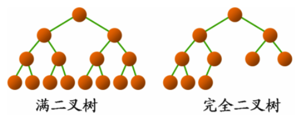
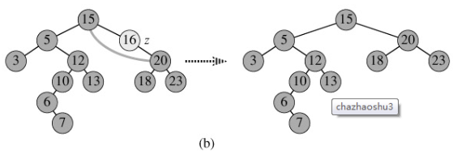
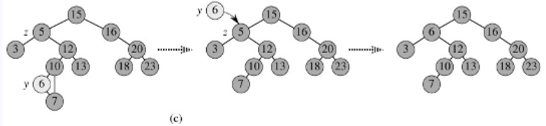
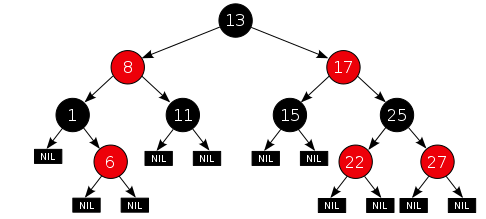
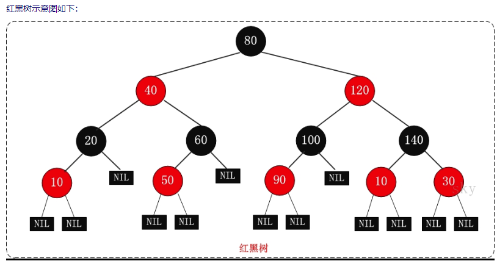
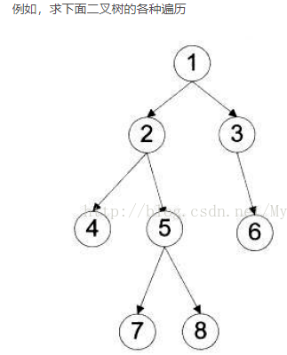
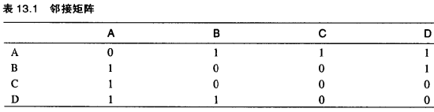
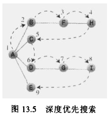
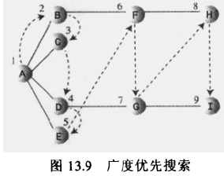

## 1. 为什么需要树这种数据结构？

树**结合了有序数组和链表的优点**：在树中查找数据的速度和在有序数组中一样快（O(logn)），插入和删除数据的速度和链表一样快（O(1)）。

- **有序数组**：二分查找快（O(logn)），但插入/删除需要移动大量元素，很慢
- **链表**：插入/删除快（O(1)），但查找必须从头遍历，很慢（O(n)）
- **树**：通过链式结构连接节点，同时利用二分性质保证查找效率

## 2. 什么是二叉树？满二叉树和完全二叉树的区别？

**二叉树**的每个节点至多只有两棵子树（不存在度大于2的节点），子树有左右之分，次序不能颠倒。

- 二叉树的第 i 层至多有 **2^(i-1)** 个节点
- 深度为 k 的二叉树至多有 **2^k - 1** 个节点
- 终端节点数 n0 与度为2的节点数 n2 满足：**n0 = n2 + 1**



**满二叉树**：除叶子节点外，所有节点都有两个子节点，所有叶子节点在同一层。节点总数 = **2^k - 1**（一定是奇数）。

**完全二叉树**：除最后一层外，其他层节点数都达到最大，最后一层节点**连续集中在最左边**。去除最后一层后是一个满二叉树。



## 3. 什么是二叉查找树（BST）？它的性质和时间复杂度？

**二叉查找树（Binary Search Tree）** 又称二叉排序树，具有以下性质：
- 左子树所有节点的值**小于**根节点
- 右子树所有节点的值**大于或等于**根节点
- 左右子树也分别是二叉查找树
- 通常没有键值相等的节点

**中序遍历BST得到有序序列**。

**时间复杂度**：平均 O(logn)，最坏 O(n)。最坏情况发生在插入有序序列时，BST退化为链表。BST的高度决定了查找效率，因此需要**平衡树**来解决退化问题。

## 4. 二叉查找树的插入和删除操作是怎样的？

**插入过程**：
- 若树为空，插入节点为根节点
- 若插入值小于根节点值，插入左子树
- 若插入值不小于根节点值，插入右子树

**删除操作分三种情况**：

1）**叶子节点**：直接删除，修改父节点指针


2）**单支节点**（只有左子树或右子树）：让子树与父节点相连，删除当前节点



3）**左右子树均非空**：找到p的后继y（或前驱x），用y的值替换p的值，再删除y。因为y一定没有左子树（或x一定没有右子树），可转化为情况2处理



## 5. 什么是平衡二叉树？什么是AVL树？

**平衡二叉树（Balanced Binary Tree）** 又称AVL树，性质：
- 左右子树高度差的绝对值**不超过1**
- 左右子树也都是平衡二叉树
- 常用算法有**红黑树、AVL树**等

**AVL树**是最早的自平衡二叉查找树，任何节点的两个子树高度差最大为1。插入和删除需要通过**旋转**来重新平衡，时间复杂度稳定在 **O(logn)**。

平衡二叉树的节点数递推公式：**F(n) = F(n-1) + F(n-2) + 1**（类似斐波那契数列）。

## 6. 什么是红黑树？有哪些性质？

**红黑树**是一种自平衡二叉查找树，每个节点带有颜色属性（红或黑）。与AVL树相比，红黑树通过**近似平衡**（而非严格平衡）来减少旋转次数，插入/删除性能更好。

**红黑树的五个性质**：
- 性质1：节点是**红色或黑色**
- 性质2：**根节点是黑色**
- 性质3：所有叶子节点（**NIL空节点**）是黑色
- 性质4：**红色节点的子节点必须是黑色**（不能有两个连续的红色节点）
- 性质5：从任一节点到其每个叶子节点的所有路径都包含**相同数目的黑色节点**

**关键推论**：从根到叶子的最长路径**不超过最短路径的两倍**，因此红黑树是近似平衡的。




**变色**：当插入或删除节点违反红黑树性质时，通过变色和旋转来恢复平衡。

## 7. 树的遍历方式有哪些？

四种遍历思想（以前序遍历结果 `1 2 4 5 7 8 3 6` 为例）：

| 遍历方式 | 顺序 | 结果示例 |
|---------|------|---------|
| **前序遍历**（先根遍历） | 根 → 左 → 右 | 1 2 4 5 7 8 3 6 |
| **中序遍历** | 左 → 根 → 右 | 4 2 7 5 8 1 3 6 |
| **后序遍历** | 左 → 右 → 根 | 4 7 8 5 2 6 3 1 |
| **层次遍历** | 按层从左到右 | 1 2 3 4 5 6 7 8 |



前/中/后序遍历可以使用**递归**或**栈**实现，层次遍历使用**队列**实现。

## 8. 如何通过前序遍历和中序遍历结果构造一棵二叉树？

**算法思想**（递归）：
- 前序遍历的**第一个值是根节点**
- 在中序遍历中找到根节点的位置 i，左侧为左子树，右侧为右子树
- 左子树的前序遍历为 `preOrder[1..i]`，中序遍历为 `inOrder[0..i-1]`
- 右子树的前序遍历为 `preOrder[i+1..]`，中序遍历为 `inOrder[i+1..]`
- 递归构建左右子树

```java
private static TreeNode helper(int[] preOrder, int pStart, int pEnd,
                               int[] inOrder, int iStart, int iEnd) {
    if (pStart > pEnd || iStart > iEnd) return null;
    TreeNode root = new TreeNode(preOrder[pStart]);
    int i = 0;
    while (inOrder[iStart + i] != preOrder[pStart]) i++;
    root.left = helper(preOrder, pStart + 1, pStart + i,
                       inOrder, iStart, iStart + i - 1);
    root.right = helper(preOrder, pStart + i + 1, pEnd,
                        inOrder, iStart + i + 1, iEnd);
    return root;
}
```

## 9. 什么是图？图的存储方式有哪些？

**图**是一种复杂的非线性结构，顶点（而非节点）之间通过边连接。从数学意义上说，树是图的一种。

图的两种主要存储方式：

**邻接矩阵**：N×N 的二维数组，`matrix[i][j] = 1` 表示顶点 i 和 j 之间存在边。矩阵的**上三角是下三角的镜像**（无向图）。



**邻接表**：一个链表数组，每个链表存储与当前顶点邻接的所有顶点，节省空间。


## 10. 什么是DFS和BFS？它们的实现方式和适用场景？

**DFS（Depth First Search，深度优先搜索）**
- 使用**栈**（Stack）实现，也可用递归
- 沿着一条路径深入到不能再深入，再回溯
- 遍历顺序：A → B → D → E → I → C → F → G → H
- 每次弹出栈顶节点，将其子节点（或邻接节点）压入栈



```java
bool DFS(Node n, int d) {
    if (d == 4) return true; // 找到解
    for (Node next : n.neighbors) {
        if (!visited[next]) {
            visited[next] = true;
            if (DFS(next, d + 1)) return true;
            visited[next] = false; // 回溯
        }
    }
    return false;
}
```

**BFS（Breadth First Search，广度优先搜索）**
- 使用**队列**（Queue）实现
- 按层依次访问，先访问离起点近的节点
- 遍历顺序：A → B → C → D → E → F → G → H → I
- 每次弹出队首节点，将其子节点（或邻接节点）加入队尾



```java
bool BFS(Node Vs, Node Vd) {
    Queue<Node> Q;
    Q.push(Vs);
    visited[Vs] = true;
    while (!Q.isEmpty()) {
        Node Vn = Q.front();
        Q.pop();
        for (Node Vw : Vn.neighbors) {
            if (Vw == Vd) return true;
            if (isValid(Vw) && !visited[Vw]) {
                Q.push(Vw);
                visited[Vw] = true;
            }
        }
    }
    return false;
}
```

**适用场景**：
- **BFS**：寻找**非加权图**中两点的最短路径（第一次遇到目标节点即为最短路径）；扩散性访问连通分量；染色法判断**二分图**
- **DFS**：遍历所有路径、拓扑排序、检测环

**注意**：对于加权图的最短路径，BFS不适用（因为BFS返回的是边数最少的路径，而非权重最小的路径），此时应使用 **Dijkstra算法**。
