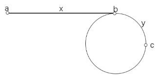

## 1. 链表反转的实现方式有哪些？

两种方式：**递归**和**双指针迭代**。

**递归**：利用递归调用栈，将当前节点之后的链表反转，再将当前节点接到反转后的链表末尾。关键是不能返回null，必须返回反转后的头节点。

```
ListNode tmp = reverseListRecursion(head.next);
head.next.next = head;
head.next = null;
return tmp;
```

**双指针迭代**：每次将cur的next指向前一个节点，然后将原始的next作为cur进行下一轮循环。

```
ListNode prev = null, cur = head;
while (cur != null) {
    ListNode temp = cur.next;
    cur.next = prev;
    prev = cur;
    cur = temp;
}
return prev;
```

## 2. 如何在O(1)时间删除链表节点？

用下一个节点的值**覆盖**当前节点的值，然后将当前节点的next指向下下个节点。

```
node.val = node.next.val;
node.next = node.next.next;
```

注意：如果删除的是尾节点，无法用此方法，仍需O(n)遍历。

## 3. 如何求链表倒数第k个节点？

设置两个指针p1和p2都指向head，**p2先向前走k步**，这样p1和p2之间间隔k个节点，然后**p1和p2同时向前移动**，当p2走到链表末尾时，p1指向的就是倒数第k个节点。也可使用堆栈实现。

## 4. 如何求链表的中间节点？

使用**快慢指针**：一个指针每次向后移动两步，一个每次移动一步，当快指针移到尾节点时，慢指针即为中间节点。如果链表长度为偶数，返回中间两个节点的任意一个。

## 5. 如何判断单链表是否存在环？

使用**快慢指针**：一个每次移动一步，另一个移动两步，两个指针移动速度不一样，如果存在环，两个指针一定会在环里相遇。

## 6. 如何找到环的入口点？

先用快慢指针找到相遇点，然后将快指针移回链表头部，两个指针都改为每次走一步，当它们再次相遇时，就是环的入口点。



**原理**：设起点到环入口距离为a，相遇点M到环入口距离为b，环周长为L。慢指针走了n步，快指针走了2n步，快指针比慢指针多跑一圈：2n - n = L，所以n = L。相遇点到入口的距离b加上a正好等于L，因此从起点和相遇点同时同速出发，必定在入口相遇。

## 7. 如何判断两个链表是否相交？

两种方法：
- **Hash表法**：遍历链表A，将每个节点引用存储在hash表中，再遍历链表B每个节点，如果在hash表中，则为相交节点
- **双指针法**：指针pA指向A链表，pB指向B链表依次遍历，pA到末尾后指向headB，pB到末尾后指向headA，这样消除了长度差，第一次相遇就是相交节点

双指针原理：两个指针第二次到达末尾时走过的距离相同（都是m+n），由于末尾到相交点的距离相同，第一个相遇的节点即为相交节点。

## 8. 链表解题有哪些常用技巧？

- **尾插法"新建"链表**：不修改原链表指针，只将原链表上满足条件的节点"拆"下，拼接到新链表上
- **dummy虚拟头节点**：当头节点可能被操作时（如删除、反转），使用dummy节点避免特殊处理
- 第一反应应判断头节点是否会被操作，是否需要dummy节点

## 9. 什么是队列？有哪些实现方式？

**队列**是一种**先进先出（FIFO）**的线性数据结构，支持在队尾插入（enqueue）、在队首删除（dequeue），插入和删除均为O(1)。

实现方式：
- **数组实现**：使用数组+两个指针（head和tail），但存在"假溢出"问题（tail到末尾后前面有空闲位置却无法利用）
- **循环队列**：解决假溢出，通过取模运算复用数组空间。判空：`head == tail`，判满：`(tail + 1) % capacity == head`
- **链表实现**：链式队列，入队尾插，出队头删，不受容量限制

## 10. 什么是阻塞队列和并发队列？

**阻塞队列**（BlockingQueue）：
- 队列为空时，**消费者阻塞等待**直到有元素入队
- 队列满时，**生产者阻塞等待**直到有元素被消费
- 典型实现：`ArrayBlockingQueue`（有界，基于数组，一把锁）、`LinkedBlockingQueue`（可有界可无界，两把锁分离）

**并发队列**（ConcurrentQueue）：
- 线程安全的非阻塞队列，基于**CAS**实现无锁并发
- 典型实现：`ConcurrentLinkedQueue`，使用循环CAS避免加锁，性能高但无法阻塞等待

## 11. 什么是哈希表？如何处理哈希冲突？

**哈希表**（Hash Table）通过**哈希函数**将key映射到数组位置，实现O(1)的查找、插入和删除。

哈希冲突的两种主流解决方案：

**开放寻址法**：如果存储位置已被占用，就**向后顺次寻找空闲位置**插入。查找时同样线性探测直到找到目标或遇到空位。

**拉链法**（链表法）：在冲突位置**维护一个链表**，所有哈希值相同的元素都存储在同一个链表中。

## 12. 什么是负载因子和rehash？

**负载因子** = **填入表中的元素个数 / 散列表的长度**。

- 负载因子越大，空闲位置越少，冲突越多，性能下降
- 负载因子过小，内存利用率低，造成浪费

**rehash**：当负载因子超过阈值（如Java HashMap为0.75）时**扩容**（通常翻倍）；负载因子过低时**收缩**。扩容后需重新计算所有元素的哈希位置，分配到新数组。

## 13. 开放寻址法和链表法各有什么优缺点？

**开放寻址法**：
- 优点：数据在数组中，**连续内存空间，CPU缓存友好**，查询快
- 缺点：删除需**特殊标记**（不能直接置空，否则中断探测链）；冲突代价高，负载因子必须小于1，**更浪费内存**

**链表法**：
- 优点：**内存利用率高**，节点按需创建；对**大负载因子容忍度高**（负载因子为10仍优于顺序查找）
- 缺点：**存储指针额外消耗内存**（小对象场景明显）；节点**零散分布，CPU缓存不友好**

## 14. 什么是布隆过滤器？原理是什么？

**布隆过滤器**是一种**概率型数据结构**，高效地插入和查询，用于判断"某样东西**一定不存在**或者**可能存在**"。

**原理**：
- 底层是一个**位数组**（bit array），初始所有位为0
- 插入时通过**K个散列函数**将元素映射到位数组中的K个点，**将这些位置设为1**
- 查询时用K个散列函数计算位置，如果**有任何一位为0**，则元素**一定不存在**；如果**全部为1**，则元素**可能存在**（有误判率）

**特点**：
- **空间效率极高**，远超一般数据结构
- 存在**误判率**（假阳性），但不会漏判（假阴性为0）
- 无法删除元素（Counting Bloom Filter可支持删除）
