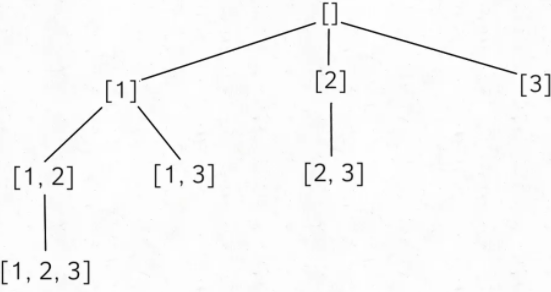
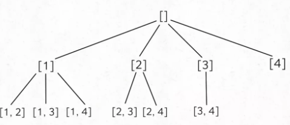
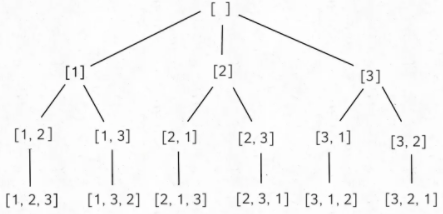

## 1. 什么是动态规划？动态规划的操作步骤是什么？

**动态规划（DP）** 的核心思想是"大事化小，小事化了"——将一个大问题转化成几个小问题，求解小问题，推出大问题的解。

**操作四步**：
1. **确定问题状态**：提炼最后一步，将原问题转化为子问题
2. **转移方程**：把问题方程化，建立状态间的递推关系
3. **设置初始条件和边界情况**：按照实际逻辑设定
4. **确定计算顺序并求解**

## 2. 哪些问题可以用动态规划解决？

DP适用于具有**最优子结构**和**重叠子问题**的问题，常见类型包括：
- **坐标型**：如棋盘路径问题
- **最小路径和**
- **最值问题**
- **编辑距离**
- **位操型**
- **序列型**：如LIS、LCS
- **博弈型**：如石子游戏
- **背包型**：0/1背包、完全背包
- **双序列**：如编辑距离、最长公共子序列

## 3. 什么是递归？递归的三要素是什么？

**递归**是一种函数自己调用自己的编程方法，核心是将大问题分解为相同结构的小问题。

**递归三要素**：
1. **终止条件**：递归必须有一个明确的出口，否则会栈溢出
2. **递推关系**：当前问题与子问题之间的函数关系
3. **返回值**：每一层递归需要返回什么给上一层

**递归与DP的关系**：递归是DP的基础实现方式之一（自顶向下+备忘录），DP通过备忘录消除递归中的重叠子问题重复计算。

## 4. 什么是回溯算法？回溯算法的模板是什么？

**回溯算法**是一种通过穷举所有可能来寻找解的算法，本质是**深度优先搜索（DFS）+ 剪枝**。它通过"做选择→递归→撤销选择"的框架遍历所有解空间。

**核心模板**（Python伪码）：

```
result = []
def backtrack(路径, 选择列表):
    if 满足结束条件:
        result.add(路径)
        return
    for 选择 in 选择列表:
        做选择
        backtrack(路径, 选择列表)
        撤销选择
```

**三个关键点**：路径（已做的选择）、选择列表（当前可做的选择）、结束条件（到达决策树底层）。

## 5. 回溯算法如何解决子集问题（不重复数组）？

输入不含重复数字的数组，如 `nums = [1,2,3]`，输出所有子集（8个，含空集）。

核心思路：**每遍历到一个层级就把当前路径加入结果**，每一层递归从上一层递归的后一位（i+1）开始，避免重复使用元素。

```java
List<List<Integer>> result = new ArrayList<>();

public List<List<Integer>> subSets(int[] nums) {
    LinkedList<Integer> track = new LinkedList<>();
    backtrack(nums, 0, track);
    return result;
}

private void backtrack(int[] nums, int start, LinkedList<Integer> track) {
    result.add(new ArrayList<>(track));   // 每层都加入结果
    for (int i = start; i < nums.length; i++) {
        track.add(nums[i]);
        backtrack(nums, i + 1, track);   // 从下一个字符开始，剪枝
        track.removeLast();
    }
}
```



## 6. 回溯算法如何解决有重复数组的子集问题？

先对数组**排序**，使相同元素相邻。在将当前数字加入track前，判断是否和上一个相同，相同则跳过。

```java
private void backtrack(int[] nums, int start, LinkedList<Integer> track) {
    result.add(new ArrayList<>(track));
    for (int i = start; i < nums.length; i++) {
        if (i > start && nums[i] == nums[i - 1]) {   // 跳过重复
            continue;
        }
        track.add(nums[i]);
        backtrack(nums, i + 1, track);
        track.removeLast();
    }
}
```

## 7. 回溯算法如何解决组合问题？

输入n和k，输出[1..n]中k个数字的所有组合（如n=4,k=2，输出[1,2],[1,3],[1,4],[2,3],[2,4],[3,4]）。

与子集相比，**只在track长度等于k时才加入结果**，剪枝方式一样（i+1）。

```java
List<List<Integer>> result = new ArrayList<>();

public List<List<Integer>> combine(int n, int k) {
    LinkedList<Integer> track = new LinkedList<>();
    backtrack(n, 0, k, track);
    return result;
}

private void backtrack(int n, int start, int k, LinkedList<Integer> track) {
    if (track.size() == k) {                     // 满足长度才加入
        result.add(new ArrayList<>(track));
        return;
    }
    for (int i = start; i < n; i++) {
        track.add(i + 1);                        // 从1开始
        backtrack(n, i + 1, k, track);
        track.removeLast();
    }
}
```



有重复数组的组合问题：先排序，添加前判断是否与上一个重复，重复则跳过。

## 8. 回溯算法如何解决不重复数组的排列问题？

输入[1,2,3]，输出6种全排列。

排列与组合的区别：**排列关心顺序，每一层递归都必须从0开始遍历所有元素**，用`used[]`数组记录当前递归已访问过的位置，深层递归时跳过。

```java
List<List<Integer>> result = new ArrayList<>();
boolean[] used;

public List<List<Integer>> permute(int[] nums) {
    LinkedList<Integer> track = new LinkedList<>();
    used = new boolean[nums.length];
    backtrack(nums, track);
    return result;
}

private void backtrack(int[] nums, LinkedList<Integer> track) {
    if (track.size() == nums.length) {
        result.add(new ArrayList<>(track));
        return;
    }
    for (int i = 0; i < nums.length; i++) {
        if (used[i]) continue;
        track.add(nums[i]);
        used[i] = true;                          // 标记已访问
        backtrack(nums, track);
        used[i] = false;                         // 撤销标记
        track.removeLast();
    }
}
```



核心区别：组合用`i+1`剪枝（对元素位置剪枝），排列用`used[]`数组（对已访问元素剪枝）。

## 9. 回溯算法如何解决有重复数组的排列问题？

先排序，然后用`pre`变量记录上一个访问的值，配合`used[]`数组一起剪枝。

```java
private void permute(int[] nums, LinkedList<Integer> track) {
    if (track.size() == nums.length) {
        result.add(new ArrayList<>(track));
        return;
    }
    int pre = Integer.MIN_VALUE;
    for (int i = 0; i < nums.length; i++) {
        if (pre == nums[i] || used[i]) continue;  // 重复值或已访问跳过
        track.add(nums[i]);
        used[i] = true;
        pre = nums[i];
        permute(nums, track);
        used[i] = false;
        track.removeLast();
    }
}
```

## 10. 什么是贪心算法？它的原理和步骤是什么？

**贪心算法**在每一步中都做出当时看起来最佳的选择，通过**局部最优选择**实现全局最优解。

**贪心算法的步骤**：
1. 确定问题的最优子结构
2. 设计一个递归算法
3. 证明做出贪心选择后只剩一个子问题
4. 证明贪心选择总是安全的
5. 设计递归算法实现贪心策略
6. 将递归算法转换为迭代算法

## 11. 贪心算法的两个性质是什么？与动态规划的关系？

**两个性质**：
1. **贪心选择性质**：全局最优解可以通过局部最优（贪心）选择来达到，只考虑当前最佳选择而不考虑子问题的结果
2. **最优子结构**：问题的一个最优解包含了其子问题的最优解

**与DP的关系**：
- 能用贪心解决的问题一般也可以用DP解决，因为贪心所需的性质DP也都需要
- **贪心是简化版的DP**：DP需要计算所有子问题的解再选择最优，贪心只需要选当前最优，不需要计算每个选择
- 贪心通常比DP更高效，但适用范围更窄
