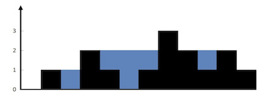
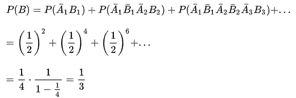
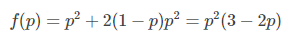
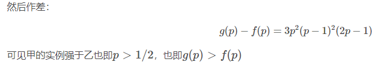
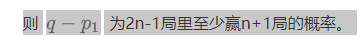
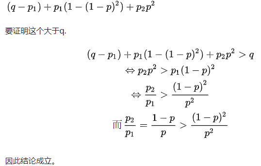

## 1. 给定一个直方图（柱状图），从上面倒水，能存多少水量？

给定数组 `[0,1,0,2,1,0,1,3,2,1,2,1]` 表示的直方图，宽度为 1，求能接多少单位的水。

输出：6

**核心思路**：每个位置能存的水量 = `min(左边最高柱, 右边最高柱) - 当前高度`。

**三种解法**：

- **暴力法**（O(n²)）：每个位置向左右分别遍历找最高柱，计算水量
- **预计算左右最大值**（O(n)时间，O(n)空间）：从左到右遍历得到`leftMax[i]`，从右到左得到`rightMax[i]`，再遍历累加`min(leftMax[i], rightMax[i]) - height[i]`
- **双指针**（O(n)时间，O(1)空间）：左右指针从两端向中间移动，维护左右两侧已扫过的最大高度`leftMax`和`rightMax`。每次移动**较矮一侧的指针**，如果当前高度小于该侧最大高度，则累加水量，否则更新最大高度

双指针是面试最推荐的解法，代码简洁且空间最优。

## 2. 如何快速得到一个数据流中的中位数？

数据流中元素不断加入，需要高效地插入新元素和获取中位数。中位数定义：奇数个数时为中间数，偶数个数时为中间两数的平均值。

使用 **大顶堆 + 小顶堆** 实现：

- **大顶堆**（max-heap）：存放数据流中较小的一半
- **小顶堆**（min-heap）：存放数据流中较大的一半

**两条核心约束**：
- 两个堆的数据个数差不超过 1，保证中位数只会出现在两个堆的交接处
- **大顶堆所有数据 ≤ 小顶堆所有数据**，满足排序要求

**插入操作**（O(logn)）：
- 先插入大顶堆，再将大顶堆最大值弹出插入小顶堆（保证小顶堆的数据都 ≥ 大顶堆）
- 如果小顶堆大小 > 大顶堆，将小顶堆最小值弹回大顶堆（平衡两堆大小）

**取中位数**（O(1)）：
- 如果两个堆大小相等，中位数 = `(大顶堆.peek() + 小顶堆.peek()) / 2`
- 如果大顶堆多一个，中位数 = `大顶堆.peek()`
- 如果小顶堆多一个，中位数 = `小顶堆.peek()`

## 3. 常见的缓存淘汰算法有哪些？

**LRU（Least Recently Used，最近最少使用）**

核心原则：**如果一个数据最近没有被访问到，那么将来被访问的可能性也很小**。当缓存满时，淘汰最久没有被访问的数据。

**LRU 的 HashMap + 双向链表实现**：
- **HashMap**：O(1) 定位缓存项
- **双向链表**：按访问时间排序，链表头为最近访问，链表尾为最久未访问
- **get(key)**：HashMap 获取节点，若存在则将该节点**移到链表头**
- **put(key, value)**：若 key 已存在则更新值并移到链表头；若不存在且缓存满，**删除链表尾节点**并从 HashMap 移除，再插入新节点到链表头

双向链表的优势：删除尾节点和移动节点到头部的操作都是 O(1)。

**LFU（Least Frequently Used，最不经常使用）**

淘汰**访问频率最低**的数据。如果频率相同，淘汰最早的那个。实现更复杂，需要维护频率到数据项的映射。

**FIFO（First In First Out，先进先出）**

按数据进入缓存的顺序淘汰，**先进入的先被淘汰**，不考虑访问频率或最近性。

实际应用中最常用的是 **LRU**，Redis、MySQL Buffer Pool 等都使用了类似 LRU 的淘汰策略。

## 4. 常见的限流算法有哪些？

**令牌桶（Token Bucket）**

以**恒定速率**向桶中放入令牌，桶有容量上限。每次请求从桶中取一个令牌，取到则通过，取不到则拒绝。

特点：能应对**突发流量**——桶中积累的令牌可以短时间内被大量请求消耗。

**漏桶（Leaky Bucket）**

请求以**任意速率**进入漏桶，桶以**恒定速率**流出请求。超过桶容量的请求被丢弃（拒绝）。

特点：强制请求以固定速率处理，**平滑流量**，但无法应对突发流量。

**固定窗口（Fixed Window）**

将时间划分为固定长度的窗口（如 1 秒），统计每个窗口内的请求数，超过阈值则拒绝。实现简单但存在**临界问题**——窗口切换时可能出现双倍流量。

**滑动窗口（Sliding Window）**

对固定窗口的优化，将窗口划分为更细粒度的时间格子（如 1 秒划为 10 个 100ms 格子）。统计当前时间点往前一个完整窗口的请求总量。精度取决于格子粒度，格子越细越精确。

**Sentinel 滑动窗口**：将 1 秒划分为多个时间格（如 500ms/格），每个格子独立计数。计算当前时间所在窗口的总请求数时，累加当前格子及之前所有完整格子的计数。统计周期为 `[当前时间 - 窗口大小, 当前时间]`。

## 5. 甲乙轮流抛硬币，先抛的人优势多大？

甲先抛，**抛到正面胜**，求甲乙各自胜率。

**解法一（对称性推导）**：

设甲胜率为 x。甲第一次抛：
- 正面（概率 1/2）：甲直接胜
- 反面（概率 1/2）：轮到乙先抛，此时乙相当于"新的先手"，胜率为 x

因此：`x = 1/2 + (1/2) * (1 - x)` → `x = 2/3`

**解法二（等比级数求和）**：

甲在第 1、3、5...轮获胜的概率：
- 第 1 轮：`1/2`
- 第 3 轮：`(1/2)³`
- 第 5 轮：`(1/2)⁵`

甲胜率 = `1/2 + 1/8 + 1/32 + ... = (1/2) / (1 - 1/4) = 2/3`

乙的胜率即为 `1/3`。

**结论**：先抛的人优势巨大，胜率是后抛者的 **2 倍**。

## 6. 五局三胜和三局两胜，哪种更公平？

假设强队单局胜率为 p（p > 0.5），比较两种赛制下强队的获胜概率。

**三局两胜（先赢 2 局胜）**：

强队获胜概率 = `p² + C(2,1)·p²(1-p) = p²(3-2p)`

- 2 局结束：`p²`
- 3 局结束：`2·p²(1-p)`

**五局三胜（先赢 3 局胜）**：

强队获胜概率 = `p³ + C(3,2)·p³(1-p) + C(4,2)·p³(1-p)² = p³ + 3p³(1-p) + 6p³(1-p)²`

- 3 局结束：`p³`
- 4 局结束：前三局赢两局（`C(3,2)·p²(1-p)`），再赢第 4 局（`p`），即 `3p³(1-p)`
- 5 局结束：前四局赢两局（`C(4,2)·p²(1-p)²`），再赢第 5 局（`p`），即 `6p³(1-p)²`

**结论**：对于任意 p > 0.5，五局三胜的胜率 > 三局两胜的胜率。**比赛局数越多，强队胜率越高，赛制越"公平"**（更能体现真实实力差距）。

因此 NBA 总决赛采用七局四胜，就是为了最大程度避免偶然性，让实力更强的球队夺冠。

**一般性证明（2n+1 局 vs 2n-1 局）**：

设强队在 2n-1 局赛制中的胜率为 q，则 2n+1 局赛制下：
- 前 2n-1 局至少赢 n+1 局 → 直接胜
- 前 2n-1 局赢 n 局 → 需要后两场至少赢 1 局：`C(2n-1,n)·p^n(1-p)^{n-1} · [1-(1-p)²]`
- 前 2n-1 局赢 n-1 局 → 需要后两场全赢：`C(2n-1,n-1)·p^{n-1}(1-p)^n · p²`

因此 2n+1 局的胜率始终大于 2n-1 局。

