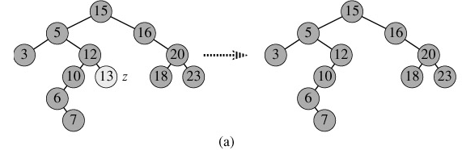
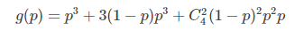
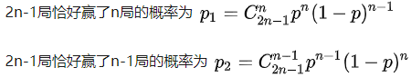
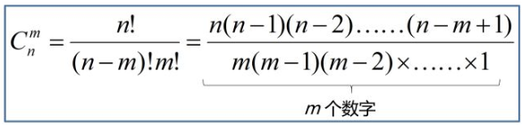
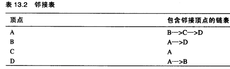

## 1. 文本编辑器中常用的数据结构有哪些？Gap Buffer 和 Rope 的原理是什么？

文本编辑器需要高效支持在光标处的插入和删除操作。常用数据结构有：

- **Gap Buffer（间隙缓冲区）** — 一个数组，在光标位置维护一段空白区域（gap），插入时直接填充gap，删除时调整gap指针。利用**编辑局部性**（连续编辑集中在光标附近），多数操作 O(1)，移动gap时 O(n)。Emacs、Notepad++ 使用此方案
  - 数据结构：一个字符数组 + `gapStart` + `gapEnd` 两个指针，数组分为 gap 前内容、gap 区域、gap 后内容三段
  - 插入：gap 足够大时直接在 `gapStart` 处写入并后移指针，O(1)；gap 不足时扩容（通常翻倍），O(n)
  - 删除：直接前移或后移 gap 指针，O(1)
  - 移动光标（移动gap）：需要将字符从 gap 一侧拷贝到另一侧，O(m)，m 为移动距离
  - 逻辑下标转实际下标：`realIndex = logicalIndex < gapStart ? logicalIndex : logicalIndex + gapLength()`

- **Rope（绳索）** — 一种二叉树/ B+树结构，叶节点存储字符串子串及其长度（权重），内部节点存储左子树权重和。插入、删除、随机访问均为 **O(log n)**。Zed 编辑器使用 SumTree（B+树变体）实现 Rope，每个节点包含摘要（长度、行数等），支持并发和写时复制
  - 相比 Gap Buffer，Rope 在大型文件和大跨度编辑场景下更稳定，不会出现 O(n) 的 gap 移动
  - Piece Table 是改进版 Gap Buffer（微软 Word 使用），便于实现撤销/重做

- **块状链表（Block Linked List）** — 将数组分块后用链表连接，插入和查找 O(√n)，折中方案

## 2. 什么是有限状态机（FSM）？和有限状态自动机（FA）有什么区别？

**有限状态机（FSM）** 是具有有限个状态及状态间转移的数学模型。每个状态转移可根据输入产生输出。形式化为五元组 M = (S, Σ, f, s₀, Z)：
- S — 有限状态集
- Σ — 有限输入字母表
- f — 转移函数 S × Σ → S
- s₀ — 初始状态
- Z — 终止状态集

**有限状态自动机（FA）** 是 FSM 的一个子类，特指用于识别语言的自动机模型，分为：
- **DFA（确定有限自动机）** — 每个状态对每个输入有唯一确定的转移
- **NFA（非确定有限自动机）** — 同一输入可转移到多个状态，允许 ε 转移

FSM 更广义，可产生输出（如 Mealy/Moore 机）；FA 只做语言识别，不产生输出。

**在编译原理中的应用**：
- 词法分析器将源代码字符流识别为 Token，核心就是用 DFA 匹配正则表达式定义的模式
- 正规式到 DFA 的转换过程：正规式 → NFA（Thompson 构造法）→ DFA（子集构造法）→ DFA 化简
- 常见模式的状态图示例：

正规式 `d → a`：初始状态0通过a到达终态1

正规式 `d → ab`：状态0→1(a)→2(b)

正规式 `d → a|b`：状态0同时通过a或b到达终态

正规式 `d → a*`：零个或多个a，最终回到终态0

正规式 `d → a?`：a出现零次或一次，有两个终态

**标识符识别**状态图：`id → letter (letter | digit)*`

**关系运算符识别**状态图：

## 3. 什么是 Dancing Links（DLX）算法？它如何解决精确覆盖问题和数独？

**Dancing Links（DLX）** 是 Donald Knuth 提出的用 **双向十字链表** 优化 X 算法求解 **精确覆盖问题** 的高效算法。

**精确覆盖问题**：给定一个 0-1 矩阵，选出若干行，使得每一列恰好有一个 1。

**X 算法**：深度优先回溯 + 剪枝
1. 若矩阵为空，得到一个可行解
2. 选择 1 的个数最少的列 c（确定性选择，减少分支）
3. 选择列 c 中某行 r 加入解（不确定性选择）
4. 删除行 r 中所有 1 所在的列，以及这些列中所有 1 所在的行
5. 递归；若失败则回溯恢复

**Dancing Links** 用双向十字链表存储稀疏矩阵，实现 O(1) 的删除/恢复操作。每个节点有 L/R/U/D 四个指针，删除时 `R[L[x]] = R[x]; L[R[x]] = L[x]`，恢复时 `R[L[x]] = x; L[R[x]] = x`——这就是"舞蹈"名称的由来，因为指针像跳舞一样跳跃。

**求解数独（9×9）的建模**：
- 行（729行）：每个格子 (r,c) 填数字 w，即 (r,c,w) 三元组，共 9×9×9 = 729
- 列（324列）：四个约束条件各 81 列
  - 第 r 行用数字 w — 81列
  - 第 c 列用数字 w — 81列
  - 第 b 宫用数字 w — 81列
  - (r,c) 格中有数字 — 81列
- 转化为 729×324 的精确覆盖矩阵，共 2916 个 1，跑 DLX 求解

DLX 是已知最快的数独求解算法之一。

## 4. 磁盘调度算法有哪些？电梯算法（SCAN）的原理是什么？

磁盘访问延迟主要由 **寻道时间** 决定，磁盘调度算法通过优化请求处理顺序来减少平均寻道时间。

主要算法：

- **FCFS（先来先服务）** — 按请求到达顺序处理，公平但性能最差，磁头无规律移动
- **SSTF（最短寻道时间优先）** — 每次选择离当前磁头最近的请求，性能较好但可能导致 **饥饿**（远处的请求长时间得不到服务）
- **SCAN（扫描/电梯算法）** — 磁头沿一个方向移动，途中服务所有请求，到最边缘后掉头。不会饥饿，各磁道等待时间相对均匀
- **C-SCAN（循环扫描）** — 只在一个方向服务，到边缘后直接快速返回另一端再继续同方向扫描。两端请求等待时间更均匀
- **LOOK（电梯算法改进）** — SCAN 的变种，不是到磁盘边缘才掉头，而是到达该方向最远的请求后就掉头，减少不必要的空移动
- **C-LOOK** — C-SCAN 的 LOOK 版本

SCAN 称作电梯算法是因为其运行方式类似电梯：磁头先在 **一个方向** 上移动，处理沿途所有请求，直到该方向没有更多请求时掉头。

**示例**：磁道 0-199，当前磁头在 100 号磁道并向 0 方向移动，请求序列 [23, 76, 180, 45, 120, 15]
- 向 0 方向扫描：100 → 76 → 45 → 23 → 15（到达 0 边界，掉头）
- 向 199 方向扫描：15 → 120 → 180
- 总寻道距离 = |100-76| + |76-45| + |45-23| + |23-15| + |15-0| + |0-120| + |120-180|

**优缺点**：
- 优点：不会产生饥饿，平均寻道时间较低
- 缺点：对最近扫描过的区域不公平；必须到磁盘边界才掉头（LOOK 算法解决了此问题）

其他调度策略：
- **N-step-SCAN** — 将请求分成长度为 N 的多个子队列，解决磁头粘着（Arm Stickiness）问题
- **FSCAN** — 仅分两个队列，交替使用 SCAN 处理

## 5. 搜索引擎如何实现搜索关键词智能提示（suggestion）？

搜索框输入前缀时，提示以该前缀开头的热门搜索词。核心方案：**Trie 树 + TOP K 算法**。

**步骤一：用 Trie 树存储所有关键词**
- **Trie 树（字典树）**：根节点不包含字符，每个子节点包含一个字符，从根到某节点的路径即为字符串
- 利用字符串公共前缀降低查询时间，查询效率比哈希表高
- 前缀固定时，只需遍历以该节点为根的子树即可得到所有候选后缀

**步骤二：TOP K 算法统计热词**
- 使用 **HashMap** 统计每个查询串的出现次数，O(N) 时间
- 用 **大小为 K 的最小堆** 取出现次数最多的 K 个热词，O(N log K)
- 定期更新热词统计，根据时间段和热度变化动态调整

**实际工程优化**：
- 当输入前缀很短时候选词过多，可加一层索引，仅索引高频词
- 结合 **调权** 机制处理突发热点（即使历史没有记录也能排在前面）
- 中文处理需考虑拼音前缀匹配
- 前端使用 **Ajax** 异步请求保证交互流畅性

