### 1. TCP有哪些特点？

**原理分析**

TCP（Transmission Control Protocol）位于传输层，20字节固定首部。一个TCP报文段包含TCP首部和数据部分，IP数据报中数据部分就是TCP报文段。

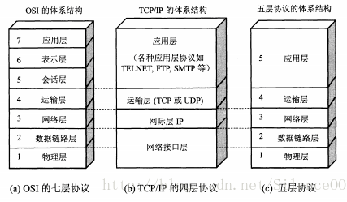

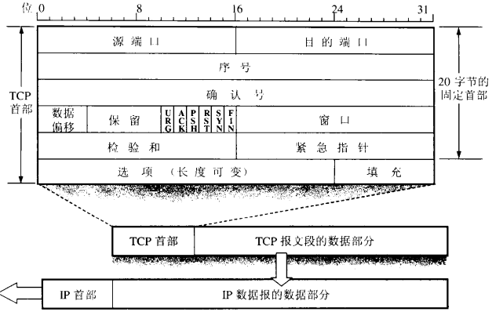

TCP特点：

- **面向连接**：使用TCP前必须先建立连接（三次握手）
- **点对点**：每个连接只能由两个端点
- **提供可靠的交付服务**：保证数据**无差错、不丢失、不重复、按序到达**，由**滑动窗口和确认重传**保证
- **提供全双工通信**
- **面向字节流**：应用程序和TCP之间以数据块交互，但TCP将数据看作一连串的无结构字节流。**不保证接收方和发送方应用程序发出的数据块具有对应大小的关系**（例如发送方交付给TCP 10个数据块，但接收方可能只用4个数据块就把字节流交付给应用程序），因此接收方需要有能力识别字节流

### 2. TCP报文首部结构是怎样的？

**原理分析**

TCP报文首部固定20字节，各字段如下：

1. **源端口和目的端口**：各占2字节
2. **序号（Seq）**：占4字节，TCP连接中传送的字节流中的每个字节都按顺序编号。例如一段报文的序号是301，携带100字节数据，则下一个报文段的数据序号从401开始
3. **确认号（Ack）**：占4字节，期望收到对方下一个报文的第一个数据字节的序号。例如B收到A的报文（序号501，数据长度200），B正确收到序号700为止的数据，则B发送确认报文时将确认号置为701
4. **数据偏移**：占4位，指出TCP报文数据距TCP报文段起始处有多远
5. **保留**：占6位，应置为0
6. **紧急URG**：URG=1表明紧急指针字段有效，通知系统此报文段有紧急数据
7. **确认ACK**：仅当ACK=1时确认号字段有效。TCP规定连接建立后所有报文ACK必须置1
8. **推送PSH**：PSH=1时，应用进程希望键入命令后立即收到响应
9. **复位RST**：RST=1表明TCP连接出现严重差错，必须释放连接后重新建立
10. **同步SYN**：连接建立时用来同步序号。SYN=1,ACK=0为连接请求报文；同意连接时响应报文SYN=1,ACK=1
11. **终止FIN**：FIN=1表明发送方数据已发送完毕，要求释放连接
12. **窗口**：占2字节，通知接收方发送本报文需要多大的空间来接受，用来表示想收到的每个TCP数据段的大小。流量控制由连接的每一端通过声明的窗口大小控制
13. **检验和**：占2字节，校验首部和数据
14. **紧急指针**：占2字节，指出紧急数据的字节数
15. **选项**：长度可变，定义其他可选参数

### 3. TCP三次握手过程是怎样的？

**原理分析**

建立一个TCP连接需要客户端和服务端总共发送3个数据包。在socket编程中由`connect`触发，`accept`函数是用来获取连接的，**只有在三次握手后才能调用**。

TCP服务端先创建传输控制块，时刻准备接受客户端连接请求，此时服务器进入**LISTEN**状态。

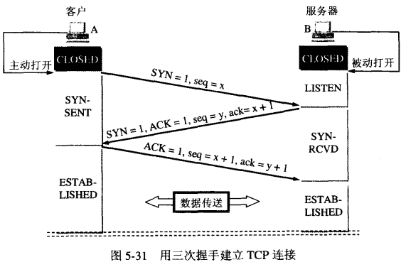

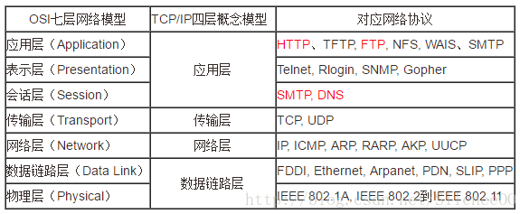

1. **第一次握手**：客户端将标志位**SYN=1, ACK=0**，随机产生序列号**seq=x**，将数据报发送给服务端，客户端进入**SYN_SENT（同步已发送）**状态。SYN报文段**不能携带数据，但消耗一个序号**。
2. **第二次握手**：服务端收到请求报文后，如果同意连接，则发出确认报文**ACK=1, SYN=1，确认号ack=x+1**，同时生成序列号**seq=y**，服务端进入**SYN_RCVD（同步收到）**状态。此报文**不能携带数据，同样消耗一个序号。如果超时，服务端会重发确认报文**。
3. **第三次握手**：客户端收到确认后，还要向服务器发出确认。**SYN=0, ACK=1, ack=y+1**，自己的序列号**seq=x+1**，此时连接建立，客户端进入**ESTABLISHED（连接已建立）**状态。这个确认报文段可以携带数据，**如果不携带数据则不消耗序号**。服务器收到确认后也进入ESTABLISHED状态，此后可以互相通信。

**关于第三次握手ACK丢失的处理**：
- 客户端发完第3次ACK后，**直接认为连接已建立**，开始发数据
- 如果服务端**没收到**这个ACK，服务端会超时，**重传第二次的SYN+ACK**
- 客户端收到重复的SYN+ACK，就知道上次的ACK丢了，**再发一遍ACK**
- 客户端不是"实时知道服务端收到ACK"，而是**没收到重传，就默认对方收到了**

第三次握手的时候是可以携带数据的，但第一次、第二次握手不可以携带数据。

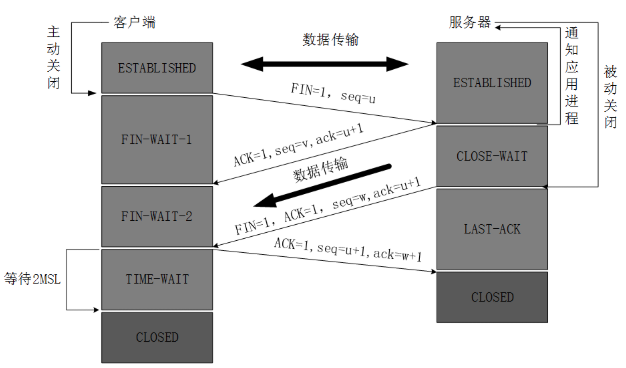

### 4. 为什么是三次握手而不是两次？

**原理分析**

TCP连接握手要达成的共识：**双方的数据原点的序列号**。最重要的是**双方都需要确认对方收到了自己的序列号**，以便让对方知道接下来接收数据时如何按序列号组装数据。

握手时双方会交换**ISN（初始序列号）**，用来给每个字节数据编号，保证：**不乱序、不重复、丢了能重传、收到能按顺序拼好**。ISN随时间变化，**每个连接具有不同的ISN**。ISN可看作32比特计数器，每4ms加1，这样选择的目的是防止网络中被延迟的分组以后又被传送，导致连接一方做错误解释。如果ISN固定，攻击者很容易猜出后续确认号。

TCP需要**seq序列号来做可靠重传或接收**，避免连接复用时无法分辨seq是延迟或旧连接的seq，因此需要三次握手确定双方初始序列号。

**三次就可以确定目前为止双方都可以正常通信**，后续能否正常通信不确定。完全可靠的通信协议不存在，就算100次也无法保证。用**最少次数**，同时确认**双方收发都正常**：

- **第一次** 服务端收到 → 知道：**客户端能发**
- **第二次** 客户端收到 → 知道 自己**能发、能收** 服务端**能发、能收**
- **第三次** 服务端收到 → 知道 客户端**能收**，双方收发都正常

最后一次ACK本身不需要再被ACK，靠**"超时重传 + 后续报文"**隐式确认。

**如果只有两次握手**：服务端发完回复就**认为连接已建立**，开始分配资源。如果网络延迟、旧重复连接请求过来，服务端会白白开很多无效连接，浪费资源，甚至被攻击。所以两次握手**不够安全，容易出问题**。

### 5. TCP握手阶段的重试机制是怎样的？

**原理分析**

TCP握手阶段的重试**没有固定次数**，靠"超时时间 + 总重试时长"控制，不是数次数。**服务端**收不到ACK，会重试SYN+ACK，客户端只是被动等着，**不主动重试**。服务端重试SYN+ACK约5次，总共等60多秒后放弃。

这60秒完全是**操作系统内核TCP协议栈**控制的，和应用层（HTTP、浏览器、Java、Nginx）**没关系**。是**内核TCP重试 + 指数退避时间**，不是应用层配置。

HTTP层的`connect timeout`是**应用自己设置的定时器**：给X秒时间去完成TCP三次握手，超过X秒还没连上，**应用直接放弃、关闭Socket、抛超时异常**，不会等TCP那60秒。例如应用设置`connectTimeout=5秒`，5秒一到应用直接不等了，断开连接，TCP内核还在慢慢重试。

### 6. TCP四次挥手过程是怎样的？

**原理分析**

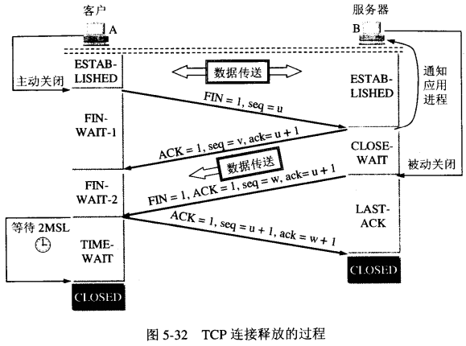

1. **第一次挥手**：客户端进程发出连接释放报文，**FIN=1**，序列号**seq=u**（等于前面已传送数据的最后一个字节的序号加1），客户端进入**FIN-WAIT-1（终止等待1）**状态。FIN报文段即使不携带数据，也要消耗一个序号。
2. **第二次挥手**：服务器收到连接释放报文，发出确认报文**ACK=1，ack=u+1**，带上自己的序列号**seq=v**，服务端进入**CLOSE-WAIT（关闭等待）**状态。TCP服务器通知高层应用进程：客户端→服务端方向已释放，此时**处于半关闭状态**，即客户端没有数据要发送了，但服务器若发送数据，客户端依然要接受。**CLOSE-WAIT**状态持续的时间取决于服务器何时关闭连接。
3. **第三次挥手**：客户端收到服务器的确认请求后进入**FIN-WAIT-2（终止等待2）**状态，等待服务器发送连接释放报文（在此之前还需接受服务器最后的数据）。服务器将最后的数据**发送完毕后**，向客户端发送连接释放报文**FIN=1，ack=u+1**，假定此时序列号为**seq=w**（半关闭期间可能又发送了一些数据），服务器进入**LAST-ACK（最后确认）**状态。
4. **第四次挥手**：客户端收到服务器的连接释放报文后，必须发出确认**ACK=1，ack=w+1**，自己的序列号**seq=u+1**，客户端进入**TIME-WAIT（时间等待）**状态。注意**此时TCP连接还没有释放，必须经过2∗MSL的时间后**，当客户端撤销TCB后，才进入**CLOSED**状态。
5. 服务器只要收到客户端发出的确认，**立即进入CLOSED状态**。服务器结束TCP连接的时间比客户端早。

**状态转换：**
- 主动关闭方：ESTABLISHED → 发FIN → FIN_WAIT1 → 收到ACK → FIN_WAIT2 → 收到对方FIN → 发ACK → TIME_WAIT → 等待2MSL → CLOSED
- 被动关闭方：ESTABLISHED → 收到FIN → 发ACK → CLOSE_WAIT → 自己也发FIN → LAST_ACK → 收到ACK → CLOSED

### 7. 为什么建立连接是三次握手，关闭连接却是四次挥手？

**原理分析**

因为TCP是**全双工通信**，**收发通道互相独立**，断开连接需要**各自单独关闭读写方向**，不能一次性关完，所以必须四次。

建立连接时，服务器在LISTEN状态下收到SYN报文后，**可以把ACK和SYN放在一个报文里发送给客户端**。

关闭连接时，服务器收到对方的FIN报文时，**仅仅表示对方不再发送数据了但还能接收数据**，而**自己也未必全部数据都发送给对方了**，所以己方可以立即关闭，也可以发送一些数据给对方后，**再发送FIN报文给对方来表示同意关闭**，因此己方**ACK和FIN一般都会分开发送**，从而导致多了一次。

**什么时候会变成"三次挥手"？**
如果**被动关闭方没有剩余数据要发送**，操作系统会把"第二次ACK"和"第三次FIN"合并成一个报文，就会出现**三次挥手**，这是特殊场景，不是标准流程。

**核心关键点：**
- 第二次挥手只是**确认对方不再发数据**，**本方还能发数据**，不能顺便带上自己的FIN
- FIN代表"我没数据了，要关我的发送端"，必须等本方数据全部发完才能发
- 两个方向关闭时机不同，无法合并报文，因此**必须4次**

### 8. 为什么客户端最后还要等待2MSL？

**原理分析**

**MSL（Maximum Segment Lifetime）**：任何报文在网络上存在的最长时间，超过这个时间报文将被丢弃。MSL建议2分钟，但TCP允许不同实现使用更小的MSL值。

**第一，保证客户端发送的最后一个ACK报文能够到达服务器**。这个ACK可能丢失，站在服务器角度，已经发送了FIN+ACK请求断开，客户端还没有回应，服务器会重新发送FIN+ACK。客户端就能在2MSL时间段内收到重传报文，继续回应ACK并重启2MSL计时器。

**第二，防止"已经失效的连接请求报文段"出现在本连接中**。客户端发送完最后一个确认报文后，在2MSL时间内，可以使本连接持续时间内所产生的所有报文段都从网络中消失，这样新的连接中不会出现旧连接的请求报文。

### 9. TCP有哪些连接状态？各状态含义是什么？

**原理分析**

TCP完整的连接状态如下：

- **CLOSED**：初始状态，表示TCP连接是"关闭着的"或"未打开的"
- **LISTEN**：表示服务器端的某个Socket处于监听状态，可以接受客户端的连接
- **SYN_SENT**：客户端Socket执行`connect()`时先发送SYN报文，随即进入SYN_SENT状态，等待服务端的SYN+ACK
- **SYN_RCVD**：表示服务器接收到了来自客户端的SYN报文。这是一个中间状态，很短暂，平常不易看到。但遇到**SYN flood攻击**时会出现大量此状态（收不到第三次握手的ACK），不会转换到ESTABLISHED
- **ESTABLISHED**：表示TCP连接已成功建立，开始传输数据
- **FIN_WAIT_1**：主动关闭方发送FIN报文后进入，等待对方ACK。实际工作中很少看到。长时间收不到ACK，通常默认超时时间60s（由内核参数`tcp_fin_timeout`控制）后，直接进入CLOSED状态
- **FIN_WAIT_2**：主动方收到ACK后进入，等待对方发送FIN。在主动断开端发现大量FIN_WAIT_2时，需注意可能是网络不稳定或程序中忘记关闭连接。也有超时时间，由`tcp_fin_timeout`控制，超时后连接直接销毁
- **CLOSE_WAIT**：只在被动端出现。主动方调用`close()`发送FIN后，被动端必然回应ACK（由TCP协议层决定），此时连接进入CLOSE_WAIT。**除非杀进程，CLOSE_WAIT不会自动消失**，意味着占着资源（FD）
- **LAST_ACK**：被动关闭方发送FIN报文后，等待对方ACK时的状态。收到ACK后进入CLOSED
- **TIME_WAIT**：**最常见的状态**，主动方收到对方FIN后，由FIN_WAIT_2进入TIME_WAIT，等待2MSL后进入CLOSED
- **CLOSING**：比较特殊的状态，较少见。当**双方同时作为主动方调用`close()`**时，两边都进入FIN_WAIT_1，期望收到ACK但先收到了对方的FIN，此时进入CLOSING状态，给对方ACK后直接进入CLOSED

三次握手中的状态（CLOSED、LISTEN、SYN_RCVD、SYN_SENT、ESTABLISHED）：
- CLOSED和ESTABLISHED在客户端和服务端都出现
- LISTEN和SYN_RCVD通常出现在服务端
- SYN_SENT出现在客户端

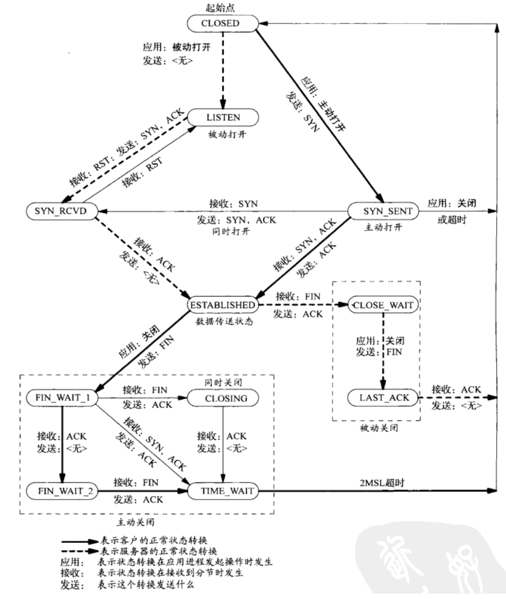

### 10. 滑动窗口是如何实现流量控制的？

**原理分析**

滑动窗口机制是TCP的流量控制方法，**允许发送方在停止并等待确认前连续发送多个分组，而不必每发送一个分组就停下来等待确认**，从而提高数据传输速率和吞吐量。

**核心流程**：由**接收方通告窗口的大小**，即**接收方窗口**。接收窗口受接收缓冲区影响，如果数据未被用户进程使用，接收窗口相应减小。**发送窗口取决于接收方窗口的大小**。**可用窗口** = 接收方窗口 - 发送但未被确认的数据包大小。

**发送方**数据分为4类：已发送并收到确认、已发送未收到确认、允许发送但还未发送、不允许发送。已发送未收到确认和允许发送但未发送称为**发送窗口**。

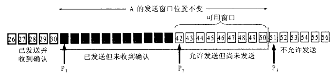

**接收方**数据分为：已接收、未接受允许接收、不允许接收。**未接受允许接收**的部分称为**接收窗口**。

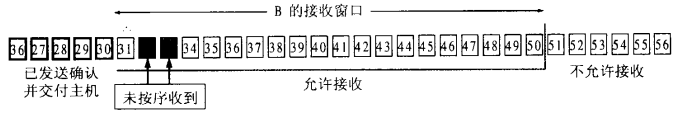

**窗口移动规则：**
- 发送窗口在收到对端ACK确认报文后，移动发送窗口左边界
- 接收窗口在收到前面所有字节后，移动接收窗口左边界。如果未按序到达，不会移动接收窗口左边界，发送方一直收不到确认会进行超时重传

**流量控制**：滑动窗口是动态的，发送方的发送窗口**不能超过接收方给出的接收窗口的数值（窗口单位是字节）**。通过改变窗口大小可以控制流量。

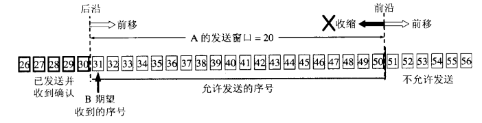

### 11. TCP拥塞控制有哪些方法？

**原理分析**

**拥塞发生的主要原因**：网络能够提供的资源不足以满足用户需求，包括缓存空间、链路带宽容量和中间节点的处理能力。由于互联网设计机制缺乏**"接纳控制"**能力，在网络资源不足时不能限制用户数量，只能靠降低服务质量继续为用户服务，即**"尽力而为"**的服务。

拥塞是因为**路由器缓存溢出**，拥塞会导致丢包，但丢包不一定触发拥塞。网络拥塞时路由器会丢弃分组，因此发送方没有收到确认报文，就可以猜测网络出现拥塞。

发送方维持一个**拥塞窗口**，大小取决于网络拥塞程度。发送方让发送窗口等于拥塞控制窗口。原则：网络没有拥塞，拥塞窗口就大一些，有拥塞就减小一点。

拥塞控制算法一般包括**慢启动算法、拥塞避免算法、快速重传算法、快速恢复算法**四部分。

1. **慢开始**：主机刚开始发送数据时由小到大增大发送窗口，避免立即将大量数据注入网络引起拥塞
2. **拥塞避免**
3. **快重传**：要求接收方每收到一个失序的报文就立即发出重复确认（SACK），使发送方早知道有报文段没有到达对方，而不是等待自己发送数据时才捎带确认
4. **快恢复**：当**发送方连续收到三个重复确认时，把慢开始门限减半，防止拥塞**。发送方认为现在没有拥塞（拥塞的话不会连续好几个报文段到达接收方，不会导致接收方连续发送重复确认）

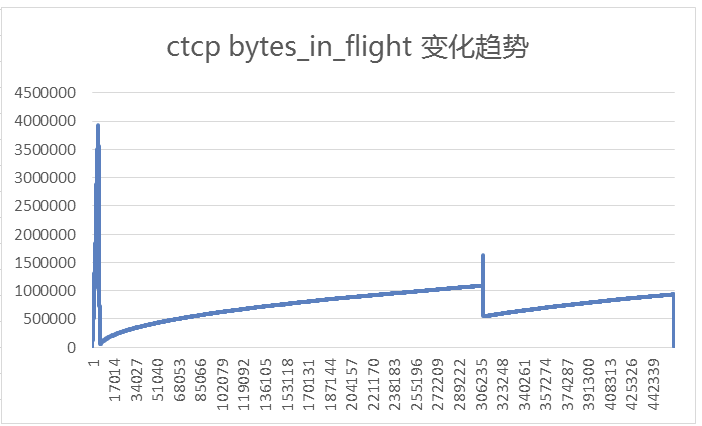

### 12. TCP如何保证可靠传输？

**原理分析**

TCP通过以下机制保证可靠传输：

- **滑动窗口**：实现流量控制，发送窗口受接收窗口限制
- **超时重传**：采用自适应算法，在规定时间内没有收到确认就要重传已发送的报文段
- **选择确认（SACK）**：选择性确认收到的数据，避免不必要的重传
- **序号机制**：每个字节都有序号，保证不乱序、不重复、按序到达
- **校验和**：检验首部和数据完整性

**注意事项：**
- TCP收到的是IP层**分片重组后**的完整TCP数据报，**一个TCP报文发送时大小和接收时一样**
- 不会出现一个TCP报文传了0-90字节，IP分成3片但丢失一片，TCP收到0-30、60-90共60字节的情况。**TCP会完全收不到这90字节**，因为IP层重组失败会直接抛弃，TCP根本收不到。IP层不会重传，需要TCP重传这90个字节

### 13. TCP有粘包问题吗？

**原理分析**

TCP**没有粘包问题**，是**应用层识别字节流时的问题**。本质是**没有设计应用层协议**。

TCP保证发送方以什么顺序发字节流，接收方就一定能按这个顺序接收到。接收方需要有能力识别字节流，也就是设计一个双方清楚的协议：第一个字节什么含义，第二个字节什么含义。

**TCP对应用进程发送多长的报文并不关心**，只会根据窗口值和当前网络情况决定到底发送多少字节。不能保证应用程序一次下发多少，接收方就能接收多少。

### 14. TCP的保活机制是怎样的？拔掉网线后TCP连接还在吗？

**原理分析**

TCP设有**保活计时器（Keepalive）**。连接建立后若客户端出现故障，服务器不能一直等待下去，这就会用到保活计时器。服务端每收到一次客户端数据就重设保活计时器，**通常是2小时**。若两小时没收到客户数据，服务端发送一个探测报文，以后**每隔75分钟发送一次**。若**连续10次**都不响应，则认为客户端出现故障，接着会关闭这个连接。

但TCP保活定时器**不是每个TCP/IP协议栈都实现了**，因为RFC并不要求TCP保活定时器一定要实现。

TCP是**虚拟连接**，**如果低层物理链路断开，只要不引起keepalive retry timeout，TCP连接会一直健在**。

**拔掉网线后的场景分析：**

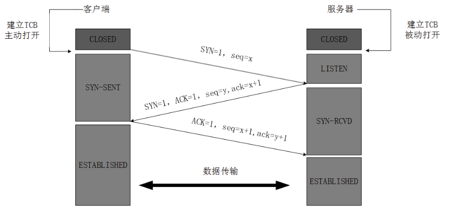

TCP连接的维持**靠的是两端TCP软件对连接状态的维护**。TCP自身有长时间没有数据包情况下判断连接是否仍存在的检测机制，**清除死连接**。即使在没有数据来往时，TCP也可以在启动保活功能的前提下自动发包检测连接是否正常。

**HTTP请求完成后TCP连接是否断开？**
取决于HTTP版本和Connection头：
- HTTP/1.0默认短连接，请求完成后断开
- HTTP/1.1默认长连接（Keep-Alive），请求完成后保持连接，用于复用

**服务端CLOSE_WAIT或TIME_WAIT过多会导致什么后果？**
- **大量CLOSE_WAIT**：占着文件描述符（FD）不释放，最终可能耗尽FD，无法新建连接
- **大量TIME_WAIT**：占用端口和连接资源，可能导致端口耗尽，影响新连接建立

### 15. TCP与UDP有哪些区别？

**原理分析**

| 特性 | TCP | UDP |
|------|-----|-----|
| 连接 | **面向连接**，使用前需建立连接 | **无连接**，发送前不需要建立连接 |
| 可靠性 | **可靠交付**，保证无差错、不丢失、不重复、按序到达 | **尽最大努力交付**，不保证可靠交付 |
| 通信方式 | **全双工通信** | 支持一对一、一对多、多对一、多对多 |
| 数据边界 | **面向字节流**，不关心报文长度，根据窗口值决定发送多少字节 | **面向报文**，应用交付的报文添加首部后直接给IP层，既不合并也不拆分 |
| 首部开销 | 20字节固定首部 | 8字节固定首部 |
| 流量控制 | 有（滑动窗口） | 无 |
| 拥塞控制 | 有（慢开始、拥塞避免、快重传、快恢复） | 无 |
| 应用场景 | HTTP、FTP、SMTP等需要可靠传输的场景 | DNS、DHCP、音视频通话等实时性要求高的场景 |

**发送数据长度差异：**
- TCP：由于是数据流协议，放入缓冲区，具体每次发送多少由TCP控制，**不存在包大小的限制**。但所指定的数据不一定会一次性发送出去，长数据会被分段，短数据可能等待和下一次数据一起发送
- UDP：报文长度是应用进程给出的，给多少发多少，**不能超出UDP最大值**。接收端接收到的数据量和发送端一致。用`sendto`函数最大能发送：**65535 - IP头(20) - UDP头(8) = 65507字节**，超出会返回错误

### 16. UDP有哪些特点？

**原理分析**

- **无连接**：发送数据前不需要建立连接，减少了开销和时延
- **尽最大努力交付**：不保证可靠交付，不需要维持复杂的连接状态
- **面向报文**：发送方UDP对应用程序交下来的报文，添加首部后给IP层，**既不合并也不拆分**。接收方UDP接收后，去除首部后交付给上层应用。因此应用必须选择合适大小的报文，若报文太长，IP层会进行分片
- 支持一对多、多对一、多对多的交互通信
- UDP首部只有8字节

**应用层需注意**：
- 如果超出了链路层MTU，IP层会自行分片。应尽量避免IP分片，使用UDP时控制每次传输大小不超过MTU

### 17. 服务端发送FIN后，客户端如何处理？连接池复用半关闭连接会怎样？

**原理分析**

服务端主动发FIN代表**服务端没有数据要发了，请求关闭TCP连接**。

**一、客户端内核收到FIN后的处理流程：**
- 客户端内核**立即回复ACK**，此时客户端TCP连接进入**CLOSE_WAIT**状态
- 内核**不会立刻删除TCP连接**，只是**半关闭**：
  - 服务端→客户端：通道关闭（客户端**读不到任何数据**，read直接返回0）
  - 客户端→服务端：通道**还能正常发数据**（内核允许继续write发送）
- 连接会**一直停在CLOSE_WAIT**，直到应用层调用`close()`/连接池销毁连接 → 客户端发FIN，进入LAST_ACK，完成四次挥手，内核删除连接
- 若应用层一直不关闭，**CLOSE_WAIT会长期挂着，内核不删除连接**

**关键结论**：服务端发FIN，**客户端内核不会直接删除连接**，只会进入半关闭CLOSE_WAIT，连接内核层面还存在、fd还合法。

**二、连接池继续用CLOSE_WAIT连接发请求会怎样？**

连接池不知道底层TCP已经半关闭，依然拿出这个连接发HTTP请求。

**场景1：客户端发送HTTP请求报文（write写内核缓冲区）**
- **第一步write调用会成功**：内核TCP还在CLOSE_WAIT，允许发送数据到内核发送缓冲区
- 但**服务端已经关闭读端**，收到数据后直接回复**RST**复位报文

**场景2：客户端内核收到服务端RST后**
- 内核**立刻销毁这条TCP连接**，回收fd
- 此时连接池再对这个fd做**read/recv/再write**都会直接报错

**三、实际业务中会出现的错误类型：**
1. **Connection reset by peer**（ECONNRESET）：对方强制关闭连接，收到RST，读写直接抛这个错
2. **Broken pipe**（EPIPE）：已经收到RST、连接已断开，还往这个连接写数据，触发管道破裂
3. HTTP层面表现：接口直接报错、超时、EOF异常、读取到空响应。连接池拿到**坏连接**，复用时报错，不做心跳/有效性校验就会**随机偶发线上报错**

**四、连接池解决方案：**
- 空闲连接设置**最大空闲时间**，低于服务端超时时间，主动淘汰闲置连接
- 从连接池获取连接时，先做**可读检测/简单心跳**，剔除半关闭、已断连接
- 捕获ECONNRESET/EPIPE异常，直接销毁当前连接，新建重试

### 18. ECONNRESET和EPIPE有什么区别？

**原理分析**

**ECONNRESET（Connection reset by peer）**
- 触发时机：**调用read/recv/write时，内核刚好收到对方发来的RST报文**
- 本质：TCP对端**强制重置连接**，内核通知你：这条链接已被对方强行断了
- 举例：连接处于CLOSE_WAIT，连接池用这个连接发请求，write把数据塞出去，服务端直接回RST，你接下来**读响应或正在写**，内核检测到RST，直接抛Connection reset by peer

**EPIPE（Broken pipe）**
- 触发时机：**连接已经收到RST、内核标记连接已断开**，**你还再次调用write往里面写数据**
- 本质：连接早已断开，还硬写数据
- 举例：第一次读写已触发RST抛了ECONNRESET，代码没处理异常没销毁连接，还拿着这个fd继续第二次、第三次write，内核发现连接早已断开，直接抛Broken pipe

**Linux下关键行为：**
- 对已经**收到RST的socket**，**第一次写**：返回失败，errno = **ECONNRESET**
- **第二次及以后再写**：errno = **EPIPE**，同时还会给进程发**SIGPIPE信号**，默认情况下程序会**直接崩溃退出**

### 19. ELB丢连接的原因有哪些？

**原理分析**

**一、ELB主动发RST强关（最常见，立即报错）**

1. **空闲超时（Idle Timeout）**
   - 默认：TCP/NLB 350s，HTTP/ALB 60s
   - 行为：ELB直接发RST给客户端
   - 客户端：下次read/write → **立即返回ECONNRESET**，不会走应用层超时

2. **后端不健康/下线**
   - 四层（NLB）：直接发RST断连
   - 七层（ALB）：发FIN关连接或直接RST
   - 客户端：收到RST→**立即ECONNRESET**；收到FIN→客户端进CLOSE_WAIT再写触发RST→同样ECONNRESET

3. **连接数/带宽超限、限流、黑白名单**
   - 行为：直接丢弃连接或发RST
   - 客户端：**立即ECONNRESET**

4. **七层ALB特殊情况：请求畸形/超长**
   - 行为：ALB直接关闭连接（RST）
   - 客户端：**立即ECONNRESET**或400错误

**二、ELB静默丢包（不发FIN/RST，客户端等超时）**

1. **网络闪断、ELB实例崩溃/重启**
   - 行为：**不发FIN/RST，直接丢包**
   - 客户端：连接状态看似正常，发请求后**一直阻塞直到应用层/内核超时**（如60s），超时后报**ETIMEDOUT**

2. **后端无响应、ELB转发超时**
   - 行为：ELB等待超时后**静默丢包或发RST**
   - 客户端：先等ELB超时（默认60s），若ELB发RST→立即ECONNRESET，若静默丢→客户端再等自己的超时→ETIMEDOUT

**一句话区分：**
- **有RST → 立即ECONNRESET/EPIPE**（主动强关）
- **无RST、无数据 → 等到ETIMEDOUT**（静默丢包）

### 20. 零窗口（TCP Zero Window）是什么？

**原理分析**

在接收方窗口大小变为0的时候，发送方就不能再发送数据了。但当接收方窗口恢复时，发送方需要知道。这时TCP会启动一个**零窗口（TCP Zero Window）定时探测器**，向接收方询问窗口大小，当接收方窗口恢复时，就可以再次发送数据。

### 21. TCP发送网络数据涉及哪些内存拷贝操作？

**原理分析**

这里的"内存拷贝"特指待发送数据的内存拷贝：

1. **第一次拷贝**：内核申请完skb后，将用户传递进来的buffer里的数据内容拷贝到skb中。发送数据量大时开销较大
2. **第二次拷贝**：从传输层进入网络层时，每一个skb都会被**克隆一个新的副本**。网络层及以下组件在发送完成后删除副本，传输层保存原始skb，当对方没有ACK时可以重新发送，实现可靠传输
3. **第三次拷贝（非必需）**：当IP层发现skb大于MTU时才需要进行。会再申请额外skb，将原skb拷贝为多个小的skb

注意：网络性能优化中常说的**零拷贝**有点夸张。TCP为了保证可靠性，**第二次拷贝根本没法省**。如果包大于MTU，分片时的拷贝同样避免不了。
