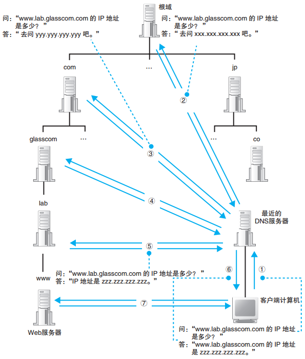
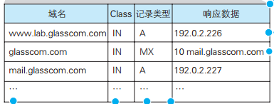
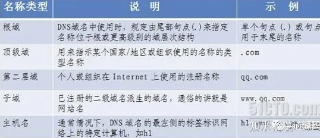
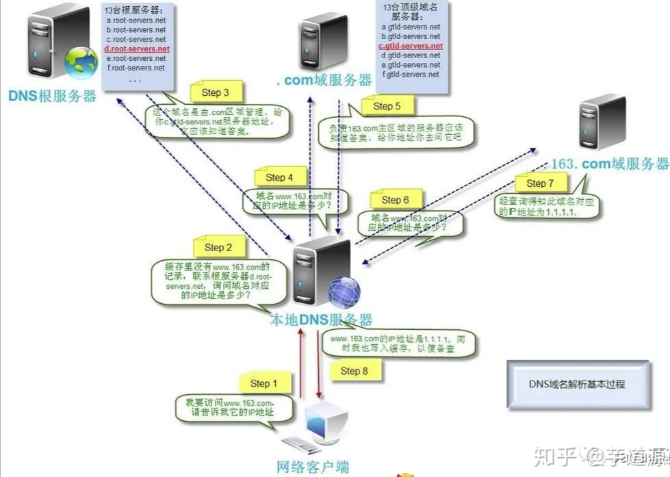
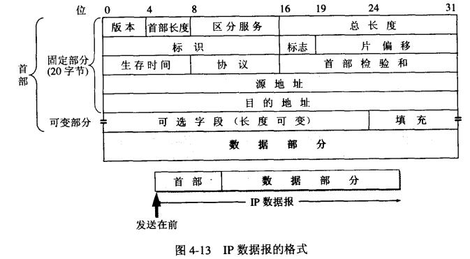
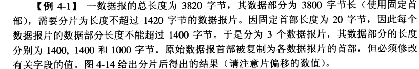

## 1. DNS是什么？DNS解析过程是怎样的？

**原理分析**

DNS（Domain Name System，域名系统）是互联网上作为**域名和IP地址相互映射的一个分布式数据库**，能够使用户更方便地访问互联网，而不用去记住能够被机器直接读取的IP数串。通过主机名，最终得到该主机名对应的IP地址的过程叫做**域名解析**。

DNS解析过程：

1. 浏览器首先查看**本地 hosts 文件**，看看其中有没有和这个域名对应的规则，如果有的话就直接使用 hosts 文件里面的 IP 地址
2. 如果在本地 hosts 文件中没有找到对应的 IP 地址，浏览器会发出一个 **DNS请求到本地DNS服务器**（一般由网络接入服务商提供，如中国电信、中国移动）。本机可通过 **DHCP协议**自动获取DNS服务器地址，DNS是DHCP的其中一个option
3. 本地DNS服务器首先查询**它的缓存记录**，如果缓存中有此条记录就可以直接返回结果，此过程是**递归**的方式进行查询。如果没有，本地DNS服务器还要向**DNS根服务器**进行查询
4. **根DNS服务器**没有记录具体的域名和IP地址的对应关系，而是告诉本地DNS服务器可以到**域服务器**（如.com域服务器）上继续查询，并给出域服务器的地址。这种过程是**迭代**的过程
5. 本地DNS服务器继续向**域服务器**发出请求，域服务器不会直接返回域名和IP地址的对应关系，而是告诉本地DNS服务器**你的域名的解析服务器**的地址
6. 最后，本地DNS服务器向**域名的解析服务器**发出请求，这时就能收到一个域名和IP地址对应关系。本地DNS服务器不仅要把IP地址返回给用户电脑，还要把**这个对应关系保存在缓存**中，以备下次别的用户查询时可以直接返回结果，加快网络访问

在真实的互联网中，一台DNS服务器可以管理**多个域的信息**，另外其他的DNS服务器也可能有缓存，就会直接返回了。

## 2. DNS查询信息包含哪些内容？有哪些记录类型？

**原理分析**

DNS查询信息包含三种信息：

1. **域名**：服务器、邮件服务器（邮件地址中@后面的部分）的名称
2. **Class**：网络类型，设计时为了兼容多种网络。由于目前主要是互联网，因此class值基本是代表互联网的**IN**
3. **记录类型**：表示域名对应的何种类型的记录

常见的DNS记录类型：

- **A记录**：域名对应的是 **IP 地址**，最常用的记录类型
- **MX记录**：域名对应的是 **邮件服务器**
- **CNAME记录**：通常称**别名解析**。可以将注册的不同域名都转到一个域名记录上，由这个域名记录统一解析管理。与A记录不同的是，CNAME别名记录设置的可以是一个域名的描述而不一定是IP地址。例如设置test.mydomain.com指向www.rddns.com，以后就可以用test.mydomain.com来代替访问www.rddns.com
- **NS记录**：NS（Name Server）记录是**域名服务器记录**，用来**指定该域名由哪个DNS服务器来进行解析**。注册域名时总有默认的DNS服务器，每个注册的域名都是由一个DNS域名服务器来进行解析的。DNS服务器NS记录地址一般以ns1.domain.com、ns2.domain.com等形式出现。简单说，**NS记录是指定由哪个DNS服务器解析你的域名**

## 3. DNS域名称空间是如何组织的？根域名服务器有多少个？

**原理分析**

DNS域名称空间按功能分为五个类别：

| 类别 | 说明 | 示例 |
|------|------|------|
| **根域** | DNS域名中最上层的域，用 `.` 表示 | `www.lab.glasscom.com.` 最后一个`.`代表根域 |
| **顶级域** | 直接位于根域下的域，如.com、.org、.cn、.jp等 | .com、.org、.cn |
| **二级域** | 顶级域下注册的域名 | glasscom.com |
| **子域** | 二级域下划分的域 | lab.glasscom.com |
| **主机** | 具体的主机名 | www.lab.glasscom.com |

DNS服务器中的所有信息都是按照域名以**分层次的结构**来保存的。例如www.lab.glasscom.com：
- com是顶级域
- 下一层是glasscom域
- 再下一层是lab域
- 再下面是www

根域中保存着**com、org、cn、jp等DNS服务器信息**，上级DNS服务器保管着所有**下级DNS服务器的信息**。

分配给根域DNS服务器的IP地址在全世界**仅有13个A**，而且这些地址几乎不发生变化。根域DNS服务器在运营上**使用多台服务器来对应一个IP地址**，因此尽管IP地址只有13个，但实际服务器的数量是很多的，编号相同的根服务器使用同一个IP。

域名会注册到DNS服务器中，并且每个域都是作为一个整体处理的。一个域的信息是**作为一个整体存放在DNS服务器中**的，不能将一个域拆开来存放在多台DNS服务器中（一台DNS服务器可以存放多个域的信息）。

**根域不可省略**，根域是真实存在的，要明确表示根域应该写作`www.lab.glasscom.com.`（最后一个`.`代表根域）。

## 4. DNS负载均衡是什么？

**原理分析**

当一个网站有足够多的用户时，如果每次请求的资源都位于同一台机器上，这台机器随时可能崩溃。解决办法就是使用**DNS负载均衡**技术。

原理：在DNS服务器中为同一个主机名**配置多个IP地址**。在应答DNS查询时，DNS服务器对每个查询将以DNS文件中主机记录的IP地址按**顺序返回不同的解析结果**，将客户端的访问引导到不同的机器上去，使得不同客户端访问不同服务器，从而达到负载均衡的目的。

例如，可以根据**每台机器的负载量**或**该机器离用户地理位置的距离**等因素来分配访问。

## 5. IP协议有哪些特点？

**原理分析**

IP协议位于**网络层**，具有以下特点：

- **无状态**：IP通信双方不同步传输数据的状态信息，所有IP数据报的发送、传输和接收都是相互独立的，没有上下文。优点：简单高效。缺点：无法处理乱序和重复的数据报
- **无连接**：双方不长久维持对方的任何信息。每次发送都需要明确指出IP地址
- **不可靠**：不能保证IP数据报准确到达接收端，只**尽最大努力交付**。不会重传

## 6. IP数据报头部结构是怎样的？

**原理分析**

IP头部固定部分为20字节（32位对齐），关键字段如下：

- 头部固定32位（4字节）
- 32位源IP地址
- 32位目的IP地址

**总长度**：字段16位，因此数据报的最大长度为 **2^16 - 1 = 65,535字节**。数据链路层有自己的帧格式，包括数据字段的最大长度——**MTU（最大传送单元）**。当数据报封装成帧时，数据报的总长度不能超过MTU。

虽然尽可能长的数据报会提高传输效率，但实际数据报很少超过**1500字节**。IP标准文档规定，所有主机和路由器必须能够处理的IP数据报长度**不得小于576字节**。当超过MTU时，必须把数据报进行分片（在IP层分片，因此有**片偏移**字段），接收方IP层进行重组。

## 7. IP分片丢失怎么办？

**原理分析**

IP层只**尽最大努力交付**，如果分片丢失，那么这次的传输数据就会**丢弃，并且不会重传**。重传需要由上层协议去做：
- **TCP**：有超时重传机制，可以恢复
- **UDP**：没有重传机制，UDP数据报会直接丢失

## 8. 刚插上网线，电脑怎么知道自己的IP是什么？DHCP的工作原理是怎样的？

**原理分析**

电脑获取IP有两种方式：

1. **手动指定**：在TCP/IP配置中手动设置IP地址
2. **通过DHCP自动获取**：DHCP（Dynamic Host Configuration Protocol，动态主机配置协议）

通过DHCP，在联网之后可以自动获取到本机需要的**IP地址、子网掩码和路由器地址**。家里用的路由器自带DHCP服务器功能（分配内网IP）。

**DHCP工作原理**（四个阶段）：

1. **DHCP Discover（发现）**：本机由于没有IP，也不知道DHCP服务器的IP地址，于是选择**广播**，向本地网段内所有人发出消息，询问"谁能给个IP用用"
2. **DHCP Offer（提供）**：不是DHCP服务器的机子会忽略广播消息，而DHCP服务器收到消息后，在自己维护的IP池里拿出一个空闲IP，通过广播的形式回复给电脑
3. **DHCP Request（请求）**：电脑在拿到IP后，再次发起广播，说"这个IP我要了"
4. **DHCP ACK（确认）**：DHCP服务器回复ACK确认。电脑正式获得这个IP在一段时间（如24小时）里的使用权。后续只要IP租约不过期，就可以一直用这个IP进行通信

**为什么要有第3和第4步**：可能有多台DHCP服务器，在电脑广播后每个DHCP服务器都有可能发Offer。电脑一般会对**第一个到的Offer**响应DHCP Request，目的是确认offer。在确认offer这段时间内，DHCP服务器确认这个IP还没被分出去，其他DHCP服务器可能把这个IP分给其他机器。

## 9. DHCP为什么使用UDP而不是TCP？

**原理分析**

因为TCP是**面向连接**的，而UDP是**无连接**的。DHCP一开始并不知道要跟谁建立连接，所以只能通过**广播**的形式发送消息。

在本地网段内发广播消息，UDP只需要发给 **255.255.255.255**。这个地址并不是某个具体的机器，而是一个**特殊地址**，只要设置了目的地址为255.255.255.255，就会在本地网段内进行广播。

TCP需要在发消息前先建立连接，但实际上255.255.255.255对应的机器并不存在，因此不能建立连接。如果同样要做到广播效果，就需要先得到本地网段内所有机器的IP，然后挨个建立连接再挨个发消息，非常低效。

## 10. 是不是每次联网都要经历DHCP四个阶段？

**原理分析**

不一定。电脑**记录了曾经使用过的IP**，重新联网后会**优先再次请求这个IP**，这样就省下了第一和第二阶段（Discover和Offer）的广播。

## 11. DHCP分配下来的IP一定不会重复吗？

**原理分析**

有两种常见情况会出现IP重复：

- **手动配置IP冲突**：手动配置的IP有可能跟其他DHCP分配下来的IP相同。解决方案：尽量不要手动配置IP，统一走DHCP；或者在DHCP服务器维护的IP范围中将该IP剔除
- **多台DHCP服务器范围重叠**：一个本地网段内可以有多个DHCP服务器，它们维护的IP地址范围可能重叠，于是可能将相同IP分配给不同机器。解决方案：修改两台DHCP服务器的IP地址范围，让它们不重叠

## 12. 得到DHCP ACK之后立马就能使用这个IP了吗？

**原理分析**

得到DHCP ACK之后，电脑不会立刻使用这个IP，而是会先发送**三条无偿ARP（Gratuitous ARP）消息**。目的有两个：

1. 告诉本地网段内所有机器，从现在起某个IP地址属于某个MAC地址，让大家记录在**ARP缓存**中
2. 检查本地网段里有没有其他机器也用了这个IP，如果**有冲突**则需要重新走一遍DHCP流程

**ARP与无偿ARP的区别**：
- 普通ARP消息：通过IP地址获取MAC地址，只填IP地址，不填MAC地址
- 无偿ARP（Gratuitous ARP）：会把**IP和MAC地址都填好**，而且填的是**自己的IP和MAC地址**

在三段无偿ARP消息之后，确认没有冲突了，才会开始使用这个IP地址进行通信。

## 13. 子网掩码是什么？

**原理分析**

**子网掩码**（subnet mask）又叫网络掩码、地址掩码、子网络遮罩，它是一种用来指明一个IP地址的**哪些位标识主机所在的子网**以及**哪些位标识主机**的位掩码。

子网掩码**不能单独存在**，必须结合IP地址一起使用。子网掩码只有一个作用：将某个IP地址**划分成网络地址和主机地址**两部分。

## 14. 公网IP和内网IP是如何转换的？

**原理分析**

公网IP通过**地址转换（NAT，Network Address Translation）**找到内网IP的机器。路由器就具有地址转换的功能，公网IP和内网IP之间会建立映射关系。地址转换有多种方式。
