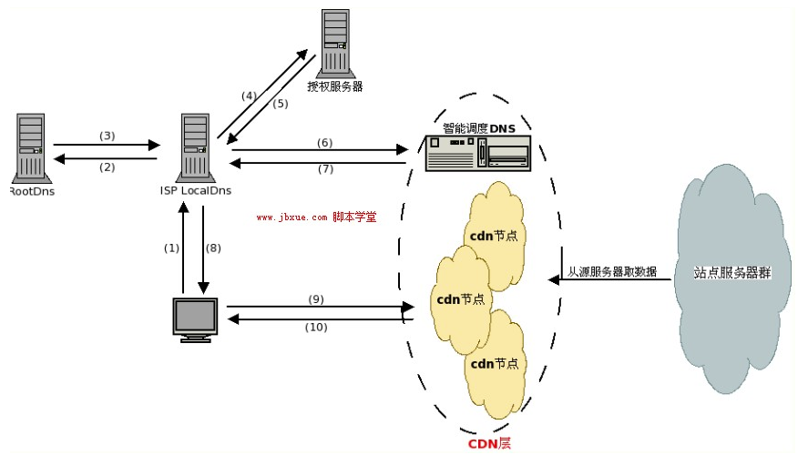
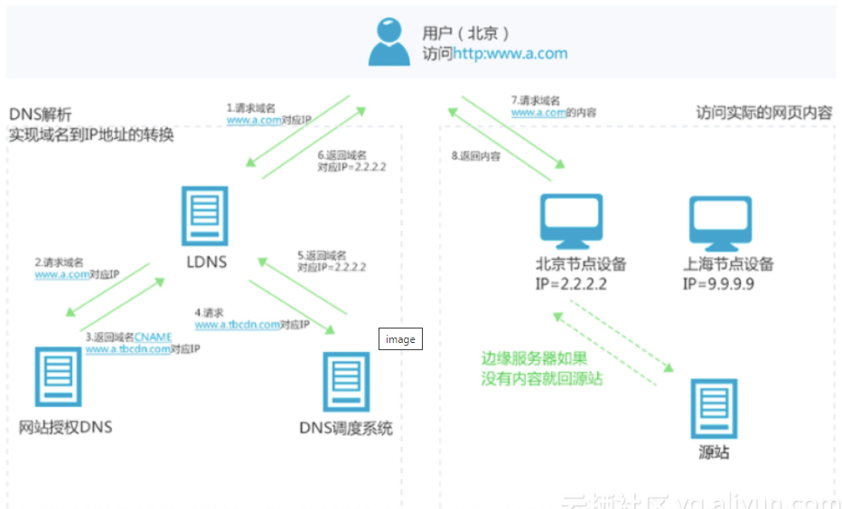
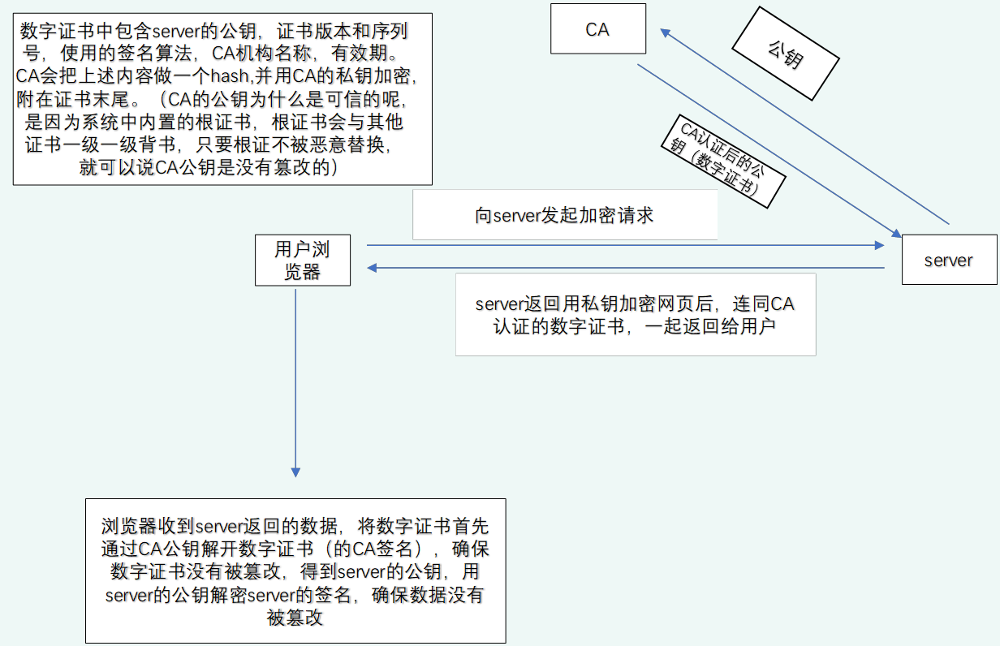
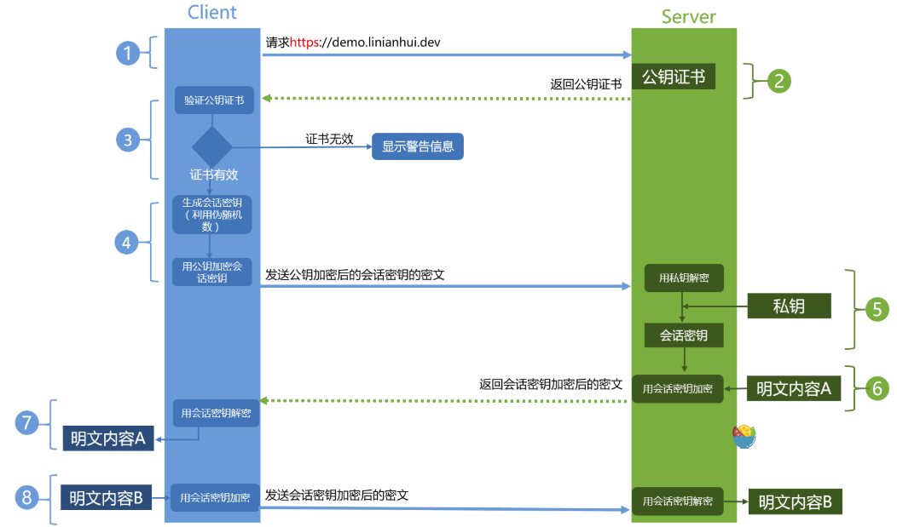
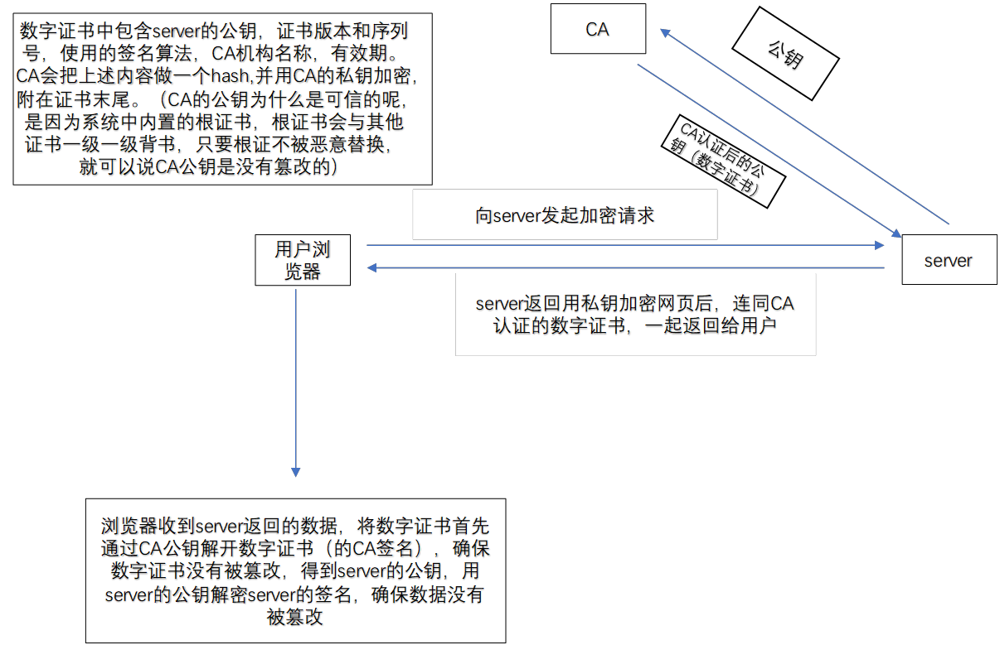

## 1. CDN是什么？它是如何加速的？

**原理分析**

在未做CDN时，访问某个域名直接拿到的是真实的服务器IP地址，这个显示IP地址的DNS记录信息叫**A记录**。CDN（Content Delivery Network）将网站的静态内容分发到多个服务器，用户就近访问，提高速度。

CDN加速的原理类似京东物流：京东在全国设有仓库物流点，从就近的杭州发货点发货到上海一天就可以到，而淘宝从海南发货到上海要走3天。CDN会根据用户所在的区域，选择**最近的节点**获取资源。

CDN的DNS解析流程：
1. 用户输入访问的域名，操作系统向**LocalDns**查询域名的IP地址
2. LocalDns向**ROOT DNS**查询域名的授权服务器（假设LocalDns缓存过期）
3. ROOT DNS将域名授权DNS记录回应给LocalDns
4. LocalDns得到域名的授权DNS记录后，继续向域名授权DNS查询域名的IP地址
5. 域名授权DNS查询域名记录后（一般是**CNAME**），回应给LocalDns
6. LocalDns得到域名记录后，向**智能调度DNS**查询域名的IP地址
7. 智能调度DNS根据一定的算法和策略（比如静态拓扑、容量等），将最合适的**CDN节点IP地址**回应给LocalDns
8. LocalDns将得到的域名IP地址回应给用户端
9. 用户得到域名IP地址后，访问站点服务器

## 2. 什么是DDoS攻击？SYN Flood的原理是什么？

**原理分析**

DDoS攻击全称**Distributed Denial of Service**（分布式拒绝服务），指攻击者利用"**肉鸡**"对目标网站在较短时间内发起大量请求，大规模消耗目标网站的主机资源，让它无法正常服务。

**SYN Flood攻击原理**：
- SYN-FLOOD是一种常见的DDoS攻击，通过网络服务所在的端口发送大量**伪造源地址的SYN报文**到服务端，造成服务端上的**半开连接队列被占满**，从而阻止其他用户进行访问
- 数据报特征是大量SYN包，且**缺少最后一步的ACK回复**
- 攻击者首先伪造地址对服务器发起SYN请求，服务器回应SYN+ACK，但真实的IP会认为自己没有发送请求，不做回应，服务端没有收到回应，默认情况下重试**5次**（syn_retries），对服务器内存和带宽有很大消耗

## 3. DDoS攻击的防御方法有哪些？

**原理分析**

**根据特征拦截**：
- 如果恶意请求有特征，直接拦截即可
- HTTP请求的特征一般有两种：**IP地址**和**User Agent**字段。比如恶意请求都是从某个IP段发出的，把这个IP段封掉；或者它们的User Agent字段有特征（包含某个特定词语），就把带有这个词语的请求拦截

**使用CDN防御**：
- CDN将网站静态内容分发到多个服务器，用户就近访问，提高速度
- CDN也是**带宽扩容**的一种方法，可以用来防御DDoS攻击

**限流**：
- 防止DDoS攻击的基本思路是**限流**，限制单个用户的流量（包括IP等）

## 4. 什么是数字证书？HTTPS请求流程是怎样的？

**原理分析**

数字证书的目的是确保服务器的公钥安全，防止**中间人攻击**。

CA会把证书（包含Server的公钥、证书版本、序列号、签名算法、有效期等）内容做一个**Hash**，得到一个固定长度的字符，再用CA自己的**私钥加密**，即可得到**数字签名**，附在证书末尾，就得到了完整的数字证书。

**HTTPS请求流程**：

1. **ClientHello**：客户端发起HTTPS请求，发送：
   - 支持的协议版本（如TLS 1.0）
   - 客户端生成的随机数**random1**（稍后用于生成"对话密钥"）
   - 支持的加密方法（如RSA公钥加密）
   - 支持的压缩方法

2. **ServerHello**：服务器返回配置好的**公钥证书**给客户端：
   - 确认使用的加密通信协议版本（如TLS 1.0）
   - 服务器生成的随机数**random2**（稍后用于生成"对话密钥"）
   - 确认使用的加密方法
   - **服务器证书**

3. **客户端验证证书**：验证公钥证书是否在有效期内、证书用途是否匹配请求站点、是否在CRL吊销列表里面、**上一级证书是否有效**（递归过程直到根证书）。如果验证通过则继续，不通过则显示警告信息

4. 客户端使用**伪随机数生成器**生成**pre-master secret**，用证书的公钥加密后发给Server。random1、random2、pre-master secret通过一定算法得出**session Key**和MAC算法秘钥

5. 服务器使用自己的**私钥**解密，结合random1、random2得到**会话密钥**。至此双方持有相同的会话密钥，后续通信使用该会话密钥加密

6. 服务器使用会话密钥加密明文内容发送给客户端

7. 客户端使用会话密钥解密得到明文

8. 后续通信都使用会话密钥加密

**注意**：如果浏览器验证证书无效，会弹出提示说该证书不可信，但用户可以忽略，继续使用该证书进行协商加密通道用于加密传输。

**关于HTTPS加密的两种说法**：
- 第一部分：客户端验证Server身份，用RSA验证服务器证书，使用**非对称加密**
- 第二部分：使用**密钥交换算法**（如DHE）交换密钥，通过只交换p，服务端解出n，客户端解出m，各自算出对称加密密钥，这部分没有用到加密但用到了密钥交换算法
- 第三部分：传输数据，根据前述密钥各自进行加解密。服务端到客户端数据加密的密钥和客户端到服务端的密钥**不相同**

## 5. 什么是根证书？证书链是如何验证的？

**原理分析**

假设C证书信任A和B，A信任A1和A2，B信任B1和B2，则构成一个**树形关系**（倒立的树）。处于最顶上的树根位置的那个证书就是"**根证书**"。

除了根证书，其它证书都要依靠**上一级的证书**来证明自己。根证书自己证明自己是可靠的（不需要被证明）。

根证书是整个证书体系安全的**根本**。如果根证书出了问题，那么所有被根证书信任的其它证书也就不再可信了。

整个流程最重要的是**操作系统预置的根证书的安全**，不要随便往系统安装证书。

## 6. 什么是CSRF攻击？有哪些类型？如何防御？

**原理分析**

CSRF（Cross-site Request Forgery）全称**跨站请求伪造**，攻击者盗用你的身份，以你的名义发送恶意请求。

**典型流程**：
- 受害者登录a.com，保留登录凭证（Cookie）
- 攻击者引诱受害者访问b.com
- b.com向a.com发送请求（浏览器默认携带a.com的Cookie）
- a.com误以为是受害者自己发送的请求，以受害者名义执行操作

**几种常见类型**：

**GET类型**：利用一个HTTP请求，如``，浏览器自动发出HTTP请求

**POST类型**：使用自动提交的表单，访问该页面后表单自动提交，模拟用户完成POST操作

**链接类型**：在论坛中嵌入恶意链接或以广告形式诱骗用户点击

**CSRF特点**：
- 攻击一般发起在**第三方网站**，被攻击网站无法防止攻击发生
- 攻击利用受害者在被攻击网站的**登录凭证**，冒充受害者提交操作
- 攻击者**不能获取到Cookie等信息**，仅仅是"冒用"
- 跨站请求可用各种方式：图片URL、超链接、CORS、Form提交等

**防护策略**：

1. **阻止不明外域访问**：
   - 同源检测
   - Samesite Cookie

2. **提交时要求附加本域才能获取的信息**：
   - **CSRF Token**：要求所有用户请求都携带CSRF攻击者无法获取到的Token，服务器通过校验Token区分正常请求和攻击请求
   - 双重Cookie验证

## 7. WEB应用常见安全漏洞有哪些？

**原理分析**

**1. SQL注入**
- 通过给Web应用接口传入特殊字符，欺骗服务器执行恶意的SQL命令
- 原因：使用外部不可信任数据作为参数进行数据库操作时未过滤
- 解决方案：不信任任何外部输入，对所有输入进行过滤；适当的权限控制、不暴露必要安全信息和日志

**2. XSS攻击（跨站脚本攻击）**
- 攻击者通过在目标网站上注入恶意脚本并运行，获取用户的敏感信息（Cookie、SessionID等）
- 原因：攻击者向浏览器页面注入恶意代码且浏览器执行了这些代码
- 解决方案：渲染前端页面或动态插入HTML片段时，任何数据都不可信任，先做HTML过滤再渲染

**3. CSRF攻击**
- 详见第6问

**4. DDoS攻击**
- 攻击者不断提出服务请求，让合法用户的请求无法及时处理
- 使用多台计算机或计算机集群进行DoS攻击即为DDoS
- 解决方案：**限流**，限制单个用户的流量（包括IP等）

**5. XXE漏洞（XML外部实体漏洞）**
- 应用程序解析XML输入时，没有禁止外部实体的加载，导致可加载恶意外部文件和代码
- 造成任意文件读取、命令执行、内网端口扫描、攻击内网网站等攻击
- 解决方案：
  - 禁用外部实体
  - 过滤用户提交的XML数据

## 8. SSL/TLS握手过程是怎样的？

**原理分析**

SSL/TLS握手是HTTPS通信的核心环节，客户端和服务器通过握手协商加密参数、验证身份、生成会话密钥。详细流程见第4问HTTPS请求流程。

关键步骤概述：
1. Client Hello：客户端发送支持的协议版本、随机数、加密方法
2. Server Hello：服务器返回证书、随机数、确认加密方法
3. 客户端验证证书链（递归验证直到根证书）
4. 客户端生成pre-master secret并用服务器公钥加密发送
5. 服务器用私钥解密，双方各自计算会话密钥
6. 开始对称加密通信

## 9. Java中的单向认证和双向认证有什么区别？

**原理分析**

**单向认证**：只验证服务端证书
- 客户端验证服务端的身份，确保服务端是可信的
- 客户端不需要提供自己的证书

**双向认证**：客户端和服务端互相验证
- 服务端要求客户端提供证书，验证客户端身份
- 客户端同样需要验证服务端证书
- 安全性更高，适用于对安全性要求极高的场景

## 10. 什么是中间人攻击？数字证书如何防止中间人攻击？

**原理分析**

中间人攻击是指攻击者在通信双方之间拦截并可能篡改通信内容。

数字证书防止中间人攻击的机制：
1. 浏览器请求服务器，服务器返回证书（证书是公开的，黑客也可能获取到）
2. 浏览器使用操作系统内置（或浏览器内置）的证书的公钥去**解密证书的签名**，拿到证书的摘要，重新对证书信息Hash，如果和解密后的摘要一致，说明证书未被篡改
3. 如果是黑客返回证书：篡改过的证书校验不会通过；返回正确证书则黑客没有正确的私钥，黑客返回的数据无法用证书公钥解密，不会被客户端接受
4. 整个流程最重要的是**操作系统预置的根证书的安全**
