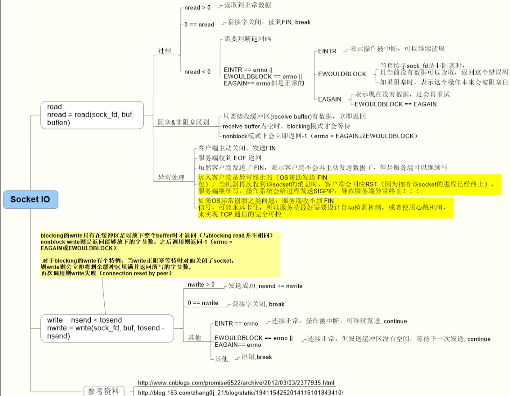
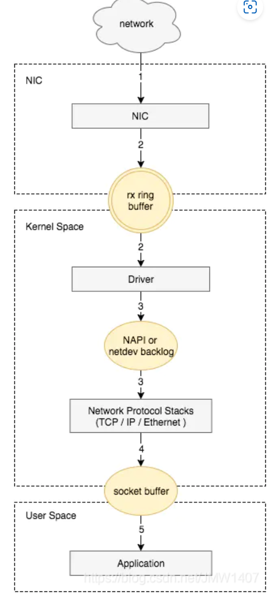

### 1. Socket是什么？

**原理分析**

Socket（套接字）用于描述IP地址和端口，是一个通信链的句柄。**Socket是对TCP/IP协议的封装和应用**。**Socket不属于协议范畴，而是一个调用接口（API）**。

对于TCP/UDP，一个端口只能有一个程序使用。当一个Server accept一个Client之后，会生成一个新的Socket，这个Socket即是这个连接的句柄，由**源IP、源端口、协议、目的IP、目的端口**唯一确定一个Socket。Server accept和一个Client建立连接后，可以继续等待新连接的到来，当有新Client建立连接时，会再生成一个Socket。

Linux中一个Socket对应一个文件。严格来说，一个Server可以创建多个连接，连接数并不受TCP端口数65535限制，而是受**Linux最大文件数限制**。Client的端口一般都是操作系统随机分配。

### 2. Client和Server的最大TCP连接数分别是多少？

**原理分析**

**Client最大TCP连接数**：Client每次发起TCP连接请求时，除非绑定端口，通常会让系统选取一个空闲的本地端口（local port），该端口是独占的，不能和其他TCP连接共享。TCP端口的数据类型是unsigned short，因此本地端口个数最大只有65536，端口0有特殊含义不能使用，可用端口最多只有65535。所以在全部作为Client端的情况下，**最大TCP连接数为65535**，这些连接可以连到不同的Server IP。

**Server最大TCP连接数**：Server通常固定在某个本地端口上监听，等待Client的连接请求。不考虑地址重用（SO_REUSEADDR）的情况下，Server端TCP连接4元组中只有remote ip和remote port是可变的，因此最大TCP连接数为**客户端IP数 × 客户端Port数**。对IPv4，最大TCP连接数约为 **2的32次方（IP数）× 2的16次方（Port数）= 2的48次方**。

**实际TCP连接数**：在实际环境中，受到机器资源、操作系统等的限制，特别是Server端，其最大并发TCP连接数远不能达到理论上限。在Unix/Linux下限制连接数的主要因素是**内存**和**允许的文件描述符个数**（每个TCP连接都要占用一定内存，每个Socket就是一个文件描述符）。在默认2.6内核配置下，每个Socket占用内存在 **15~20KB** 之间。

### 3. 网络连接和断开的本质是什么？

**原理分析**

**网络连接的本质**：
- 从服务器角度讲，新建一个连接代表着新建一个客户端的记录（客户端地址：客户端端口号），所有来自这个数据包都交给创建这个连接的应用去处理
- 从客户端角度讲，新建一个连接代表着新建一个服务器地址记录（服务器地址：服务器端口号），所有从这个连接发出的数据，都只能发给连接指定的地址
- TCP是双工的，所以连接建立后，两端都是客户端，也都是服务器

**断开连接的本质**：**不再往对应IP和端口收发数据**

### 4. 通信过程中哪些情况会导致线程进入阻塞状态？

**原理分析**

**Client端阻塞场景**：
- 请求与服务器建立连接时（执行Socket带参数的构造方法或connect()方法时），会进入阻塞状态，直到连接成功才返回
- 从Socket的输入流读入数据时，如果没有足够数据，会进入阻塞状态直到读到足够数据
  - `int read()`：只要输入流中有一个字节就算足够
  - `int read(byte[] buff)`：只要输入流中的字节数目与参数buff数组长度相同就算足够
  - `String readLine()`：只要输入流中有一行字符串就算足够（BufferedReader类中才有此方法）
- 向Socket的输出流写一批数据时，可能会进入阻塞状态，等到输出了所有数据或出现异常才返回
- 调用`setSoLinger()`设置关闭Socket的延迟时间后，执行close()会进入阻塞状态，直到底层Socket发送完所有剩余数据或超过延迟时间

**Server端阻塞场景**：
- 执行`ServerSocket.accept()`等待客户连接，直到接收到连接才返回
- 从Socket的输入流读入数据时，如果没有足够数据就会进入阻塞
- 向Socket的输出流写一批数据时，可能会阻塞直到输出了所有数据或出现异常

### 5. read/write的语义是什么？为什么会阻塞？

**原理分析**

write成功返回，只是buf中的数据被复制到了kernel中的**TCP发送缓冲区**。至于数据什么时候被发往网络、什么时候被对方主机接收、什么时候被对方进程读取，**系统调用层面不会给予任何保证和通知**。

write在什么情况下会阻塞？当kernel的该Socket的发送缓冲区已满时。对于每个Socket，拥有自己的send buffer和receive buffer。从Linux 2.6开始，两个缓冲区大小都由系统来自动调节（autotuning），一般在default和max之间浮动。

**已经发送到网络的数据依然需要暂存在send buffer中，只有收到对方的ack后，kernel才从buffer中清除这一部分数据**，为后续发送数据腾出空间。接收端将收到的数据暂存在receive buffer中，自动进行确认。但如果Socket所在的进程不及时将数据从receive buffer中取出，最终导致receive buffer填满。由于TCP的滑动窗口和拥塞控制，接收端会阻止发送端向其发送数据，最终导致send buffer填满，write调用阻塞。

**一般来说，由于接收端进程从Socket读数据的速度跟不上发送端进程向Socket写数据的速度，最终导致发送端write调用阻塞。**

read调用的行为相对容易理解，从Socket的receive buffer中拷贝数据到应用程序的buffer中。read调用阻塞，通常是发送端的数据没有到达。

### 6. blocking和nonblock模式下read/write行为的区别？

**原理分析**

将Socket fd设置为nonblock（非阻塞）是在服务器编程中常见的做法。采用blocking IO并为每一个Client创建一个线程的模式开销巨大且可扩展性不佳（带来大量的切换开销），更为通用的做法是采用**线程池+Nonblock I/O+Multiplexing（select/poll/epoll）**。

**几个重要的结论：**
1. **read**总是在接收缓冲区有数据时立即返回，而不是等到给定的read buffer填满时返回。只有当receive buffer为空时，blocking模式才会等待，而nonblock模式下会立即返回**-1**（errno = EAGAIN或EWOULDBLOCK）
2. **blocking的write**只有在缓冲区足以放下整个buffer时才返回（与blocking read并不相同）。nonblock write则是返回能够放下的字节数，之后调用则返回**-1**（errno = EAGAIN或EWOULDBLOCK）
3. blocking的write有个特例：当write正阻塞等待时对面关闭了Socket，则write会立即将剩余缓冲区填满并返回所写的字节数，再次调用则write失败（**connection reset by peer**）

### 7. read/write对连接异常的反馈行为是怎样的？

**原理分析**

对应用程序来说，与另一进程的TCP通信其实是完全异步的过程：
1. 并不知道对面什么时候、能否收到数据
2. 不知道什么时候能够收到对面的数据
3. 不知道什么时候通信结束（主动退出、异常退出、机器故障、网络故障等）

对于1和2，采用write→read→write→read…的序列，通过blocking read或nonblock read+轮询的方式可以保证正确的处理流程。对于3，kernel将这些事件的"通知"通过read/write的结果返回给应用层。

**FIN通知**：假设A机器上的进程a正在和B机器上的进程b通信：
- 当b进程终止时，OS会发送一个**FIN**包到对面
- **同步通知**：进程a对已经收到FIN的Socket调用read，如果已经读完receive buffer的剩余字节，返回**EOF（0）**
- **异步通知**：如果进程a正阻塞在read调用上，read调用立即返回EOF，进程a被唤醒
- Socket在收到FIN后，虽然调用read会返回EOF，但进程a依然可以调用write（TCP协议规定收到对方的FIN包只意味着对方不会再发送任何消息）

**RST通知**：如果b进程是异常终止的，发送FIN包是OS代劳的，b进程已经不复存在。当机器再次收到该Socket的消息时，会回应**RST**。a进程对收到RST的Socket调用write时，操作系统会给a进程发送**SIGPIPE**信号，默认处理动作是**终止进程**。

**网络不可达场景**：当B机器的OS崩溃/主机断电/网络不可达时：
- 如果a进程阻塞在read上，结果只能是**永远的等待**
- 如果a进程先write然后阻塞在read，TCP会持续重传**12次**（时间跨度约9分钟），然后在阻塞的read调用上返回错误：**ETIMEDOUT/EHOSTUNREACH/ENETUNREACH**
- 如果B机器恰好在某个时候恢复通路，收到a某个重传的packet，会因为不能识别而返回**RST**，此时a阻塞的read调用会返回错误**ECONNREST**

**总结**：write的错误最终通过read来通知应用层。Socket（或者说TCP/IP栈本身）对错误的反馈能力是有限的。

### 8. 如何可靠地检测连接状态？

**原理分析**

仅仅通过read/write来检测异常情况是不靠谱的，还需要额外的工作：

**1. 使用TCP的KEEPALIVE功能**
- keepalive routine每**2小时（7200秒）**启动一次，发送第一个探测包（probe）
- 如果在**75秒**内没有收到对方应答则重发probe
- 当连续**9个**probe没有被应答时，认为连接已断
- 缺点：默认时间间隔太长，又是整个TCP/IP栈的全局参数，修改会影响其他进程

**2. 应用层心跳**
- 严格的网络程序中，应用层的心跳协议是必不可少的
- 比TCP自带的keep alive要麻烦，但有其最大优点：**可控**
- 也可以简单一点，针对连接做timeout，关闭一段时间没有通信的"空闲"连接（参考Muduo网络编程中的Timing wheel踢掉空闲连接）

### 9. 数据从网卡到应用程序的过程是怎样的？

**原理分析**

1. 网卡驱动程序提取帧的全部内容，去掉以太网的帧头，向上传递给IP层
2. IP层接收到包，继续去掉IP头的内容，交给TCP层
3. TCP层根据TCP协议定义的格式继续解包，read()从socket buffer读取数据，传递给应用层
4. 应用层根据TCP层传来的数据，按照对应的应用层协议来分析包

### 10. 网卡驱动如何处理接收到的数据？

**原理分析**

硬件需要驱动程序来控制，而**网卡驱动就是CPU控制和使用网卡的程序**。

网卡处理完数字信号后，接下来的数据接收需要CPU参与，此时网卡通过**中断**将数据包到达的事件通知给CPU。接着CPU暂停手头工作，开始用网卡驱动来干活：
- 从网卡缓冲区读取接收到的数据
- 根据MAC头部的以太类型字段判断协议种类并调用处理该协议的软件（即协议栈）
- 通常接触的以太类型是IP协议，因此会调用TCP/IP协议栈来处理

### 11. 物理网卡收到数据包的处理流程是怎样的？

**原理分析**

1. 网卡收到数据包，先将高低电平转换到网卡fifo存储。网卡申请ring buffer的描述，根据描述找到具体的物理地址，从fifo队列物理网卡会使用**DMA**将数据包写到了该物理地址，其实就是**skb_buffer**中
2. 这个时候数据包已经被转移到skb_buffer中，因为是DMA写入，内核并没有监控数据包写入情况。这时候NIC触发一个**硬中断**，每一个硬件中断会对应一个中断号，且指定一个vCPU来处理
3. 硬件中断的中断处理程序调用驱动程序完成：**启动软中断**
4. 硬中断触发的驱动程序会**禁用网卡硬中断**，告诉NIC再来数据不用触发硬中断了，把数据DMA拷入系统内存即可
5. 硬中断触发的驱动程序会启动软中断，将数据包后续处理流程交给软中断慢慢处理。退出硬件中断，但注意和网络有关的硬中断，要等到后续开启硬中断后才有机会再次被触发
6. **NAPI**触发软中断，触发napi系统
7. 消耗ringbuffer指向的skb_buffer
8. NAPI循环处理ringbuffer数据，处理完成
9. 启动网络硬件中断，有数据来时候就可以继续触发硬件中断，继续通知CPU来消耗数据包

上述过程简单描述为：网卡收到数据包，**DMA到内核内存**，中断通知内核数据有了，内核按轮次处理消耗数据包，一轮处理完成后，开启硬中断。其核心是网卡和内核是**生产和消费模型**，网卡生产，内核负责消费。生产者需要通知消费者消费，如果生产过快会产生丢包，如果消费过慢也会产生问题。在高流量压力情况下，只有生产消费优化后，消费能力够快，此生产消费关系才可以正常维持。所以如果物理接口有丢包计数时，未必是网卡存在问题，也可能是**内核消费太慢**。

### 12. 如何将网卡收到的数据写入到内核内存？

**原理分析**

NIC在接收到数据包之后，首先需要将数据同步到内核中，这中间的桥梁是**rx ring buffer**。它是由NIC和驱动程序共享的一片区域。实际上rx ring buffer存储的并不是实际的packet数据，而是一个**描述符**，这个描述符指向了它真正的存储地址，具体流程如下：

1. 驱动在内存中分配一片缓冲区用来接收数据包，叫做**sk_buffer**
2. 将上述缓冲区的地址和大小（即接收描述符），加入到rx ring buffer。描述符中的缓冲区地址是DMA使用的物理地址
3. 驱动通知网卡有一个新的描述符
4. 网卡从rx ring buffer中取出描述符，从而获知缓冲区的地址和大小
5. 网卡收到新的数据包
6. 网卡将新数据包通过**DMA**直接写到sk_buffer中

当驱动处理速度跟不上网卡收包速度时，驱动来不及分配缓冲区，NIC接收到的数据包无法及时写到sk_buffer，就会产生堆积。当NIC内部缓冲区写满后，就会丢弃部分数据，引起丢包。这部分丢包为**rx_fifo_errors**，在`/proc/net/dev`中体现为fifo字段增长，在ifconfig中体现为**overruns**指标增长。

### 13. 互联网上的设备能收到所有其他设备发的报文吗？

**原理分析**

互联网上的设备通常无法直接接收到其他所有设备发送的报文。这是因为互联网是一个庞大的网络，设备之间通过路由器、交换机等中间设备进行通信，而不是直接连接到所有其他设备。

数据包通常通过**路由器**进行传输，路由器根据目的地址将数据包从发送者转发到接收者。因此，设备只能收到发送给它的数据包或者**广播地址**的数据包。

在局域网中，设备可以收到同一网络内的广播数据包。但在更大范围的互联网上，设备通常只能接收到发送给自己的数据包或者发送到广播地址的数据包。

有一些特殊情况，比如在网络分析、监控或黑客攻击等情况下，使用特殊工具或技术可能会使设备能够监听到其他设备之间的通信，但这通常需要特殊的权限和技能。

**点对点传输**：数据直接从一个设备传输到另一个设备，只有目标设备才能接收到数据。在点对点连接中，数据经过路由器、交换机等设备，但只有目标设备会接收到数据，其他设备无法收到。

### 14. 什么是混杂模式？

**原理分析**

开启**混杂模式（Promiscuous Mode）**的网卡能够接收到网络上所有经过它所连接的网络链路的数据包，而不仅限于发往它自己的目标地址或广播地址的数据包。但是也仅限于该设备所在链路的。其他设备比如路由器，不会收到非该路由器的数据。

在大型网络中，设备连接到交换机或路由器，这些设备之间的数据传输会经过这些网络设备。混杂模式的网卡可以接收到经过它所连接的交换机或路由器链路的数据包。

### 15. 操作系统如何将接收到的数据分发给正确的应用程序？

**原理分析**

当网卡接收到数据后，操作系统的网络协议栈会对数据包进行解析和处理。操作系统会根据数据包中的目标IP地址和目标端口号来确定应该交给哪个应用程序进行处理。

具体过程大致如下：
1. **数据接收**：网卡接收到数据包，将其传输到操作系统的网络协议栈
2. **网络协议栈处理**：操作系统的网络协议栈根据数据包中的目标IP地址和目标端口号进行解析
3. **端口分发**：操作系统根据数据包中的目标端口号，将数据包分发给相应监听该端口的应用程序或进程
4. **应用程序处理**：数据包最终被传递给相应端口对应的应用程序进行处理

这种方式通过网络协议栈中的**端口映射机制**，将接收到的数据包分发给了正确监听相应端口的应用程序。这样，即使有多个应用程序在同一台计算机上监听不同的端口，操作系统也能够将数据包正确地分发给相应的应用程序进行处理。
