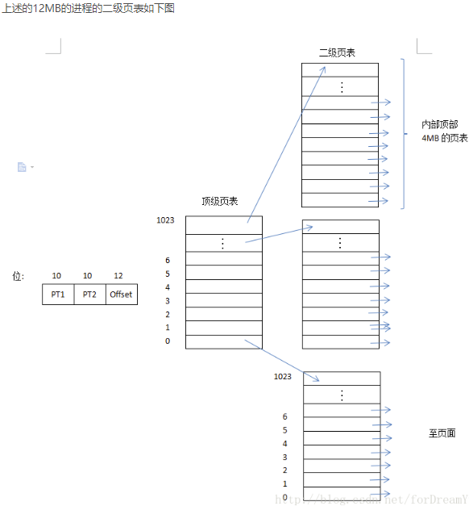
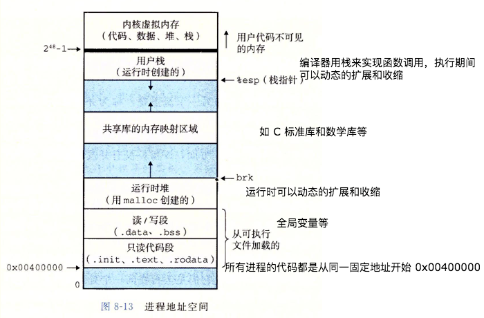
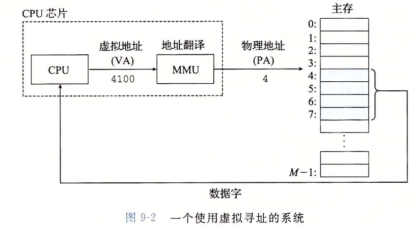
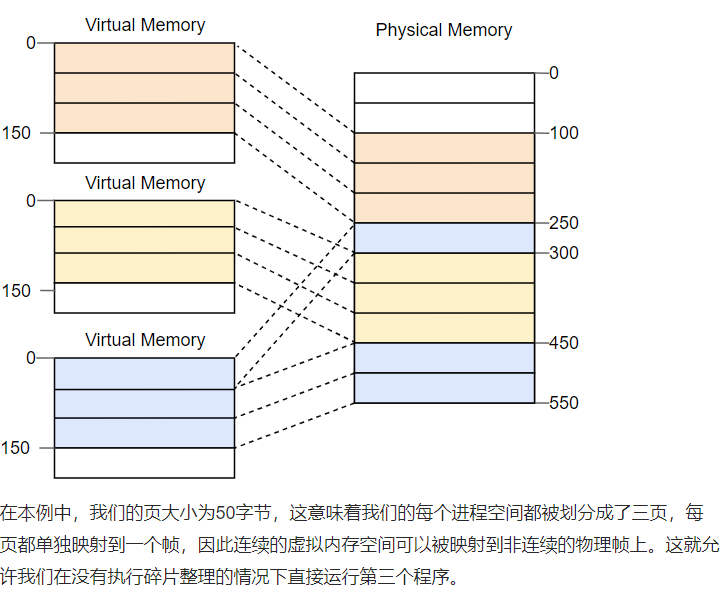
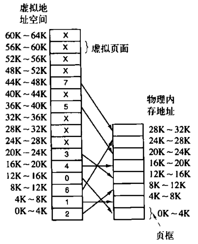
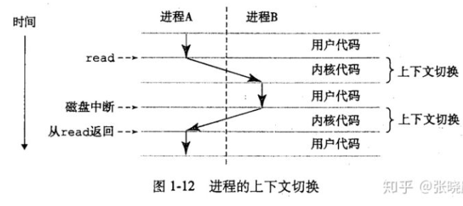
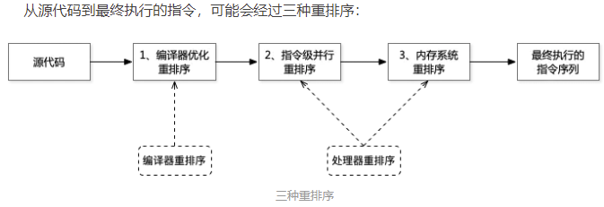
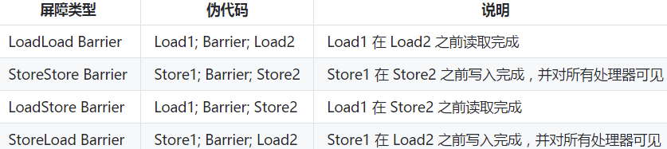

## 1. 什么是内存管理？传统内存管理方式有什么问题？

内存管理是操作系统对计算机内存进行**分配、回收和保护**的一套机制，记录哪些内存在使用、哪些空闲，在进程需要时为其分配内存，使用完后释放内存。

传统内存管理要求程序**完整且连续**地装入内存才能运行，存在三大问题：

- **地址空间不隔离**：一个程序可以通过内存地址直接访问或破坏另一个程序的内存，没有保护机制。
- **运行时地址不确定**：程序每次装载进内存的位置不同，代码中写死的绝对地址无法保证正确指向目标数据。
- **内存利用率低下**：所有程序必须完全装入内存，产生大量外部碎片。例如程序A 10M、B 70M、C 30M，内存共100M，三个程序共110M无法同时容纳。即使换出A，剩余两块空闲（10M + 20M）因不连续也无法装入30M的C，只能换出B，导致60M空闲浪费。

## 2. 什么是分页？分页解决了什么问题？

分页的核心思想是**将虚拟内存空间和物理内存空间划分成固定大小的小块**。虚拟内存空间的块称为**页（Page）**，物理地址空间的块称为**页帧（Page Frame）**，两者大小通常相同（典型为 **4KB**）。

分页带来的优势：

- 每个**页可以单独映射到任意一个帧上**，使得大块虚拟内存可以分散映射到不连续的物理内存上，解决了外部碎片问题。
- RAM和磁盘之间的交换以**整个页为单元**进行，程序只需装入当前所需的部分页面即可运行。
- 不同进程的虚拟地址彼此隔离，一个进程无法访问其他进程的物理内存。

## 3. 什么是页表？地址转换是如何进行的？

**页表**是存储虚拟页面到物理页帧映射关系的数据结构，**每个进程都有自己独立的页表**。页表的作用是**实现从页号到物理块号的地址映射**。在x86架构上，用**CR3寄存器**存放指向当前活动页表的指针，每次运行进程前操作系统将正确的指针写入该寄存器。

地址转换过程：
1. 程序产生一个**虚拟地址**（由指令中的地址、索引、基址寄存器、段寄存器产生）。
2. 硬件自动将虚拟地址拆分为**页号**（可能多级）和**页内偏移量**。
3. 根据页号查找页表，映射为对应的**页帧号**。
4. 页帧号 + 页内偏移量 = **物理地址**，完成对内存的读写/执行操作。

## 4. 多级页表为什么能节省空间？

当页面大小为4KB时，32位地址空间有 **100万个页面**。每个页表项需4-8字节，单级页表占用 **4MB~8MB**内存。每个进程都需要自己的页表，64位系统下更无法用单级页表实现。

**多级页表的核心思想**：**避免把全部页表一直保存在内存中，不需要的页表就不应该保留**。

根本原因：一个进程不会使用整个虚拟地址空间。例如一个12MB的进程，底端4MB程序正文、中间4MB数据、顶端4MB堆栈，中间大量空间未被使用。**顶级页表只为真正有用的页表提供索引**，未被使用的二级页表项标记为"不在内存"，访问时触发缺页中断。

x86_64架构使用**4级页表**，页大小为4KiB。每级页表固定 **512项**，每项8字节，每个页表大小恰好为 **4KiB**（正巧放满一页）。

## 5. 什么是虚拟内存？它的核心价值是什么？

**虚拟内存**是计算机系统内存管理的一种技术，是对物理内存的一层抽象。它在操作系统的管理下，**让每个进程产生了一种自己在独享主存的错觉**，拥有一个**一致的、私有的地址空间**。

虚拟内存的**重要意义**：
- **定义了一个连续的虚拟地址空间**。
- **把内存扩展到硬盘空间**，虚拟内存可以比实际物理内存大得多。
- 程序运行时可能只需要4G内存，但物理内存只有2G，**暂时用不到的内存被调出到磁盘，需要时再加载**。

虚拟内存的最大容量由**计算机的地址结构（CPU寻址范围）**和**磁盘空间大小**共同决定：
- 虚存大小 ≤ 内存容量 + 外存容量。
- 虚存大小 ≤ 计算机地址位数能容纳的最大容量。

## 6. 虚拟内存解决了传统存储管理的哪些问题？

传统存储管理有两个关键缺点：

1. **一次性**：作业必须一次性全部装入内存后才能开始运行。大作业无法运行；大量作业并发时只能运行少量，多道程序并发度低。
2. **驻留性**：作业一旦装入内存就驻留至运行结束，大量暂时不用的数据长期占用内存，浪费资源。

虚拟存储技术基于**局部性原理**解决以上问题：
- 程序装入时，**将很快会用到的部分装入内存**，暂用不到的部分留在外存。
- 执行过程中，**所访问的信息不在内存时**，操作系统从外存调入所需信息。
- **内存空间不够时**，操作系统将暂时用不到的信息换出到外存。

## 7. 什么是局部性原理？

**时间局部性**：如果执行了某条指令，不久后这条指令很可能再次被执行；如果某个数据被访问过，不久后该数据很可能再次被访问（因为程序中存在大量循环）。

**空间局部性**：一旦程序访问了某个存储单元，不久后其附近的存储单元也很有可能被访问（因为数据在内存中连续存放）。

时间局部性和空间局部性统称为**局部性原理**。

## 8. 什么是MMU？虚拟地址如何转换为物理地址？

**MMU（Memory Management Unit，内存管理单元）**是CPU中的硬件，**专门用于将虚拟地址翻译为物理地址**。现代处理器使用**虚拟寻址（Virtual Addressing）**方式，CPU需要将虚拟地址翻译成物理地址才能访问真实的物理内存。

转换流程：
1. CPU发出虚拟地址。
2. MMU借助存放在内存中的**页表**（由操作系统管理）进行翻译。
3. 虚拟地址被拆分为**页号**和**页内偏移量**，通过页表映射为页帧号。
4. 组合得到物理地址，完成内存访问。

CPU为页表寻址设置了缓存策略（**TLB快表**），由于程序的局部性，**TLB缓存命中率能达到98%**。

通过虚拟地址访问内存的优势：
- 程序可以使用**相邻的虚拟地址**访问物理内存中**不相邻的大内存缓冲区**。
- 程序可以使用虚拟地址访问**大于可用物理内存的内存缓冲区**，数据页在物理内存与磁盘之间移动。
- **不同进程使用的虚拟地址彼此隔离**，一个进程中的代码无法更改另一进程或操作系统使用的物理内存。

## 9. 什么是缺页中断（页缺失）？

**缺页中断（Page Fault）**是指程序访问的虚拟地址在页表中没有有效的物理页帧映射时，由系统触发的中断。

过程：一条线程在执行，CPU通过调度将其切出。如果虚拟内存不足，操作系统将前一个线程的数据写入磁盘，释放其虚拟内存。当CPU再次调度到该线程时，它在虚拟内存中对应的数据已不存在，需先从磁盘读到内存中，这种情况就是**页缺失**。

线程等待数据从磁盘读到内存时，**该CPU核会空闲下来**。多创建一条线程可以让CPU去执行其他任务而不必一直等待，充分利用CPU。

## 10. 什么是Swap空间？它是如何工作的？

Linux中的**Swap空间**（交换空间）在物理内存不够用时，将物理内存中的一部分空间释放出来供当前程序使用。

工作过程：
1. 系统检测到物理内存不足。
2. 选择**长时间没有什么操作的程序**，将其内存状态（包括堆栈状态等）写入磁盘上的Swap区保存。
3. 释放的内存空间分配给需要运行的程序。
4. 当被换出的程序重新被操作时，系统从Swap区读取数据恢复到内存中继续运行。

**系统总是在物理内存不够时**才进行Swap交换。

## 11. 为什么32位系统最多只能使用4GB内存？

32位系统的地址总线宽度为**32位**，能够寻址的物理地址范围为 **2^32 = 4GB**。这是由CPU的物理寻址能力决定的，每个内存地址都是32位，最多只能表示4GB的地址范围。

实际可用的物理内存通常**小于4GB**，因为这4GB地址空间还包括其他需要映射的设备（如显卡显存、BIOS、PCI设备等）。

**注意**：这是物理地址空间的限制。通过虚拟内存技术，32位系统下每个进程拥有独立的**4GB虚拟地址空间**，且可通过页表和Swap扩展，实际可用的虚拟内存可以超过物理内存。

## 12. 什么是内核内存映射？

内核内存映射是指操作系统内核如何将物理内存映射到内核地址空间。Linux内核地址空间通常划分为：

- **直接映射区（低端内存）**：物理内存的前896MB被直接映射到内核地址空间，通过简单偏移即可算出物理地址。
- **高端内存**：超过896MB的物理内存无法直接映射，需通过vmalloc、kmap等动态映射临时建立映射关系。
- **vmalloc区**：用于非连续内存分配，虚拟地址连续但物理地址可以不连续。
- **持久/临时内核映射区**：用于将高端内存页映射到内核地址空间。

**内核空间由所有进程共享同一套页表映射**，这就是系统调用切换到内核态时能访问同一内核地址空间的原因。而每个进程的用户空间拥有独立的页表。

## 13. 什么是内存屏障？为什么需要内存屏障？

**内存屏障（Memory Barrier）**是一类同步屏障指令，它使得CPU或编译器在对内存进行操作时，**严格按照一定的顺序来执行**。屏障之前的指令和之后的指令不会由于系统优化等原因而乱序，同时让一个CPU处理单元中的内存状态对其他处理单元可见。

**为什么需要内存屏障？**
- **CPU高速缓存**会缓存主存中的数据，避免每次向内存取，但也导致不同CPU核上不同线程对同一变量的缓存值不同。
- **指令重排序**：编译器和CPU为提高效率可能对指令重排序，多核环境下可能导致意外结果。

**根本原因**：MESI缓存一致性协议引入了**Store Buffer（存储缓存）**和**Invalidate Queue（失效队列）**优化以避免阻塞，使缓存一致性从强一致性弱化为**最终一致性**。内存屏障的作用就是**将缓存一致性从最终一致性强化为强一致性**。

内存屏障是**硬件之上、操作系统或JVM之下**对并发作出的最后一层支持。

## 14. 内存屏障有哪些类型？各类型的作用是什么？

**硬件层**的内存屏障分为三种基本类型：

- **读屏障（Load Barrier / lfence）**：屏障之后的读操作一定在屏障之前的读操作完成后执行。让Invalidate Queue中的无效化指令全部执行，强制读取入L1 Cache。相当于 **LoadLoad Barriers**。
- **写屏障（Store Barrier / sfence）**：屏障之后的写操作一定在屏障之前的写操作完成后执行。强制将Store Buffer中缓存的修改刷入L1 Cache，使**所有修改值可见**且**禁用重排序**。相当于 **StoreStore Barriers**。
- **全屏障（Full Barrier / mfence）**：同时刷新Store Buffer和Invalidate Queue，保证屏障前后的读写操作顺序正确。相当于 **StoreLoad Barriers**。

**Java中**抽象出四种内存屏障：

| 屏障类型 | 指令示例 | 说明 |
|---------|---------|------|
| **LoadLoad** | Load1;LoadLoad;Load2 | 确保Load1先于Load2及之后的所有装载指令完成 |
| **StoreStore** | Store1;StoreStore;Store2 | 确保Store1先刷新到内存（对其他处理器可见），再执行Store2及之后的存储指令 |
| **LoadStore** | Load1;LoadStore;Store2 | 确保Load1先于Store2及之后的所有存储指令完成 |
| **StoreLoad** | Store1;StoreLoad;Load2 | 确保Store1先刷新到内存，再执行Load2及之后的装载指令，兼具其他三种屏障效果，开销最大 |

**StoreLoad Barriers**同时具备其他三个屏障的效果，称为**全能屏障（mfence）**。

## 15. Java中volatile和final的内存屏障语义是怎样的？

**volatile的内存屏障策略**非常严格保守：
- 在每个 **volatile写操作前**插入 **StoreStore**屏障，写操作后插入 **StoreLoad**屏障。
- 在每个 **volatile读操作前**插入 **LoadLoad**屏障，读操作后插入 **LoadStore**屏障。

由于内存屏障的作用，避免了volatile变量与其他指令的重排序，线程之间实现了通信，使得volatile表现出了**轻量锁**的特性。

**编译器层面**，仅将volatile作为标记，取消编译层面的缓存和重排序。如果硬件架构本身已保证内存可见性（如单核处理器），volatile就是一个空标记。

**在写volatile变量v之后**插入sfence，sfence之前所有store不会被重排序到sfence之后，且修改的值都会被写回缓存并标记其他CPU中的缓存失效。
**在读volatile变量v之前**插入lfence，lfence之后的load不会被重排序到lfence之前，且会刷新无效缓存，得到最新的修改值。

**final的内存屏障规则**：
1. **写final域**：构造体结束前插入 **StoreStore**屏障，保证对final域的写入对其他线程可见，阻止重排序。
2. **读final域**：读final域前插入 **LoadLoad**屏障，保证先获取对象引用再读取final域。

x86处理器不会对写-写操作重排序，所以**StoreStore屏障会被省略**；X86也不会对逻辑上有依赖关系的操作重排序，**LoadLoad也会被省略**。

## 16. x86架构下如何实现内存屏障？HotSpot VM如何实现StoreLoad？

x86架构遵循 **TSO（Total Store Order）** 模型，StoreLoad Barrier以外的屏障均为空操作。

| x86指令 | 类型 | 说明 |
|---------|------|------|
| **sfence** | Store Barrier | 强制之前所有store指令执行完毕并刷出到L1 Cache，禁止重排序 |
| **lfence** | Load Barrier | 强制之后所有load指令在lfence之后执行，刷新无效缓存 |
| **mfence** | Full Barrier | 综合sfence与lfence，保证之前所有操作对之后的操作可见 |
| **lock** | 原子操作+Full Barrier | 使指令操作的内存只能由当前CPU使用，自带Full Barrier效果 |

x86-64一般情况下无需使用lfence和sfence，除非操作Write-Through内存或使用**non-temporal指令**（如movntdq、movnti等SSE指令集）。

**HotSpot VM**选择 **LOCK指令**作为StoreLoad屏障的实现。OpenJDK源码中使用 `lock; addl rsp,offset` 方式实现，在保证语义的同时避免了cpuid指令的昂贵开销。

## 17. MESI协议和内存屏障的关系是什么？

**MESI缓存一致性协议**可以解决各个CPU缓存的数据一致性问题。但为了避免阻塞带来的资源浪费，CPU引入了两个优化：

- **Store Buffer（存储缓存/写缓存）**：处理器修改缓存时，新值放入Store Buffer后就可干别的事，由Store Buffer负责后续同步。
- **Invalidate Queue（失效队列）**：收到缓存失效请求后放入队列，不等处理完成就让处理器继续执行。

这两个优化使缓存一致性从强一致性变为**最终一致性**，带来了可见性问题。**内存屏障的作用**：
- **写屏障**：保证之前所有Store Buffer中的指令真正写入了缓存。
- **读屏障**：保证之前所有Invalidate Queue中的无效化指令都执行完毕。

有了读写屏障的配合，不同核心上的缓存可以得到**强同步**。

在锁的实现上，**lock会加入读屏障**保证后续代码读到其他CPU核上的最新数据，**unlock会加入写屏障**将所有未回写的缓存进行回写。

并不是所有硬件架构都提供相同的一致性保证，JVM需要volatile统一语义。可见性问题也不局限于CPU缓存，JVM自身维护的内存模型中也有可见性问题，使用volatile可以一并解决。
