## 1. PageCache 是什么？它有哪些作用？

**PageCache（页高速缓存）**是操作系统内核中的磁盘高速缓存，本质是用内存来缓存磁盘数据。读写磁盘比读写内存慢得多，所以操作系统通过 DMA 把磁盘数据搬运到 PageCache 中，用读内存替换读磁盘。

PageCache 的两个核心优点：

- **缓存最近被访问的数据**：根据局部性原理，刚被访问的数据在短时间内再次被访问的概率很高。PageCache 缓存最近访问的数据，空间不足时淘汰最久未使用的缓存。
- **预读功能**：比如 read 方法每次只读 32KB，内核不仅读 0~32KB，还会把后面的 32~64KB 也读到 PageCache。后面读取这部分数据时成本极低。预读功能对机械硬盘尤其重要，因为旋转磁头寻道非常耗时。

读磁盘的流程：先在 PageCache 中查找，数据存在则直接返回；不存在则从磁盘读取并缓存到 PageCache。

## 2. 什么是 DMA 技术？没有 DMA 时 I/O 是怎么工作的？

**DMA（Direct Memory Access，直接内存访问）**：在进行 I/O 设备和内存的数据传输时，数据搬运工作全部交给 DMA 控制器，CPU 不再参与数据搬运，可以处理其他任务。

**没有 DMA 时**：CPU 收到中断信号后，从磁盘控制器缓冲区一个字节一个字节地读进自己的寄存器，再写入内存。数据传输期间 CPU 无法执行其他任务。

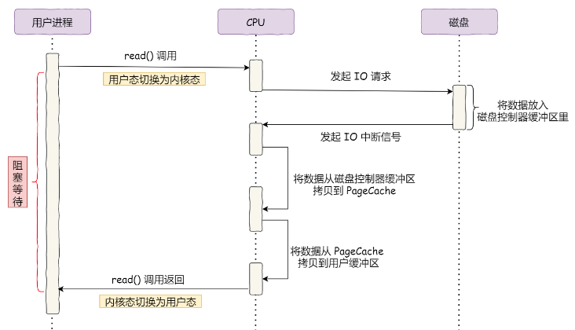

**有 DMA 时**：
1. DMA 收到磁盘信号，将磁盘控制器缓冲区中的数据拷贝到内核缓冲区，此时不占用 CPU，CPU 可执行其他任务。
2. CPU 收到 DMA 的信号，知道数据已准备好，将数据从内核拷贝到用户空间，系统调用返回。

**注意**：CPU 虽然不参与数据搬运，但传输什么数据、从哪里传输到哪里，仍需要 CPU 来告诉 DMA 控制器。CPU 在这个过程中仍然是必不可少的。

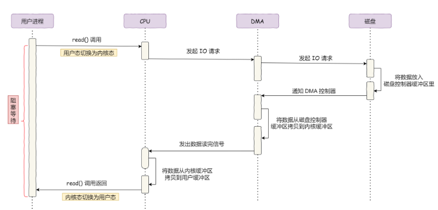

## 3. 传统 I/O 读写存在什么问题？

传统 I/O 代码通常为 `read(file, tmp_buf, len); write(socket, tmp_buf, len);`，需要两个系统调用。

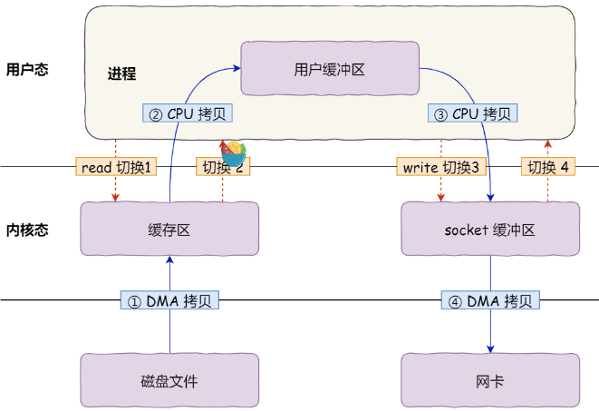

期间共发生 **4 次用户态与内核态的上下文切换**（两次系统调用，每次从用户态→内核态→用户态）。

共发生 **4 次数据拷贝**，其中两次是 DMA 拷贝，两次是 CPU 拷贝：

1. DMA 从磁盘拷贝到内核缓冲区。
2. CPU 从内核缓冲区拷贝到用户缓冲区。
3. CPU 从用户缓冲区拷贝到 socket 缓冲区。
4. DMA 从 socket 缓冲区拷贝到网卡。

上下文切换是因为用户空间没有权限操作磁盘或网卡，必须通过系统调用由内核代劳，一次系统调用必然发生 2 次上下文切换。

## 4. 什么是零拷贝技术？有哪些实现方式？

零拷贝是指计算机在执行操作时，CPU 不需要先将数据从内核空间拷贝到用户空间，再从用户空间拷贝回内核空间。它的作用是减少数据拷贝次数和系统调用，实现 CPU 零参与。**零拷贝技术可以把文件传输的性能提高至少一倍以上**。

实现零拷贝主要有两种方式：**mmap + write** 和 **sendfile**。

**mmap + write**：
- 用 `mmap()` 替换 `read()`，将内核缓冲区数据直接「**映射**」到用户空间，不再需要从内核拷贝到用户空间。
- `buf = mmap(file, len); write(sockfd, buf, len);`
- 减少了 1 次数据拷贝（省去了内核→用户的拷贝），但仍然需要 **4 次上下文切换和 3 次数据拷贝**（其中 1 次 CPU 拷贝）。

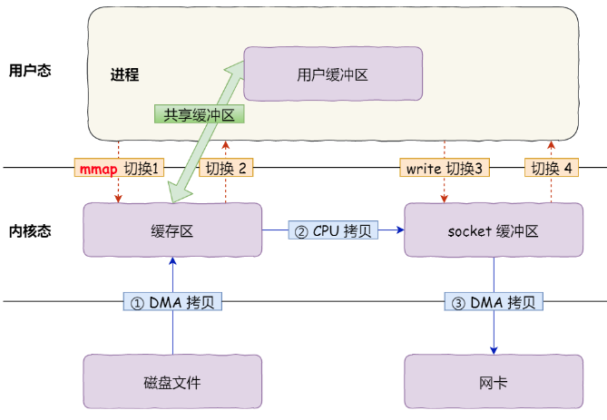

**sendfile**：
- Linux 内核 2.1 引入的专用系统调用，**替代 read() 和 write()**，减少一次系统调用和 2 次上下文切换。
- 直接把内核缓冲区数据拷贝到 socket 缓冲区，不再拷贝到用户态。
- 只有 **2 次上下文切换和 3 次数据拷贝**（2 次 DMA + 1 次 CPU 拷贝）。

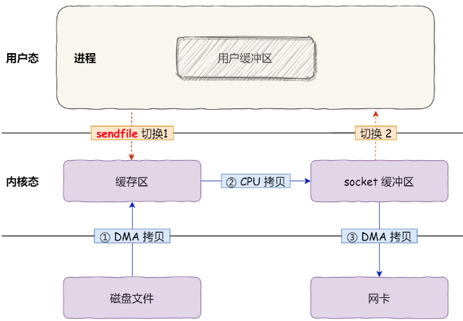

## 5. sendfile 如何实现真正的零拷贝？什么是 SG-DMA？

从 Linux 内核 **2.4 版本**开始，如果网卡支持 **SG-DMA（Scatter-Gather DMA）**技术，sendfile 可以实现真正的零拷贝：

1. 通过 DMA 将磁盘数据拷贝到内核缓冲区。
2. 将**缓冲区描述符和数据长度**传到 socket 缓冲区（不拷贝数据本身），网卡的 SG-DMA 控制器根据描述符信息直接将内核缓存中的数据拷贝到网卡缓冲区。
3. 全程无需 CPU 参与数据搬运。

变为 **2 次上下文切换和 2 次数据拷贝**（都是 DMA 拷贝，没有 CPU 拷贝），这就是真正的**零拷贝（Zero-copy）**。

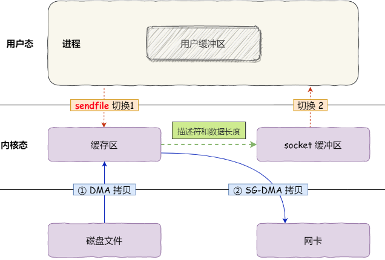

可以用 `ethtool -k eth0 | grep scatter-gather` 命令查看网卡是否支持 SG-DMA。

**sendfile 的局限性**：用户程序不能对数据进行修改，只是单纯地完成数据传输。零拷贝技术不允许进程对文件内容进一步加工（比如压缩数据再发送）。

Nginx 默认开启零拷贝技术。

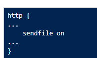

## 6. mmap+write 和 sendfile 有什么区别？

| 对比维度 | mmap + write | sendfile | sendfile + SG-DMA |
|---------|-------------|---------|-----------------|
| 系统调用次数 | 2 次 | 1 次 | 1 次 |
| 上下文切换 | 4 次 | 2 次 | 2 次 |
| 数据拷贝 | 3 次（2 DMA + 1 CPU） | 3 次（2 DMA + 1 CPU） | 2 次（2 DMA，0 CPU） |
| 数据对用户可见 | 是（共享缓冲区） | 否 | 否 |
| 能否修改数据 | 可以 | 不可以 | 不可以 |

mmap 映射方式中数据对用户可见，应用进程与内核「**共享**」缓冲区；而 sendfile 数据完全在内核空间内部传输，对用户空间完全不可见。

## 7. PageCache 在大文件传输中有什么问题？应该用什么方式？

**大文件（GB 级别）传输时 PageCache 会不起作用**，导致性能下降：

- 大文件会很快占满 PageCache 空间。
- 大文件局部数据被再次访问的概率低，**缓存命中率不高**。
- PageCache 被大文件占据后，其他「**热点**」小文件无法使用 PageCache，高并发下会带来严重的性能问题。
- 浪费 DMA 多做的一次数据拷贝到 PageCache。

**解决方案**：针对大文件使用「**异步 I/O + 直接 I/O**」替代零拷贝技术。

- **直接 I/O**：绕开 PageCache，不缓存数据。
- **异步 I/O**：发起读请求后不等待数据就位就返回，进程可以处理其他任务；当内核将数据拷贝到进程缓冲区后，通知进程再处理数据，不会阻塞。

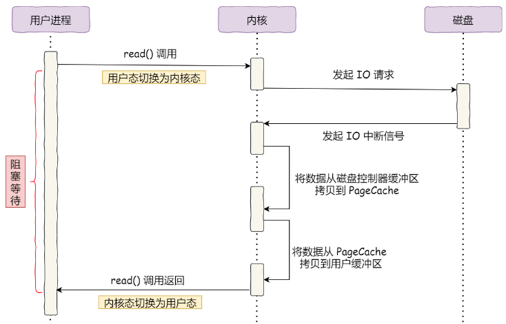

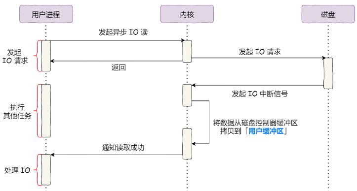

**直接 I/O 的应用场景**：
- 应用程序已实现磁盘数据缓存，不需要 PageCache 再次缓存（如 MySQL，可通过参数开启直接 I/O）。
- 传输大文件时。

**直接 I/O 的代价**：绕过了 PageCache，无法享受内核的两点优化：
- I/O 调度算法无法合并多个小 I/O 请求为一个大请求。
- 无法进行预读。

**传输文件的选择原则**：
- **小文件**：使用零拷贝技术（基于 PageCache）。
- **大文件**：使用「异步 I/O + 直接 I/O」。

Nginx 可以通过配置设定文件大小阈值来区分使用。

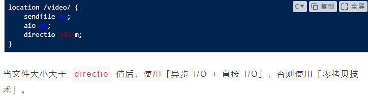

## 8. rm 删除文件后，磁盘空间会立刻释放吗？

**不一定**。`rm` 命令的行为：

1. `rm` 删除的是文件的**目录项（dentry）**，将 inode 中的**硬链接计数（link count）减 1**。
2. 如果 link count 变为 **0**，且没有任何进程以文件描述符（fd）形式打开该文件，则系统会释放 inode 和数据块，磁盘空间**真正释放**。
3. 如果文件**仍被某进程打开**（如正在写入的日志文件），内核会保留数据块，空间不会被释放。只有当持有该 fd 的进程关闭文件（close）或进程退出后，空间才会释放。

**典型场景**：删除正在被写入的日志文件后，`df -h` 看到磁盘空间没有变化。因为日志进程仍持有该文件的 fd，数据块未被释放。需要重启日志进程或 `> /proc/<pid>/fd/<n>` 来清空。

## 9. 什么是顺序读写和随机读写？为什么顺序读写更快？

**顺序读写**：数据在磁盘上**连续存放**，磁头从一个数据块移动到下一个相邻块时无需大幅移动，寻道时间很短。PageCache 的**预读功能**对顺序读写特别有效，内核会提前读入相邻的数据块。

**随机读写**：数据**分散在磁盘不同位置**，磁头需要频繁寻道和旋转等待，机械硬盘每次寻道约需 10ms。SSD 虽然不存在寻道问题，但随机读写仍比顺序读写慢（因为闪存按页读写、擦除以块为单位，随机写涉及读-改-写）。

**典型场景**：
- **顺序读写**：日志写入、大文件传输（下载/上传）、数据库的 redo log / binlog、Kafka 消息持久化。
- **随机读写**：数据库的 B+ 树查询（按主键查找）、OLTP 业务的大量小更新、文件系统的元数据操作。

## 10. 什么是用户空间和内核空间？什么是进程切换？

操作系统采用虚拟存储器，32 位系统的虚拟地址空间为 4G。为了保证用户进程不能直接操作内核，系统将虚拟空间分为两部分：

- **内核空间**：最高的 1G 字节（虚拟地址 0xC0000000 ~ 0xFFFFFFFF），供内核使用，可以执行任意命令、调用系统一切资源。
- **用户空间**：较低的 3G 字节（虚拟地址 0x00000000 ~ 0xBFFFFFFF），供各进程使用，只能执行简单运算，不能直接调用系统资源。用户态必须通过系统调用（System Call）向内核发出指令。

**进程切换**：内核挂起正在 CPU 上运行的进程，恢复以前挂起的某个进程执行。过程包括：
1. 保存处理机上下文（程序计数器和其他寄存器）。
2. 更新 PCB（进程控制块）信息。
3. 将进程 PCB 移入相应队列（就绪、阻塞等）。
4. 选择另一个进程执行，更新其 PCB。
5. 更新内存管理的数据结构。
6. 恢复处理机上下文。

进程切换**非常耗资源**。

## 11. 什么是文件描述符（fd）？

**文件描述符（File descriptor）**是一个非负整数，本质上是**一个索引值**，指向内核为每个进程维护的**该进程打开文件的记录表**。当程序打开或创建一个文件时，内核向进程返回一个文件描述符。底层程序编写往往围绕文件描述符展开。该概念适用于 UNIX、Linux 等操作系统。

## 12. 什么是 I/O 多路复用？select、poll、epoll 有什么区别？

**I/O 多路复用**通过一种机制使**一个进程可以监视多个描述符**，一旦某个描述符就绪（读就绪或写就绪），能通知程序进行相应的读写操作。select、poll、epoll 都是同步 I/O，因为读写事件就绪后需要自己负责进行读写，读写过程是阻塞的。

**select**：
- 将文件描述符分 3 类（writefds、readfds、exceptfds），用位图表示。
- 调用后阻塞，直到有描述符就绪或超时。
- 返回后需**遍历 fdset** 找到就绪的描述符。
- 最大 fd 数量限制为 **1024**（Linux 默认）。
- 每次调用需要**将 fd 数组从用户态拷贝到内核态**。

**poll**：
- 使用 **pollfd 结构体指针**代替位图，包含要监视的 event 和发生的 event。
- **没有最大数量限制**，但数量过大性能仍会下降。
- 返回后仍需**轮询 pollfd** 获取就绪的描述符。

**select 和 poll 的共同缺点**：
- 都需要**遍历所有文件描述符**来获取就绪的 socket。
- 随着监视描述符数量增长，效率线性下降。
- 大量客户端同时连接时，只有少数处于就绪状态，轮询效率极低。

**epoll**：
- 使用**一个文件描述符管理多个描述符**，将用户关心的 fd 事件存放到内核事件表中。
- 用户空间和内核空间的 copy **只需一次**（通过 epoll_ctl 注册后内核保存副本）。
- **没有描述符数量限制**，上限为 `/proc/sys/fs/file-max`（1GB 内存约 10 万）。
- **IO 效率不随 fd 数量增长而下降**，通过每个 fd 的回调函数实现，只有就绪的 fd 才会执行回调。
- 如果没有大量 idle-connection，epoll 效率不一定比 select/poll 高很多；遇到大量 idle-connection 时 epoll 效率远高于 select/poll。

## 13. epoll 的底层原理是什么？为什么高效？

epoll 提供三个系统调用接口：

**1. `epoll_create(int size)`**：创建一个 epoll 对象，在 epoll 文件系统中分配资源。返回的 fd 能在 `/proc/进程id/fd/` 看到，使用完后必须 `close()`，否则 fd 会被耗尽。

**2. `epoll_ctl(int epfd, int op, int fd, struct epoll_event *event)`**：对指定描述符执行操作（EPOLL_CTL_ADD 添加、EPOLL_CTL_DEL 删除、EPOLL_CTL_MOD 修改）。

**3. `epoll_wait(int epfd, struct epoll_event *events, int maxevents, int timeout)`**：收集发生的事件，返回需要处理的事件数目。

**epoll 高效的原因**：

调用 `epoll_create` 时，内核做了三件事：
- 在 epoll 文件系统里建一个 file 结点。
- 在内核 cache 里建一个**红黑树**，用于存储 `epoll_ctl` 传入的 socket。
- 建立一个 **rdllist 双向链表**，用于存储准备就绪的事件。

**回调机制**：添加到 epoll 中的事件都会与设备（如网卡）驱动程序建立回调关系。当对应的事件（如可读）发生时，驱动程序调用回调方法 **ep_poll_callback**，将事件放到 rdllist 双向链表中。调用 `epoll_wait` 时仅观察 rdllist 是否为 NULL 即可。

**select 的三个缺陷及 epoll 的改进**：
- 缺陷 1：select 需要传入 fd 数组并拷贝到内核。→ epoll 内核中保存一份 fd 集合，只需告知修改部分。
- 缺陷 2：select 内核层通过遍历检查 fd 就绪状态。→ epoll 通过异步 IO 事件唤醒。
- 缺陷 3：select 仅返回就绪 fd 个数，具体哪个可读需用户遍历。→ epoll 仅将有 IO 事件的 fd 返回给用户。

## 14. epoll 的 LT 和 ET 触发模式有什么区别？

**LT（水平触发，Level Triggered）**—— 默认模式：
- 只要文件描述符还有数据可读，每次 `epoll_wait` 都会返回它的事件，提醒用户程序去操作。
- 编程简单，不易丢失事件。

**ET（边缘触发，Edge Triggered）**—— 高速模式：
- 检测到 I/O 事件时，通过 `epoll_wait` 得到有事件通知的 fd。
- 对于每个被通知的 fd（如可读），**必须将该 fd 一直读到空，让 errno 返回 EAGAIN 为止**，否则下次 `epoll_wait` 不会返回余下数据，会丢掉事件。
- 如果 ET 模式不是非阻塞的，那一直读或一直写势必会在最后一次阻塞。
- 适合高并发场景，事件通知次数更少，效率更高。

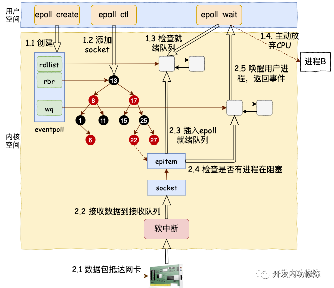

## 15. 异步 I/O（AIO）有什么缺陷？io_uring 是什么？

**AIO 的缺陷**：

1. **仅支持 direct IO**：使用 AIO 时只能用 O_DIRECT，不能借助文件系统缓存，存在 size 对齐等限制。
2. **仍可能被阻塞**：语义不完备，`io_getevents` 中如果 events 未完成，进程仍会进入睡眠。
3. **拷贝开销大**：每个 IO 提交需拷贝 64+8 字节，每个 IO 完成需拷贝 32 字节。大量小 IO 场景下影响较大。
4. **API 不友好**：每个 IO 至少需要两次系统调用（submit 和 wait-for-completion）。
5. **系统调用开销大**：`io_submit/io_getevents` 造成较大系统调用开销。

以 nginx 为例，仅在读取文件时使用 AIO，写入往往写入内存就立刻返回，效率很高，替换成 AIO 写入速度反而会下降。

**io_uring**：Linux 内核全新的异步 IO 引擎，解决了 AIO 的诸多限制，通过共享内存的环形队列（Submission Queue 和 Completion Queue），实现真正的**无需系统调用**的 IO 操作，大幅降低 IO 延迟。

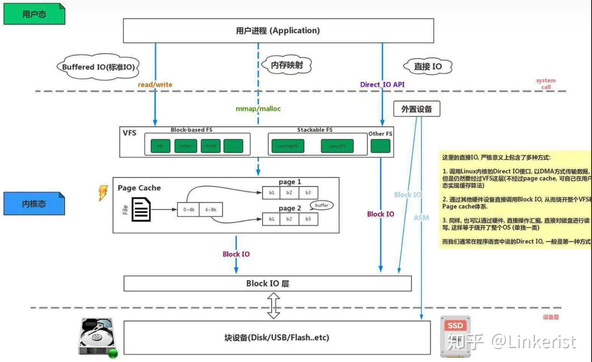
