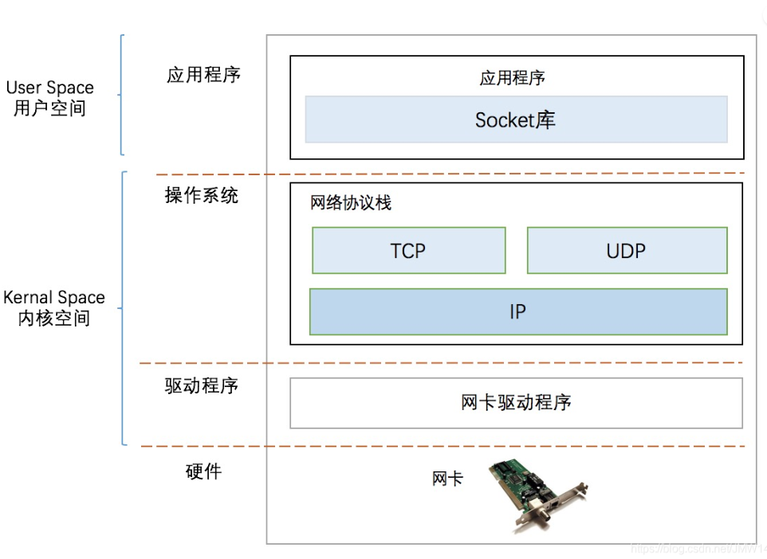
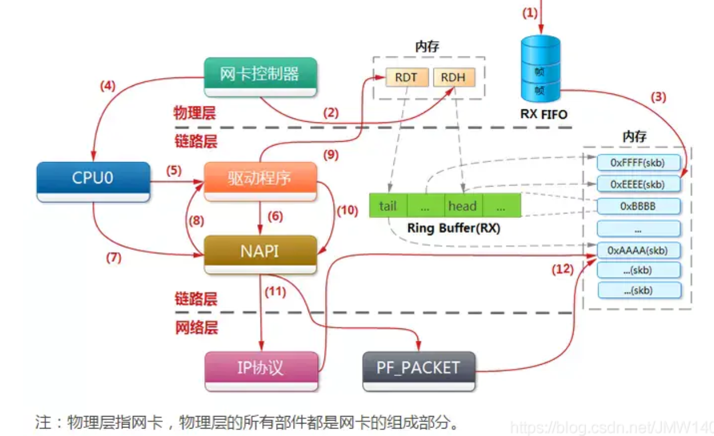
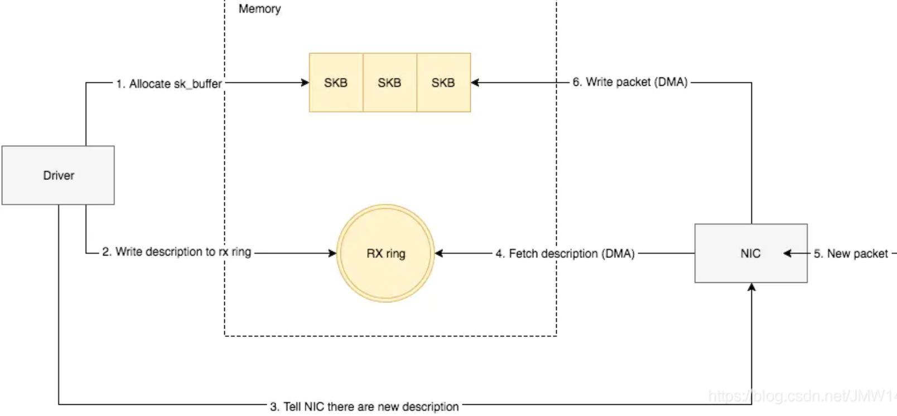
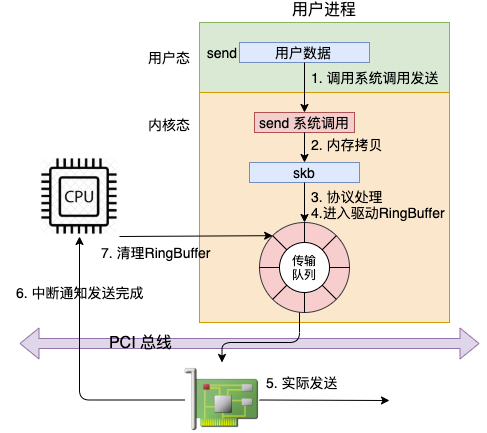

## 1. 什么是用户态和内核态？CPU如何区分指令来源？

- **用户态（Ring3）**：应用程序运行的状态，只能执行非特权指令，访问受限的内存空间，不能直接操作硬件。
- **内核态（Ring0）**：操作系统内核运行的状态，可以执行特权指令，访问所有内存空间和硬件资源。
- **特权指令**：在系统态时运行的指令，对内存空间的访问范围基本不受限制，只能由操作系统使用，应用程序不允许使用。
- **非特权指令**：在用户态时运行的指令，只能完成一般性操作，不能直接访问系统中的硬件和软件，对内存的访问范围局限于用户空间。

CPU本身并不能区分指令来自用户还是操作系统，而是通过**特权等级**来区分。CPU内部有一个**状态位**记录当前运行级别，根据这个状态位判断是否能执行某条指令。保证这个状态位当且仅当在操作系统内部为内核态，是操作系统的任务。

## 2. 用户态如何切换到内核态？有哪几种方式？

从用户态切换到内核态的**唯一途径**是**中断/异常/陷入**，有三种方式：

- **系统调用**：用户态程序主动请求操作系统服务（如读写文件、创建进程），通过软中断指令（如 `int 0x80`）陷入内核。系统调用本身就是软件中断。
- **异常**：用户态程序运行时发生异常事件（如缺页异常、除零错误），触发切换到内核态处理。
- **外设中断**：外设完成用户请求后向CPU发送中断信号，CPU暂停当前程序进入内核态处理中断。

从内核态切换回用户态的途径：**设置程序状态字（PSW）**，恢复用户态的执行环境。

## 3. 用户态和内核态的切换为什么有开销？

- **寄存器保存与恢复**：进入内核时需要保存用户态的寄存器，返回用户态时恢复。
- **栈切换**：每个进程有两个栈——用户态栈和内核态栈。执行int中断指令时，从用户态栈切换到内核栈。
- **CR3寄存器更新**：如果涉及不同用户程序间切换，需要更新CR3寄存器（更换虚拟内存到物理内存的映射表），这是一个较高负担的操作。
- **安全检查**：内核代码对用户不信任，需要进行额外的参数检查。
- **返回处理**：系统调用的返回过程有额外工作，如检查是否需要调度等。

## 4. 什么是中断？中断发生后操作系统底层的工作步骤？

**中断**是指CPU执行程序时，由于发生了某种事件，CPU暂停当前程序，转去执行中断处理程序，处理完后再返回继续执行被暂停的程序。

当中断发生时，中断程序的程序计数器、程序状态字、寄存器会被**硬件压入堆栈**，然后计算机跳转到**中断向量**所指示的地址。

中断发生后操作系统底层工作步骤：
1. **硬件压入堆栈**：保存程序计数器、程序状态字等。
2. **硬件装入新PC**：从中断向量装入新的程序计数器。
3. **汇编保存寄存器**：汇编语言过程保存寄存器值。
4. **汇编设置新栈**：汇编语言过程设置新的堆栈。
5. **C中断服务程序运行**：C语言编写的中断服务程序执行。
6. **调度程序决策**：调度程序决定下一个将运行的程序。
7. **C过程返回**：C过程返回至汇编代码。
8. **汇编运行新进程**：汇编语言过程开始运行新的当前进程。

所有的中断都从**保存寄存器开始**。

## 5. 什么是异常？中断和异常有什么区别？

**异常**是由CPU执行指令过程中产生的**同步事件**，与当前执行的指令直接相关。例如：
- **缺页异常**：访问的虚拟地址没有对应的物理页帧。
- **除零异常**：整数除法中除数为0。
- **段错误**：访问非法内存地址。

**中断和异常的区别**：

| 对比维度 | 中断 | 异常 |
|---------|------|------|
| 触发方式 | **异步**，由外部硬件设备产生 | **同步**，由CPU执行指令产生 |
| 与当前指令关系 | 无关 | 直接相关 |
| 返回地址 | 通常返回被中断指令的下一条 | 可能返回当前指令重新执行（如缺页），也可能终止程序 |
| 典型例子 | 网卡收到数据、时钟中断 | 缺页异常、除零异常、系统调用 |

## 6. 什么是系统调用？为什么需要系统调用？

**系统调用**是用户态程序请求操作系统内核服务的**唯一合法入口**。用户态程序没有权限直接操作硬件或访问内核资源，必须通过系统调用让内核代劳。

系统调用的本质是一种**软件中断**（如 x86 上的 `int 0x80` 或 `sysenter` 指令），程序执行到系统调用时：
1. 使用软中断指令，**保存现场**。
2. 获取系统调用号，在内核态执行对应的内核函数。
3. **恢复现场**，返回用户态。

每个进程都会有两个栈——一个**内核态栈**和一个**用户态栈**。当执行int中断指令时，由用户态栈转向内核栈。

## 7. 什么是驱动程序？驱动程序的本质是什么？

**驱动程序**是运行在**内核态**的软件组件，可以操作各种硬件，访问操作系统的大多数底层资源。

驱动程序的本质：
- 绝大多数用户进程运行在**用户态**，无法直接操作硬件和访问系统底层资源。
- 绝大多数驱动程序运行在**内核态**，可以操作硬件、访问系统底层资源。
- 驱动程序除了操作硬件，就是访问操作系统底层资源的**桥梁**。

操作系统通过驱动程序抽象硬件差异，为上层应用提供统一的接口。没有驱动程序，操作系统无法控制和使用任何硬件设备。

## 8. 网络数据包从网卡到应用程序的完整流程是怎样的？

**数据接收流程**：
1. **网卡接收数据**：网卡收到数据包，将高低电平转换到网卡FIFO存储，申请ring buffer的描述符找到物理地址。
2. **DMA写入内存**：网卡通过DMA将数据包写入内核预分配的 **sk_buffer** 中，不占用CPU。
3. **硬中断通知**：NIC触发一个**硬中断**，通知CPU有数据到达。每个硬件中断对应一个中断号，且指定一个vCPU来处理。
4. **中断处理程序**：硬中断的处理程序调用驱动程序，**禁用网卡硬中断**（告诉NIC再来数据不用触发硬中断，直接DMA到内存），然后**启动软中断**，将数据包后续处理流程交给软中断慢慢处理。
5. **NAPI轮询**：软中断触发NAPI系统，NAPI循环消耗ring buffer中的sk_buffer数据。
6. **协议栈处理**：数据包经过IP层（去掉IP头）、TCP层（去掉TCP头，根据TCP协议格式继续解包）逐层解析。
7. **交付应用**：最终数据存入 socket 的**接收缓冲区**，应用程序通过 `read()` 系统调用读取数据。

处理完成后**开启网络硬中断**，等待下一个数据包到达。

**核心机制**：网卡和内核是**生产和消费模型**，网卡生产数据，内核负责消费数据。如果生产过快会产生丢包，如果消费过慢也会产生问题。当驱动处理速度跟不上网卡收包速度时，驱动来不及分配缓冲区，NIC接收到的数据包无法及时写到sk_buffer，NIC内部缓冲区写满后会丢弃部分数据，引起丢包（`rx_fifo_errors`）。

**混杂模式**：开启混杂模式的网卡能够接收到网络上所有经过它所连接的网络链路的数据包，而不仅限于发往它自己的目标地址或广播地址的数据包。但也仅限于该设备所在链路的范围。

## 9. 什么是Socket？最大TCP连接数是多少？

**Socket（套接字）**：对TCP/IP协议的封装和应用，是一个调用接口（API），不属于协议范畴。Socket描述了IP地址和端口，是一个通信链的句柄。Linux中一个socket对应一个文件描述符。

**最大TCP连接数**：
- **Client端**：每次发起TCP连接时，系统分配一个空闲的本地端口（unsigned short类型，最多65535个可用端口），所以client端**最大TCP连接数为65535**，这些连接可以连到不同的server IP。
- **Server端**：监听端口固定，4元组中只有remote IP和remote port可变，理论最大连接数为 **2^32（IP数）× 2^16（端口数）= 2^48**。
- **实际限制**：受机器资源、操作系统限制。主要限制因素是**内存**和**文件描述符个数**（每个socket占用15~20KB内存）。在默认2.6内核配置下，每个socket占用内存在15~20KB之间。

一个server accept和一个client建立连接后，会生成一个新的socket，这个socket即是这个连接的句柄。源IP、端口、协议、目的IP、端口唯一确定一个socket。server可以继续等待新连接的到来，当有新client建立连接时，会再生成一个socket。

## 10. Socket通信中read/write的阻塞行为是怎样的？

**write阻塞**：当内核的socket发送缓冲区已满时，write调用会阻塞。已经发送到网络的数据依然需要暂存在send buffer中，只有收到对方的ACK后，内核才从buffer中清除这部分数据，为后续发送数据腾出空间。接收端将收到的数据暂存在receive buffer中，如果socket所在的进程不及时将数据取出，最终导致receive buffer填满，由于TCP的滑动窗口和拥塞控制，接收端会阻止发送端发送数据，最终导致send buffer填满，write调用阻塞。**导致write阻塞的根本原因是接收端读数据速度跟不上发送端写数据速度。**

**read阻塞**：从socket的receive buffer中拷贝数据到应用程序的buffer中。当receive buffer为空时，blocking模式下read调用会阻塞等待。

**非阻塞模式**：将socket fd设置为nonblock时：
- **read**：receive buffer为空时立即返回 **-1**（errno = EAGAIN或EWOULDBLOCK）。
- **write**：返回能够放下的字节数，后续调用返回 **-1**（errno = EAGAIN或EWOULDBLOCK）。

## 11. read/write对连接异常的反馈行为是怎样的？

对应用程序来说，TCP通信是完全异步的过程，不知道对面何时收到数据、何时能收到对面数据、何时通信结束。

**正常关闭**：
- 收到FIN后，read同步返回**EOF（0）**（如果已经读完receive buffer的剩余字节）；如果正阻塞在read上，read立即返回EOF唤醒进程。
- 收到FIN后仍可以write（TCP半关闭），但对方会回复RST。

**进程异常终止**：OS代劳发送FIN包，行为与正常关闭一致。

**主机崩溃/断电/网络不可达**：
- 无法收到FIN包。TCP会持续重传12次（时间跨度大约9分钟），然后在阻塞的read调用上返回错误：**ETIMEDOUT/EHOSTUNREACH/ENETUNREACH**。
- 如果没有那次write调用，应用层永远不会收到连接错误的通知。**write的错误最终通过read来通知应用层。**

**收到RST后write**：OS会发送**SIGPIPE**信号，默认处理动作是**终止进程**。

**检测连接异常的方法**：
- **TCP Keepalive**：每2小时（7200秒）启动一次探测，发送probe后75秒无应答则重发，连续9个无应答认为连接已断。但默认时间间隔太长，且是全局参数，修改会影响其他进程。
- **应用层心跳**：更推荐的方式，可控性更强。
- **连接超时**：关闭一段时间没有通信的空闲连接。

## 12. 发送网络数据时涉及哪些内存拷贝操作？

发送网络数据涉及三次内存拷贝：

1. **第一次拷贝**：内核申请skb后，将用户buffer中的数据拷贝到skb中。数据量较大时开销不小。
2. **第二次拷贝**：从传输层进入网络层时，每个skb都会被**克隆**一个副本。网络层、驱动、软中断在发送完成时删除副本，传输层保存原始skb以便在未收到ACK时重传。**这是TCP可靠传输的必要代价。**
3. **第三次拷贝**（非必须）：当IP层发现skb大于MTU时，将skb分片，申请额外的skb并拷贝为多个小的skb。

零拷贝技术无法省略第二次拷贝，因为TCP可靠性需要保留原始数据用于重传。

## 13. 什么是函数调用栈？为什么函数调用要用栈实现？

**函数调用栈**是指程序运行时，在内存中开辟的一块**后进先出（LIFO）**的存储区域，用于保存函数调用过程中的返回地址、参数、局部变量和寄存器等信息。

函数调用用栈实现的原因：
- **支持嵌套调用**：函数A调用B，B调用C，每次调用的返回地址、参数、局部变量都需要保存，栈的LIFO特性完美匹配调用/返回顺序。
- **自动管理**：调用时自动压栈，返回时自动出栈，无需手动管理内存。
- **支持递归**：同一函数的多次调用可以在栈上保存不同的局部变量副本。
- **效率高**：压栈/出栈操作由硬件直接支持，速度极快。

## 14. 什么是线程挂起？和阻塞有什么区别？

**线程挂起**是指线程暂时停止执行的状态，通常由以下原因触发：
- 调用了sleep()主动让出CPU。
- 等待某个条件满足（如等待I/O完成）。
- 被操作系统调度器暂停。

**阻塞**是挂起的一种特殊情况，指线程因等待某个资源（如I/O、锁）而无法继续执行时，由操作系统将其置为阻塞状态。当资源可用时，操作系统会自动将线程唤醒。

挂起（Suspend）和阻塞（Block）的核心区别：
- **阻塞的线程**在等待的资源就绪后会由操作系统**自动唤醒**，进入就绪态。
- **挂起的线程**通常需要其他线程或外部事件**显式唤醒**（如调用resume或条件满足）。
