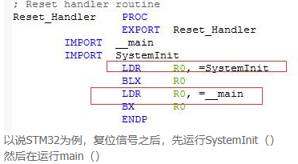

## 1. 什么是数字电路？逻辑门如何构成计算单元？

**数字电路**的基础是**逻辑门**（AND、OR、NOT等），通过逻辑门可以搭建出**组合电路**和**时序电路**，再构建**触发器**、**加法器**等基本单元，最终组成CPU和整个计算机。

- 电子门的工作方式由**开关**驱动。在电路中连接多个门就得到了**加法器**，一组开关代表第一个数字，另一组代表第二个数字，打开/关闭开关输入数字，输出显示两数之和。
- **原始CPU**就是许多这样的电路的集合。
- 就像游戏中的"红石电路"可以搭建出逻辑门，从逻辑门出发可以搭建出计算机的全部功能单元。

## 2. 什么是图灵机？什么是图灵完备？

**图灵机**（Turing Machine）是英国数学家艾伦·图灵提出的一个**抽象计算模型**，由一个无限长的纸带和一个读写头组成，可以模拟任何计算机算法的执行过程。

**图灵完备**（Turing Completeness）是指一个编程语言或系统能够模拟图灵机的全部功能，即能计算所有可计算的问题。如果一个系统是图灵完备的，那么它理论上可以完成任何其他编程语言能完成的计算任务。

- 大多数现代编程语言（C、Java、Python等）都是**图灵完备**的。
- 图灵机是最基础的计算模型，所有**可计算问题**都可以在图灵机上求解。

## 3. 计算机组成原理的核心结构是怎样的？

计算机组成原理的核心是**冯·诺依曼体系结构**，包含以下五大部件：

- **运算器**：执行算术运算和逻辑运算。
- **控制器**：负责指令的取指、译码、执行控制。
- **存储器**：存储程序和数据（内存）。
- **输入设备**：向计算机输入数据（键盘、鼠标等）。
- **输出设备**：将计算结果输出（显示器、打印机等）。

**关键特点**：
- **存储程序**：指令和数据以同等地位存储在存储器中，可以按地址访问。
- **二进制**：指令和数据都用**二进制**表示。
- **顺序执行**：指令按顺序逐条执行，除非遇到跳转指令。

## 4. C语言编译出来的文件是什么？它是如何被机器执行的？

C语言源代码经过编译流程生成**可执行文件**（二进制机器码），流程如下：

**编译四步骤**：
1. **预处理**：处理`#include`、`#define`等预处理指令，生成`.i`文件。
2. **编译**：将C代码翻译成**汇编语言**，生成`.s`文件。
3. **汇编**：将汇编代码翻译成**机器指令**（二进制目标代码），生成`.o`或`.obj`文件。
4. **链接**：将多个目标文件和库文件合并，重定位地址，生成最终**可执行文件**（ELF/PE格式）。

**如何被机器执行**：
- 可执行文件中的**二进制机器指令**被加载到**内存**中。
- CPU的**取指单元**从内存中逐条读取指令。
- **译码器**将机器指令翻译成控制信号。
- **执行单元**根据控制信号完成算术运算、内存访问、跳转等操作。
- 程序计数器（PC）记录下一条指令的地址，控制指令执行顺序。

## 5. 计算机是如何启动的？

计算机启动分为**单片机（MCU）启动**和**PC（x86）启动**两种情况。

**单片机（MCU）启动流程**：
1. **复位延时** → **内部RC起振** → **内部自举程序** → **用户程序**。
2. 上电后，MCU厂商固化的**ROM代码**运行，初始化核心时钟、总线、片上Flash等。
3. 加载Flash中的用户代码（.s汇编文件），安排**中断向量表**、系统初始化、堆栈，然后跳转到`main`函数。
4. `main`函数执行，配置PLL、片上外设初始化，所有设备开始工作。
5. 上电瞬间，MCU的**程序计数器（PC）** 被初始化为**上电复位地址**，从此地址读取第一条指令开始执行。

**PC（x86）启动流程**：
1. 上电后CPU的PC指针指向**BIOS**（基本输入输出系统）的入口地址。
2. BIOS完成**硬件自检（POST）**、初始化中断向量、检测硬件设备。
3. BIOS按照启动顺序（硬盘→U盘→光驱等）读取**引导扇区（MBR）**。
4. 引导程序（如GRUB）加载**操作系统内核**到内存。
5. 操作系统内核初始化，接管硬件控制权。

## 6. 什么是时钟信号？时钟周期和指令周期的关系是什么？

**时钟信号**是CPU工作的**心跳**，由晶体振荡器产生，是一个周期性的方波信号。

- **时钟周期**：时钟信号中两个相邻上升沿之间的时间间隔，是CPU最基本的**时间计量单位**。
- **指令周期**：CPU执行一条指令所需的全部时间，包含多个**机器周期**。
  - **取指周期**：从内存读取指令。
  - **译码周期**：解析指令操作码。
  - **执行周期**：执行指令规定的操作。
  - **写回周期**：将结果写回寄存器或内存。
- 一个机器周期通常由**若干个时钟周期**组成。

**关系**：时钟频率越高，每个时钟周期越短，CPU执行指令的速度越快。但受限于物理功耗和散热，频率不能无限提高。

## 7. 什么是中断？中断上下文是如何保存和切换的？

**中断**是硬件或软件向CPU发送的**信号**，使CPU暂停当前任务，转去执行中断处理程序，处理完后再返回原任务继续执行。

**中断分类**：
- **硬中断**：由硬件设备产生（如网卡、键盘、磁盘）。
- **软中断**：由软件通过指令主动触发（如系统调用、异常）。

**中断上下文**：中断发生以后，CPU跳到内核设置的中断处理代码中执行。这个处理过程中的上下文就是**中断上下文**。

**现场信息保存方式（保存上下文）**：

- **集中式保存**：在内存系统区设置一个**中断现场保存栈**，所有中断的现场信息统一保存在这个栈中，进栈和退栈由系统严格按照**后进先出（LIFO）** 原则实施。
- **分散式保存**：在每个进程的PCB中设置一个**核心栈**，一旦程序被中断，中断现场信息就保存在自己的核心栈中。

**中断处理过程**：
1. CPU保存当前任务的**寄存器状态**（程序计数器、通用寄存器等）。
2. 关闭中断，防止嵌套中断。
3. 识别中断源，跳转到对应的**中断处理程序**。
4. 执行中断处理。
5. 恢复寄存器，开中断，返回原任务继续执行。

## 8. 网卡在什么情况下会产生中断？为什么需要中断？

网卡在**发送完成**或**接收完成**时会产生**硬中断**通知CPU。

- **发送场景**：数据发送完毕后，需要**释放缓存队列等内存**。网卡在发送完毕时给CPU发送硬中断，通知CPU可以释放传输缓存。
- **接收场景**：网卡接收到数据，将数据写入内存中的接收缓冲区，然后发送硬中断通知CPU去处理接收到的数据。

**为什么需要中断**：没有中断时CPU需要**轮询**设备状态，浪费大量CPU时间。中断机制让CPU在无事时执行其他任务，设备完成操作后再通知CPU，大大提高了CPU利用率。

## 9. fork系统调用的实现原理是什么？

**fork**用于创建一个新进程（子进程），子进程是父进程的**完整拷贝**。它的核心特点是**一次调用，两次返回**。

**fork返回值**：
- 父进程：返回子进程的**PID**（>0）。
- 子进程：返回**0**。

**两次返回的原理**：在子进程的栈中构造好返回数据后，子进程从栈中获取返回值，所以父进程和子进程看到不同的返回值。

**fork的实现分为两步**：

**第一步：复制进程资源**
1. 复制进程的**PCB（进程控制块）**。
2. 复制程序体（**代码段、数据段**等）。
3. 复制**用户栈**。
4. 复制**内核栈**。
5. 复制**虚拟内存池**（虚拟地址位图）。
6. 复制**页表**。

**第二步：执行该进程**
- 将子进程加入**就绪队列**，等待CPU调度执行。

## 10. 磁盘的基本工作原理是什么？

**磁盘**是计算机的主要**外部存储设备**，利用**磁性材料**记录数据。

**机械硬盘（HDD）结构**：
- **盘片**：涂有磁性材料的圆形盘片，数据存储在盘片的磁道上。
- **磁头**：悬浮在盘片表面，负责读写数据。
- **主轴电机**：带动盘片高速旋转（5400/7200/10000 RPM）。
- **磁臂**：带动磁头在盘片表面移动，寻找目标磁道。

**数据读写过程**：
1. **寻道**：磁臂移动磁头到目标磁道（最耗时的步骤）。
2. **旋转延迟**：等待盘片旋转到目标扇区位置。
3. **数据传输**：磁头读取或写入数据。

**性能指标**：
- **寻道时间**：磁头移动到目标磁道的时间，通常为几毫秒。
- **旋转延迟**：盘片旋转半圈的平均时间（如7200RPM约4.17ms）。
- **数据传输率**：磁头读写数据的速度。

**固态硬盘（SSD）** 使用**闪存芯片**代替机械部件，没有寻道和旋转延迟，随机读写性能远优于HDD，但有**写寿命限制**。

## 11. 计算机的主要存储层次是怎么样的？

计算机采用**存储层次结构**来解决速度、容量和成本之间的矛盾：

1. **寄存器**（1ns以内，KB级）— CPU内部，速度最快。
2. **L1/L2/L3缓存**（1-10ns，MB级）— CPU内部或附近，缓存热点数据。
3. **主存（RAM）**（约100ns，GB级）— 运行程序和存放数据。
4. **固态硬盘（SSD）**（约0.1ms，TB级）— 持久化存储。
5. **机械硬盘（HDD）**（约10ms，TB级）— 大容量低成本存储。

**局部性原理**：程序访问具有**时间局部性**（刚访问的数据很可能再次被访问）和**空间局部性**（刚访问数据附近的数据很可能被访问），缓存利用这一原理提升性能。
