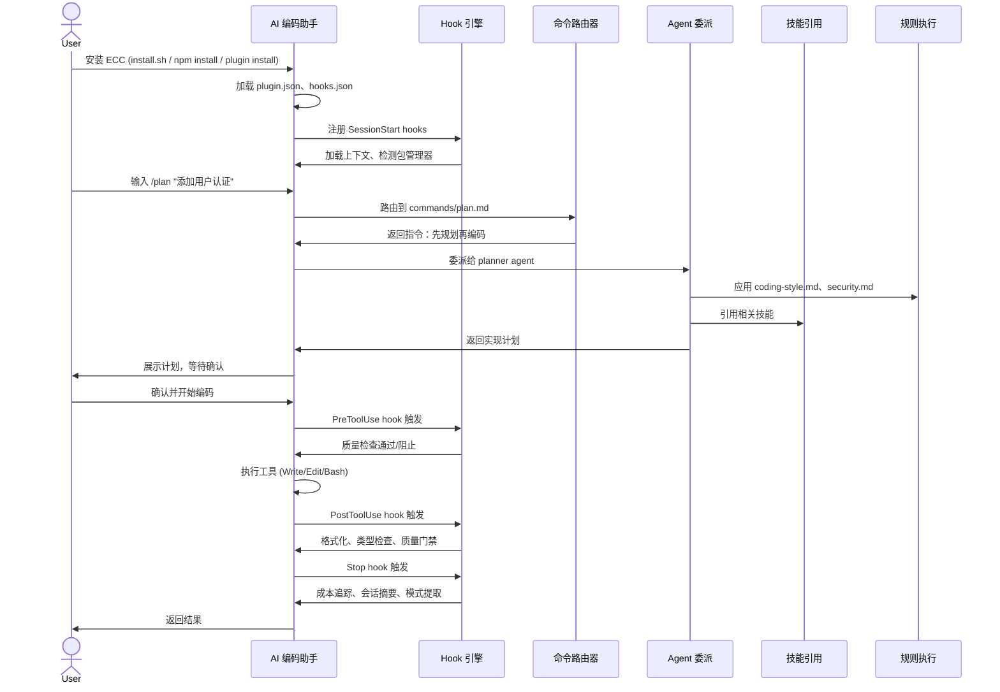
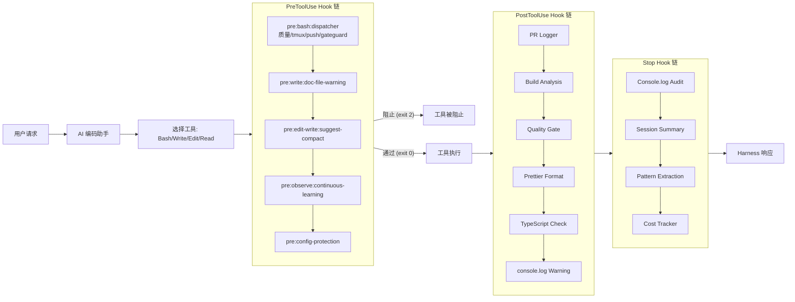
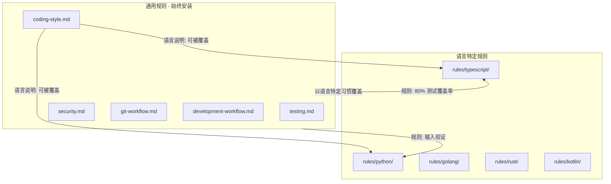
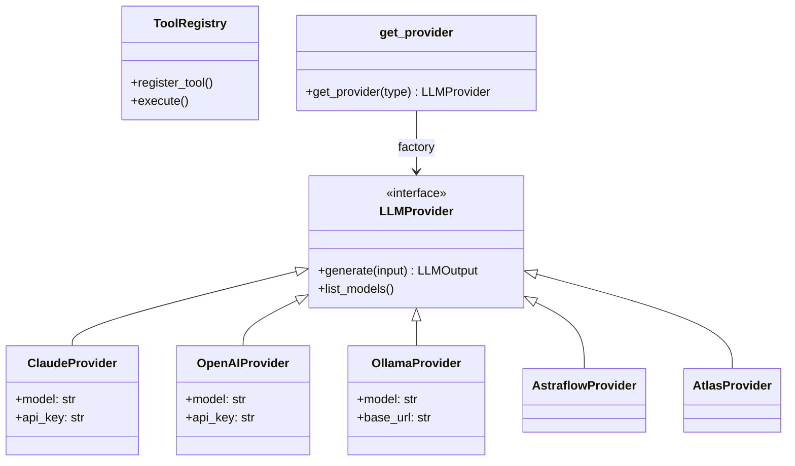

# ECC 仓库全面分析报告

## 1. 基本信息与概览

| 项目 | 内容 |
|------|------|
| **仓库名称** | ECC (Everything Claude Code) — The Agent Harness Operating System |
| **版本** | 2.0.0 |
| **作者** | Affaan Mustafa ([@affaan](https://x.com/affaan)) |
| **许可** | MIT |
| **npm 包名** | `ecc-universal` / `ecc-agentshield` |
| **网站** | [ecc.tools](https://ecc.tools) |
| **仓库地址** | [github.com/affaan-m/ECC](https://github.com/affaan-m/ECC) |
| **GitHub App** | [github.com/apps/ecc-tools](https://github.com/apps/ecc-tools) |

### 一句话概括

ECC 是一个 **harness-native agent operating system**，为 AI 编码助手（Claude Code、Cursor、Codex、OpenCode、Gemini 等）提供可复用的 agents、skills、hooks、rules 和 MCP 配置，将任意 AI 编码工具转变为生产级开发环境。

### 统计概览

| 指标 | 数值 |
|------|------|
| Agents（子代理） | 67 |
| Skills（技能） | 278 |
| Commands（命令） | 59+（含 94 个 legacy shims） |
| 支持的语言生态 | 12+ |
| 支持的 AI 平台 | 6+ |
| Hook 脚本 | 19+ |
| Node.js 脚本 | 30+ |
| JSON Schema | 10 |
| 贡献者 | 230+ |
| Stars | 211.9K+ |
| Forks | 32.5K+ |

---

## 2. 整体架构

### 架构描述

ECC 是一个分层的插件系统，位于 AI 编码助手之上：

```
┌─────────────────────────────────────────────────────────────┐
│                     Developer (开发者)                       │
└─────────────────────────────────────────────────────────────┘
                               │
                               ▼
┌─────────────────────────────────────────────────────────────┐
│              AI Harness Layer (AI 编码助手层)                │
│  ┌─────────┐ ┌────────┐ ┌──────┐ ┌────────┐ ┌────────┐   │
│  │Claude   │ │ Cursor │ │Codex │ │OpenCode│ │ Gemini │ ... │
│  │  Code   │ │  IDE   │ │      │ │        │ │        │     │
│  └─────────┘ └────────┘ └──────┘ └────────┘ └────────┘   │
└─────────────────────────────────────────────────────────────┘
                               │
                               ▼
┌─────────────────────────────────────────────────────────────┐
│                   ECC Plugin Layer                          │
│  ┌────────┐ ┌─────────┐ ┌──────────┐ ┌─────┐ ┌────────┐  │
│  │agents/ │ │ skills/ │ │commands/ │ │hooks│ │ rules/ │  │
│  │  67个  │ │  278个  │ │  59+个   │ │     │ │  分层  │  │
│  └────────┘ └─────────┘ └──────────┘ └─────┘ └────────┘  │
│  ┌────────┐ ┌──────────┐ ┌──────────┐ ┌───────────────┐  │
│  │scripts │ │ mcp-     │ │schemas/  │ │ contexts/     │  │
│  │ Node.js│ │ configs/ │ │ 验证     │ │ 上下文注入    │  │
│  └────────┘ └──────────┘ └──────────┘ └───────────────┘  │
└─────────────────────────────────────────────────────────────┘
                               │
                               ▼
┌─────────────────────────────────────────────────────────────┐
│              ECC 2.0 Rust Operator (Alpha)                  │
│       会话管理 · 仪表盘 · 后台守护进程 · SQLite 存储       │
└─────────────────────────────────────────────────────────────┘
```

### 设计意图

ECC 的核心理念是：**不要重复造轮子**。开发者在使用 AI 编码助手时，往往需要反复定义相同的规则、提示词、工作流。ECC 将这些封装为可复用的模块，让 AI 助手开箱即用，具备：

1. **专业化代理** — 代码审查、架构设计、安全审计等任务由专门的 agent 处理
2. **自动化质量门禁** — 通过 hooks 在工具执行前后自动检查质量
3. **跨平台一致性** — 同一套配置在不同 AI 编码助手上行为一致
4. **社区驱动** — 278 个技能覆盖从后端模式到医疗合规的广泛领域

---

## 3. 工作流程

### 用户会话生命周期



### Hook 执行流水线



---

## 4. 各模块深入分析

### 4.1 Agents 模块（agents/）

#### 设计意图

提供**专业化子代理**（sub-agents）供主 AI 助手委派任务。实现 "Agent-First" 理念：将工作尽早路由给正确的专家。每个 agent 有明确的范围和职责，避免主对话上下文被无关信息污染。

#### 实现方式

Markdown 文件 + YAML frontmatter。每个文件包含：

```markdown
---
name: code-reviewer
description: Reviews code for quality, security, and maintainability
tools: ["Read", "Grep", "Glob", "Bash"]
model: opus
---

You are a senior code reviewer...
```

- **name**: agent 名称
- **description**: 职责描述
- **tools**: 允许使用的工具列表
- **model**: 推荐的模型（opus/sonnet/haiku）
- **正文**: 系统提示词，定义 agent 的行为和输出格式

#### Agent 分类

| 分类 | 示例 | 数量 |
|------|------|------|
| **规划类** | planner, architect | ~2 |
| **代码审查类** | code-reviewer, security-reviewer, python-reviewer, go-reviewer, rust-reviewer, java-reviewer, typescript-reviewer, kotlin-reviewer | ~15 |
| **构建修复类** | build-error-resolver, go-build-resolver, rust-build-resolver, java-build-resolver, cpp-build-resolver, pytorch-build-resolver | ~9 |
| **测试类** | tdd-guide, e2e-runner, pr-test-analyzer | ~3 |
| **安全类** | security-reviewer, silent-failure-hunter | ~2 |
| **文档类** | doc-updater, docs-lookup | ~2 |
| **专项类** | loop-operator, harness-optimizer, refactor-cleaner, database-reviewer, mle-reviewer, fsharp-reviewer | ~13+ |

#### 工作方式

1. 用户输入命令（如 `/code-review`）
2. 命令路由到对应的 agent
3. 主 AI 助手启动子对话，将任务委派给 agent
4. Agent 在限定范围内执行任务
5. Agent 返回结果给主对话

---

### 4.2 Skills 模块（skills/）

#### 设计意图

Skills 是 ECC 的**主要工作流表面**（primary workflow surface）。如果说 rules 规定"做什么"，skills 则规定"怎么做"——提供深入的领域知识、步骤指南和最佳实践。每个 skill 聚焦一个具体任务或领域。

#### 实现方式

每个 skill 是一个目录，包含：

```
skills/tdd-workflow/
├── SKILL.md          # 核心技能内容（含 YAML frontmatter）
├── examples/         # 使用示例（可选）
├── references/       # 参考材料（可选）
├── scripts/          # 辅助脚本（可选）
└── templates/        # 模板文件（可选）
```

SKILL.md 的 YAML frontmatter 包含 `name`、`description`、`origin`（ECC 或 community）。

#### Skill 分类

| 分类 | 示例 | 数量 |
|------|------|------|
| **语言模式** | python-patterns, golang-patterns, rust-patterns, kotlin-patterns, swiftui-patterns, react-patterns | ~30 |
| **测试** | tdd-workflow, e2e-testing, python-testing, rust-testing, golang-testing | ~15 |
| **框架模式** | django-patterns, springboot-patterns, fastapi-patterns, nestjs-patterns, postgres-patterns | ~25 |
| **安全** | security-review, security-scan, gateguard, safety-guard | ~12 |
| **架构** | architecture-decision-records, hexagonal-architecture, blueprint | ~10 |
| **AI/ML** | deep-research, mle-workflow, pytorch-patterns, eval-harness | ~10 |
| **领域特定** | healthcare-cdss-patterns, customs-trade-compliance, visa-doc-translate | ~15 |
| **内容创作** | article-writing, content-engine, video-editing, manim-video | ~12 |
| **DevOps** | docker-patterns, deployment-patterns, kubernetes-patterns | ~10 |
| **ECC 自引用** | ecc-guide, configure-ecc, skill-stocktake, config-gc | ~10 |

---

### 4.3 Commands 模块（commands/）

#### 设计意图

提供用户可直接调用的**斜杠命令**（slash commands），是 ECC 的主要用户界面。用户输入 `/command-name` 即可触发相应功能。注意：ECC 正从 commands 迁移到 skills 优先，但 commands 仍保持兼容。

#### 实现方式

Markdown 文件 + YAML frontmatter（`description`、`argument-hint`）。

#### 命令分类

| 分类 | 命令 |
|------|------|
| **核心工作流** | `/plan`, `/code-review`, `/build-fix`, `/quality-gate`, `/refactor-clean` |
| **测试** | `/tdd`, `/e2e`, `/test-coverage` |
| **代码审查** | `/python-review`, `/go-review`, `/rust-review`, `/java-review`, `/typescript-review` |
| **构建修复** | `/go-build`, `/rust-build`, `/cpp-build`, `/kotlin-build` |
| **项目/Epic** | `/epic-decompose`, `/epic-claim`, `/epic-review`, `/projects` |
| **编排** | `/multi-plan`, `/multi-execute`, `/multi-backend`, `/multi-frontend` |
| **学习** | `/learn`, `/evolve`, `/skill-create`, `/instinct-status` |
| **会话** | `/sessions`, `/checkpoint`, `/loop-start`, `/loop-status` |
| **工具** | `/auto-update`, `/cost-report`, `/security-scan`, `/setup-pm` |

---

### 4.4 Hooks 模块（hooks/）

#### 设计意图

提供**事件驱动的自动化**机制，在 AI 助手执行工具前后自动触发检查。这是 ECC 质量保障的核心——无需用户手动干预即可执行代码格式化、类型检查、安全扫描等。

#### 实现方式

`hooks/hooks.json` 定义所有 hook 的配置，包含 matcher（匹配条件）和 hook 类型（command/script）。Hook 脚本存放在 `scripts/hooks/` 目录。

三种 profile 控制严格程度：
- **minimal**: 仅基本 hook
- **standard**（默认）: 标准质量检查
- **strict**: 包含治理捕获等严格检查

#### Hook 类型

| Hook 类型 | 触发时机 | 匹配器 | 功能 |
|-----------|---------|--------|------|
| **Pre: Bash Dispatcher** | Bash 执行前 | Bash | 质量检查、tmux 提醒、git push 提醒、GateGuard |
| **Pre: Doc File Warning** | Write 前 | Write | 警告非标准 .md/.txt 文件 |
| **Pre: Suggest Compact** | Edit/Write 前 | Edit\|Write | ~50 工具调用后建议 /compact |
| **Pre: Config Protection** | Write/Edit 前 | Write\|Edit | 阻止修改 linter/formatter 配置文件 |
| **Pre: MCP Health Check** | 任意工具前 | * | 检查 MCP 服务器健康状态 |
| **Post: Quality Gate** | Edit/Write 后 | Edit\|Write | 快速质量检查 |
| **Post: Prettier Format** | Edit 后 | Edit | 自动格式化 JS/TS 文件 |
| **Post: TypeScript Check** | Edit 后 | Edit | 运行 tsc --noEmit |
| **Post: console.log Warning** | Edit 后 | Edit | 警告 console.log |
| **Stop** | 响应后 | Stop | 会话摘要、模式提取、成本追踪 |
| **SessionStart** | 会话开始 | SessionStart | 加载上下文、检测包管理器 |
| **PreCompact** | 压缩前 | PreCompact | 保存状态 |

---

### 4.5 Rules 模块（rules/）

#### 设计意图

定义**始终遵循**的标准规范、约定和检查清单。采用分层覆盖设计：通用规则（common）适用于所有项目，语言特定规则（typescript/、python/、golang/ 等）在通用规则基础上增加语言相关的补充。

#### 实现方式

Markdown 文件，按目录组织：

```
rules/
├── common/          # 通用规则（始终安装）
│   ├── coding-style.md    # 编码风格
│   ├── testing.md         # 测试要求
│   ├── security.md        # 安全检查
│   ├── git-workflow.md    # Git 工作流
│   ├── development-workflow.md  # 开发流程
│   ├── patterns.md        # 设计模式
│   ├── hooks.md           # Hook 架构
│   ├── agents.md          # Agent 使用
│   └── performance.md     # 性能优化
├── typescript/      # TypeScript 特定规则
├── python/          # Python 特定规则
├── golang/          # Go 特定规则
├── swift/           # Swift 特定规则
├── php/             # PHP 特定规则
└── arkts/           # HarmonyOS / ArkTS 规则
```

#### 规则层叠示意图



---

### 4.6 LLM 层（src/llm/）

#### 设计意图

提供**与供应商无关**的 Python LLM 接口，使 ECC 可以路由到不同的模型和提供商，不绑定于特定 AI 服务。

#### 实现方式

Python 包，包含 provider 适配器：



| 提供商 | 支持模型 | 认证方式 |
|--------|---------|---------|
| **Claude** | opus-4-8, sonnet-4-6, haiku-4-5 | ANTHROPIC_API_KEY |
| **OpenAI** | gpt-4o, gpt-4o-mini, gpt-4-turbo | OPENAI_API_KEY |
| **Ollama** | llama3.2, mistral, codellama | OLLAMA_BASE_URL |
| **Astraflow** | UModelVerse 模型 | API Key + Endpoint |
| **Atlas** | 300+ 模型 | Atlas Cloud API Key |

---

### 4.7 ECC 2.0 Rust Operator（ecc2/）

#### 设计意图

提供**多会话编排管理层**（Alpha 阶段），位于单个 harness 安装之上。用于管理多个 agent 会话、提供仪表盘、后台守护进程。

#### 实现方式

Rust 二进制，包含：
- 终端 UI 仪表盘（dashboard）
- SQLite 会话存储
- 守护进程模式（daemon）
- 会话生命周期管理（start/stop/resume）

#### 主要命令

| 命令 | 功能 |
|------|------|
| `cargo run -- dashboard` | 启动终端仪表盘 |
| `cargo run -- start` | 启动新会话 |
| `cargo run -- sessions` | 列出所有会话 |
| `cargo run -- status` | 查看最新状态 |
| `cargo run -- stop <id>` | 停止会话 |
| `cargo run -- resume <id>` | 恢复会话 |
| `cargo run -- daemon` | 启动守护进程 |

---

### 4.8 其他模块

#### Scripts 模块（scripts/）

Node.js 工具集，涵盖安装、审计、仪表盘、编排等功能：

| 脚本 | 功能 |
|------|------|
| `scripts/ecc.js` | CLI 入口点（bin: ecc） |
| `scripts/control-pane.js` | 操作控制面板 |
| `scripts/install-apply.js` | 应用安装（bin: ecc-install） |
| `scripts/install-plan.js` | 规划安装 |
| `scripts/harness-audit.js` | Harness 审计 |
| `scripts/doctor.js` | 诊断检查 |
| `scripts/dashboard-web.js` | Web 仪表盘 |
| `scripts/claw.js` | CLAW 操作（Claude Agent Wrapper） |

#### Harness 配置目录

ECC 支持多个 AI 编码平台，每个平台有对应的配置目录：

| 目录 | 目标平台 | 配置类型 |
|------|---------|---------|
| `.claude/` | Claude Code | settings.json, plugin.json |
| `.cursor/` | Cursor IDE | hooks.json, rules/ |
| `.codex/` | Codex | config.toml, agents/ |
| `.opencode/` | OpenCode | opencode.json |
| `.gemini/` | Gemini | GEMINI.md |
| `.zed/` | Zed Editor | settings.json |
| `.github/` | GitHub Copilot | copilot-instructions.md, prompts/ |

---

## 5. 设计意图总结

ECC 的设计遵循以下核心原则：

1. **Agent-First** — 将工作尽早路由给正确的专家 agent
2. **Test-Driven** — 先写测试再实现，要求 80%+ 覆盖率
3. **Security-First** — 验证输入、保护密钥、保持安全默认值
4. **Immutability** — 倾向于显式状态转换而非突变
5. **Plan Before Execute** — 复杂变更应分解为有意识的阶段
6. **Cross-Harness** — 跨多个 AI 编码平台工作
7. **Layered Rules** — 通用规则 + 语言特定覆盖（类似 CSS 优先级）
8. **Hook-Based Automation** — 事件驱动质量保障，无需用户干预
9. **Skills-First** — Skills 是主要工作流表面，commands 是兼容层

---

## 6. 安装与使用

### 安装方式

| 方式 | 命令 | 适用场景 |
|------|------|---------|
| **Claude Code 插件**（推荐） | `/plugin marketplace add https://github.com/affaan-m/ECC` → `/plugin install ecc@ecc` | Claude Code 用户 |
| **Shell 脚本** | `./install.sh --profile full` | Linux/macOS 全量安装 |
| **PowerShell** | `.\install.ps1 --profile full` | Windows 全量安装 |
| **npm** | `npx ecc-install --profile minimal --target claude` | 精细控制安装内容 |
| **GitHub App** | [github.com/apps/ecc-tools](https://github.com/apps/ecc-tools) | 私有仓库、PR 审计 |

### 基本用法

安装完成后，在 AI 编码助手中输入 `/` 查看可用命令：

```bash
/plan "添加用户认证功能"     # 规划新功能
/code-review                  # 审查代码
/build-fix                    # 修复构建错误
/security-scan                # 安全扫描
/learn                        # 从会话中学习模式
```

### 环境变量配置

| 变量 | 作用 |
|------|------|
| `ECC_HOOK_PROFILE` | Hook 严格程度（minimal/standard/strict） |
| `ECC_DISABLED_HOOKS` | 禁用特定 hook |
| `ECC_AGENT_DATA_HOME` | 多 harness 数据隔离目录 |
| `ECC_SESSION_START_MAX_CHARS` | SessionStart 上下文最大字符数 |
| `ECC_MAX_INJECTED_INSTINCTS` | 注入的最大 instinct 数 |

---

## 7. 场景与目标用户

### 目标用户画像

| 用户画像 | 解决的问题 | 核心使用模块 |
|---------|-----------|------------|
| **独立开发者** | 没有代码审查、TDD 纪律、安全检查 | hooks, commands, rules |
| **工程团队** | 编码标准不一致、缺乏自动化 | rules, hooks, agents |
| **开源维护者** | PR 审查工作量大、发布质量 | commands, agents, workflows |
| **企业** | 合规要求、安全审计、多仓库管理 | hooks (governance), ecc2, GitHub App |
| **全栈开发者** | 跨语言标准、构建修复 | agents, build-fix commands, rules |
| **DevSecOps** | 安全扫描、供应链完整性 | hooks (gateguard), security rules |

### 常见场景

| 场景 | 描述 | 使用命令 | 触发的 Hook |
|------|------|---------|------------|
| **开始新功能** | 规划→实现→测试→审查 | `/plan`, `/tdd`, `/code-review` | Pre, Post, Stop |
| **修复构建错误** | 检测→诊断→修复 | `/build-fix` | Post: build analysis |
| **代码审查** | 质量和安全审查 | `/code-review`, `/security-scan` | Pre: governance |
| **初始化项目** | 安装规则、配置 hooks | `install.sh`, `/project-init` | SessionStart |
| **从历史学习** | 从会话中提取模式 | `/learn`, `/evolve` | Stop: pattern extraction |
| **多 agent 编排** | 协调复杂变更 | `/multi-plan`, `/multi-execute` | 工作流脚本 |

---

## 8. 关键文件索引

| 文件路径 | 说明 |
|---------|------|
| `README.md` | 项目主文档（安装、使用、跨平台支持） |
| `SOUL.md` | 核心设计哲学 |
| `AGENTS.md` | 所有 agent 列表及编排说明 |
| `package.json` | npm 包定义（v2.0.0） |
| `install.sh` | Linux/macOS 安装脚本 |
| `install.ps1` | Windows 安装脚本 |
| `hooks/hooks.json` | Hook 引擎配置 |
| `ecc_dashboard.py` | 桌面仪表盘（Tkinter） |
| `the-security-guide.md` | 安全指南 |
| `the-shortform-guide.md` | 快速入门指南 |
| `the-longform-guide.md` | 高级使用指南 |
| `src/llm/` | LLM 抽象层（Python） |
| `ecc2/` | Rust 控制平面（Alpha） |
| `mcp-configs/mcp-servers.json` | MCP 服务器配置 |

---

## 9. 统计汇总

| 类别 | 数量 |
|------|------|
| Agents | 67 |
| Skills | 278 |
| Commands | 59+（94 legacy shims） |
| 支持的语言生态 | 12+ |
| 支持的 AI 平台 | 6+ |
| Hook 事件类型 | 8+（Claude Code）/ 15+（Cursor）/ 11+（OpenCode） |
| Hook 脚本 | 19+ |
| Node.js 脚本 | 30+ |
| LLM 提供商 | 5（Claude、OpenAI、Ollama、Astraflow、Atlas） |
| JSON Schema | 10 |
| Rust 控制平面 | 1（Alpha） |
| MCP 服务器配置 | 14+ |
| 贡献者 | 230+ |
| Stars | 211.9K+ |
| Forks | 32.5K+ |

---

> **总结**：ECC 是一个面向 AI 编码时代的"代理操作系统"。它将 10+ 个月的生产实战经验提炼为可复用的 agents、skills、hooks、rules 和命令，让任何 AI 编码助手都能开箱即用地具备专业开发环境的质量保障和工作流自动化能力。无论是独立开发者还是企业团队，都能从中获得代码审查、安全扫描、自动格式化、TDD 流程等关键能力。
